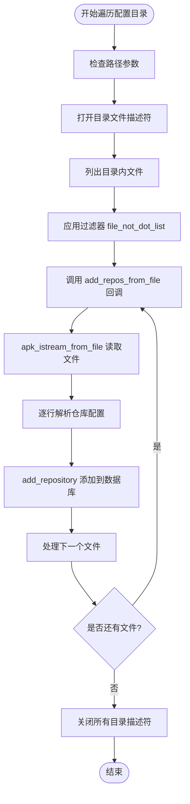

# 系统仓库加载

<cite>
**本文档引用的文件**   
- [database.c](file://src/database.c#L1971-L2160)
- [database.c](file://src/database.c#L1661-L1675)
- [io.c](file://src/io.c#L944-L982)
- [apk_io.h](file://src/apk_io.h#L214-L214)
- [apk_io.h](file://src/apk_io.h#L96-L96)
- [repoparser.c](file://src/repoparser.c)
</cite>

## 目录
1. [系统仓库加载流程](#系统仓库加载流程)
2. [核心函数分析](#核心函数分析)
3. [配置文件遍历机制](#配置文件遍历机制)
4. [优先级关系与配置示例](#优先级关系与配置示例)

## 系统仓库加载流程

在 `apk_db_open` 函数中，系统仓库的加载流程由 `APK_OPENF_NO_SYS_REPOS` 标志位控制。当该标志位未被设置时，系统将加载预定义的仓库配置。加载优先级如下：若 `ac->repositories_file` 被显式指定，则优先使用该文件；否则，默认遍历 `/etc/apk/repositories.d` 和 `/lib/apk/repositories.d` 目录下的所有配置文件。

此机制确保了配置的灵活性与兼容性，允许用户通过环境变量或命令行参数覆盖默认仓库设置，同时保留系统级配置作为后备方案。

**Section sources**
- [database.c](file://src/database.c#L1971-L2160)

## 核心函数分析

`add_repos_from_file` 函数作为回调函数，在 `apk_dir_foreach_config_file` 中被调用，用于处理每个仓库配置文件。该函数首先通过 `apk_repoparser_set_file` 设置当前解析的文件名，随后调用 `apk_db_parse_istream` 读取文件内容并触发解析流程。

`apk_db_parse_istream` 使用 `apk_istream_from_file` 创建输入流，逐行读取配置内容，并通过回调函数 `add_repository` 将解析出的仓库信息添加到数据库中。若读取失败且文件来自标准路径，则记录错误日志并返回错误码。

**Section sources**
- [database.c](file://src/database.c#L1661-L1675)
- [repoparser.c](file://src/repoparser.c)

## 配置文件遍历机制

`apk_dir_foreach_config_file` 函数负责遍历指定目录中的配置文件。它接受可变参数列表，支持多个目录路径。函数内部通过 `va_list` 解析参数，依次打开每个目录，并使用 `apk_dir_foreach_file` 遍历其中的文件。

遍历过程中，`filter` 函数用于过滤无效文件（如隐藏文件或临时文件），确保仅处理合法的配置文件。每个匹配的文件都会触发 `add_repos_from_file` 回调，完成仓库信息的加载。

该机制通过 `source` 数组记录每个目录的文件描述符和路径信息，保证在回调时能正确传递上下文，实现跨目录的统一处理。



**Diagram sources**
- [io.c](file://src/io.c#L944-L982)
- [database.c](file://src/database.c#L1661-L1675)

## 优先级关系与配置示例

系统仓库与命令行仓库的优先级关系如下：命令行指定的仓库（通过 `APK_OPENF_NO_CMDLINE_REPOS` 控制）优先于系统仓库加载。这意味着用户可以通过命令行动态添加或覆盖系统级仓库配置。

典型的系统仓库配置目录结构如下：

```
/etc/apk/
├── repositories          # 主仓库配置文件
└── repositories.d/       # 附加仓库配置目录
    ├── alpine-main.conf
    ├── community.conf
    └── testing.conf

/lib/apk/
└── repositories.d/       # 系统默认仓库配置目录
    ├── base.conf
    └── updates.conf
```

此结构支持模块化配置管理，便于系统维护和第三方扩展。

**Section sources**
- [database.c](file://src/database.c#L1971-L2160)
- [apk_io.h](file://src/apk_io.h#L214-L214)
- [apk_io.h](file://src/apk_io.h#L96-L96)