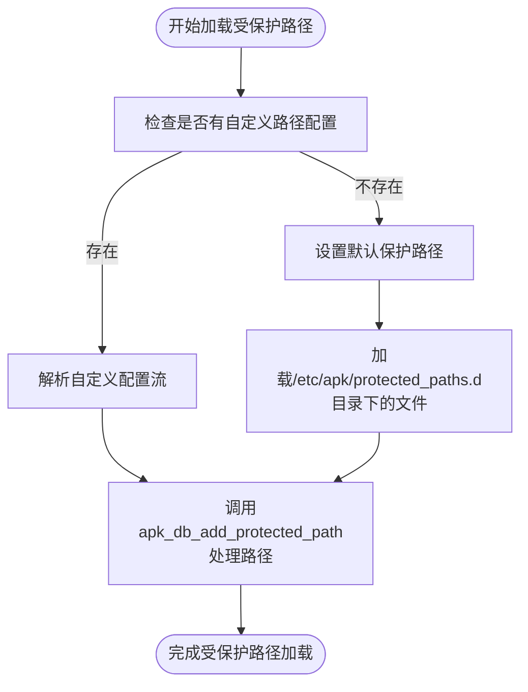
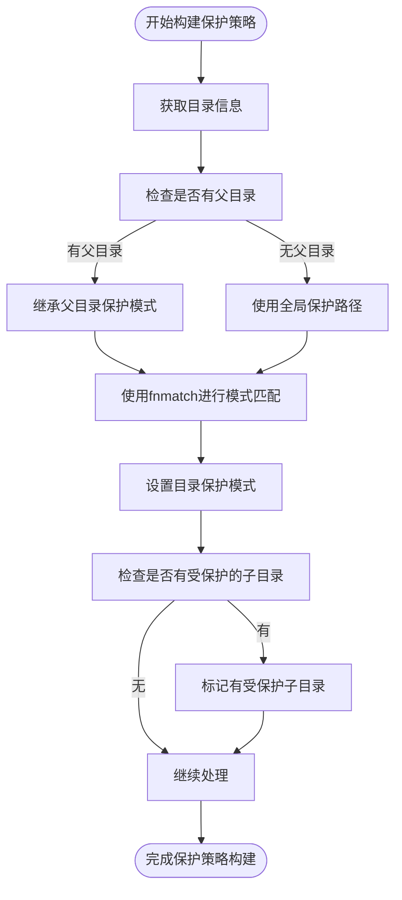
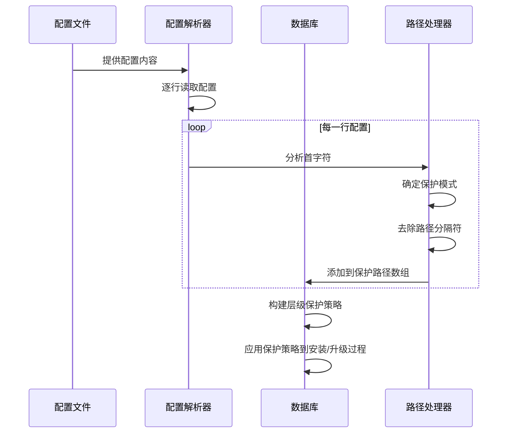

# 受保护路径处理

<cite>
**本文档中引用的文件**   
- [database.c](file://src/database.c)
- [apk_database.h](file://src/apk_database.h)
</cite>

## 目录
1. [简介](#简介)
2. [受保护路径加载机制](#受保护路径加载机制)
3. [路径条目前缀含义](#路径条目前缀含义)
4. [模式匹配与层级构建](#模式匹配与层级构建)
5. [安装升级时的文件覆盖行为](#安装升级时的文件覆盖行为)
6. [配置示例与处理流程](#配置示例与处理流程)

## 简介
本文档详细解析apk-tools中受保护路径（protected paths）的加载与处理机制。重点分析在apk_db_open函数中如何通过apk_db_add_protected_path函数处理受保护路径配置，以及这些保护策略在软件包安装或升级时对文件覆盖行为的影响。

**Section sources**
- [database.c](file://src/database.c#L1971-L2160)

## 受保护路径加载机制
在apk_db_open函数中，系统会初始化受保护路径的处理流程。当ac->protected_paths存在时，通过apk_db_parse_istream函数解析输入流并调用apk_db_add_protected_path进行处理；否则，系统会设置默认的受保护路径配置，并从/etc/apk/protected_paths.d目录下的文件中加载额外的配置。



**Diagram sources **
- [database.c](file://src/database.c#L2053-L2064)

**Section sources**
- [database.c](file://src/database.c#L2053-L2064)

## 路径条目前缀含义
受保护路径配置中的首字符具有特殊含义，用于指定不同的保护模式：

- **+**：表示内容变更保护（APK_PROTECT_CHANGED），当文件内容发生变化时需要特殊处理
- **@**：表示仅符号链接保护（APK_PROTECT_SYMLINKS_ONLY），只对符号链接进行保护
- **!**：表示完全保护（APK_PROTECT_ALL），对路径进行完全保护
- **-**：表示忽略（APK_PROTECT_IGNORE），该路径将被忽略不进行保护
- **无前缀**：默认为内容变更保护（APK_PROTECT_CHANGED）

```mermaid
classDiagram
class apk_protect_mode {
+APK_PROTECT_NONE
+APK_PROTECT_IGNORE
+APK_PROTECT_CHANGED
+APK_PROTECT_SYMLINKS_ONLY
+APK_PROTECT_ALL
}
note right of apk_protect_mode
枚举类型定义了不同的保护模式
对应路径条目前缀的处理逻辑
end note
```

**Diagram sources **
- [apk_database.h](file://src/apk_database.h#L67-L73)

**Section sources**
- [database.c](file://src/database.c#L1386-L1403)
- [apk_database.h](file://src/apk_database.h#L67-L73)

## 模式匹配与层级构建
系统使用fnmatch函数进行模式匹配，将路径按层级关系构建保护策略。在apk_db_dir_get函数中，通过遍历父目录的保护路径数组，使用fnmatch函数匹配目录名，从而确定当前目录的保护模式和子目录的保护策略。



**Diagram sources **
- [database.c](file://src/database.c#L307-L368)

**Section sources**
- [database.c](file://src/database.c#L345-L367)

## 安装升级时的文件覆盖行为
在安装或升级软件包时，受保护路径的配置会影响文件的覆盖行为。系统会根据路径的保护模式决定是否允许覆盖、如何处理权限变更以及是否需要特殊验证。完全保护路径(!)将阻止任何修改，而内容变更保护(+)则允许内容更新但会记录变更。

**Section sources**
- [database.c](file://src/database.c#L307-L368)

## 配置示例与处理流程
以下是一个典型的受保护路径配置示例及其处理流程：



**Diagram sources **
- [database.c](file://src/database.c#L1377-L1416)
- [database.c](file://src/database.c#L2053-L2064)

**Section sources**
- [database.c](file://src/database.c#L1377-L1416)
- [database.c](file://src/database.c#L2057-L2060)