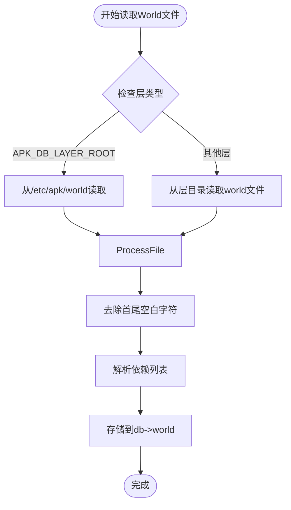
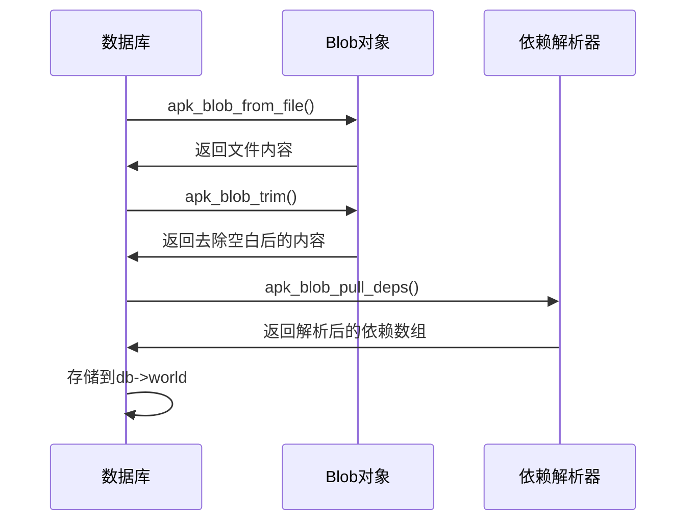
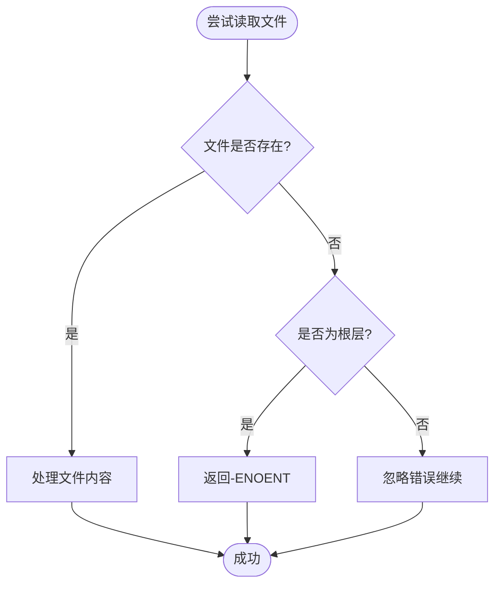
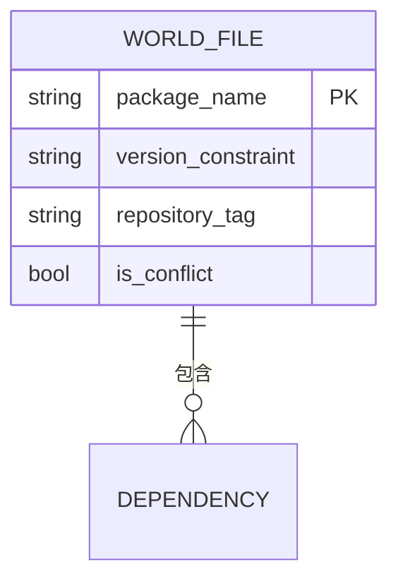
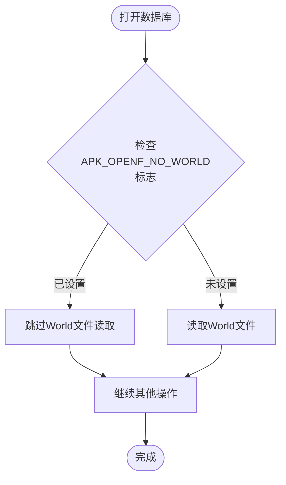

# World文件读取机制

<cite>
**本文档引用的文件**   
- [database.c](file://src/database.c)
- [apk_io.h](file://src/apk_io.h)
- [apk_blob.h](file://src/apk_blob.h)
- [apk_package.h](file://src/apk_package.h)
- [apk_context.h](file://src/apk_context.h)
</cite>

## 目录
1. [简介](#简介)
2. [World文件读取流程](#world文件读取流程)
3. [依赖解析与存储](#依赖解析与存储)
4. [错误处理机制](#错误处理机制)
5. [World文件格式与作用](#world文件格式与作用)
6. [控制标志位分析](#控制标志位分析)

## 简介
World文件是APK包管理系统中的核心配置文件，用于记录用户显式安装的软件包依赖关系。该文件位于系统根目录下的`/etc/apk/world`路径，其内容决定了系统在更新或升级时需要保留的软件包集合。本文档深入解析World文件的读取、解析和处理机制，涵盖从文件读取到依赖解析的完整流程。

## World文件读取流程

World文件的读取过程由`apk_db_read_layer`函数实现，该函数根据不同的数据库层（layer）采用不同的读取策略。当层为`APK_DB_LAYER_ROOT`时，系统从`/etc/apk/world`路径读取文件；对于其他层，则从对应层目录下的`world`文件读取。

**Diagram sources**
- [database.c](file://src/database.c#L1302-L1350)

**Section sources**
- [database.c](file://src/database.c#L1302-L1350)

## 依赖解析与存储

读取World文件内容后，系统使用`apk_blob_pull_deps`函数解析依赖列表。该函数将文件内容中的依赖字符串解析为结构化的依赖数组，并存储在数据库的`db->world`字段中。

**Diagram sources**
- [database.c](file://src/database.c#L1302-L1350)
- [package.c](file://src/package.c#L227-L243)

**Section sources**
- [database.c](file://src/database.c#L1302-L1350)
- [package.c](file://src/package.c#L227-L243)

## 错误处理机制

World文件读取过程中包含完善的错误处理机制。当文件不存在时，仅在根层返回`-ENOENT`错误，其他层则忽略该错误继续执行。这种设计确保了系统在多层架构下的稳定性和容错能力。

**Diagram sources**
- [database.c](file://src/database.c#L1302-L1350)

**Section sources**
- [database.c](file://src/database.c#L1302-L1350)

## World文件格式与作用

World文件采用简单的文本格式，每行包含一个软件包的依赖声明。文件格式遵循APK包管理系统的标准依赖语法，支持版本约束和条件依赖。

**Diagram sources**
- [database.c](file://src/database.c#L1302-L1350)

**Section sources**
- [database.c](file://src/database.c#L1302-L1350)

## 控制标志位分析

`APK_OPENF_NO_WORLD`标志位用于控制World文件的加载行为。当该标志位被设置时，系统将跳过World文件的读取过程，这对于某些不需要维护用户安装状态的操作场景非常有用。

**Diagram sources**
- [database.c](file://src/database.c#L1302-L1350)
- [apk_context.h](file://src/apk_context.h#L46-L47)

**Section sources**
- [database.c](file://src/database.c#L1302-L1350)
- [apk_context.h](file://src/apk_context.h#L46-L47)