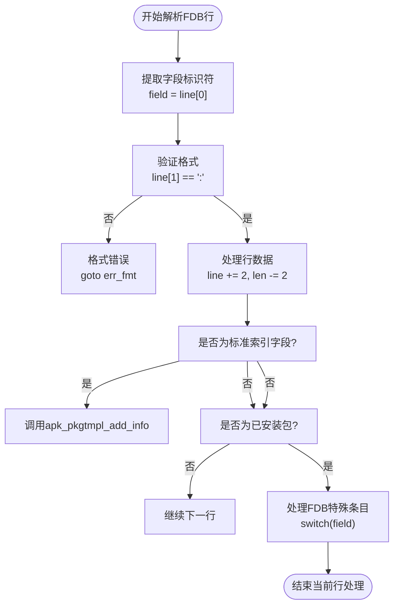
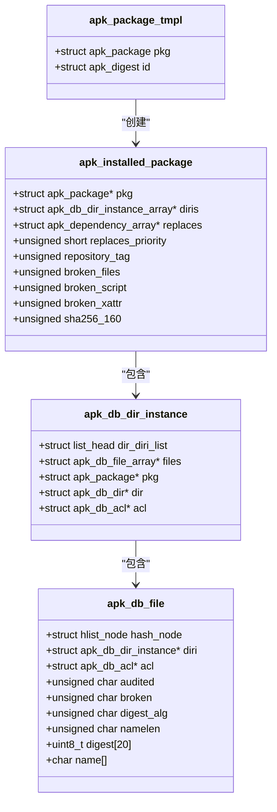
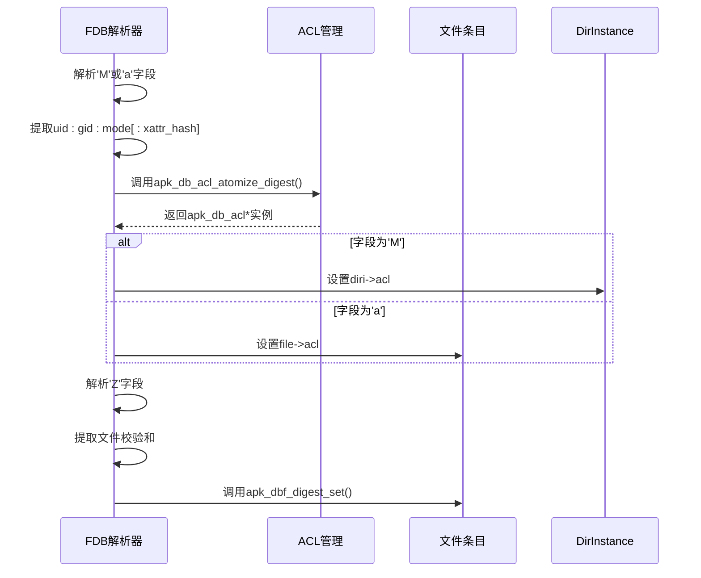
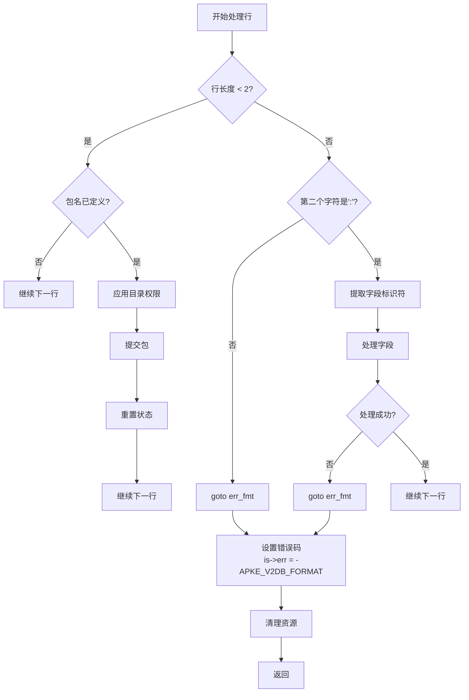

# 已安装包数据库读取

<cite>
**Referenced Files in This Document**   
- [database.c](file://src/database.c)
- [apk_database.h](file://src/apk_database.h)
- [apk_package.h](file://src/apk_package.h)
- [apk_context.h](file://src/apk_context.h)
</cite>

## 目录
1. [简介](#简介)
2. [核心函数分析](#核心函数分析)
3. [FDB文件格式解析](#fdb文件格式解析)
4. [元数据与文件条目处理](#元数据与文件条目处理)
5. [访问控制与校验和](#访问控制与校验和)
6. [替换规则与状态标志](#替换规则与状态标志)
7. [错误处理机制](#错误处理机制)
8. [APK_OPENF_NO_INSTALLED标志](#apk_openf_no_installed标志)
9. [FDB与APK包索引格式对比](#fdb与apk包索引格式对比)

## 简介
本文档深入解析Alpine Package Keeper (APK)系统中已安装软件包数据库的读取机制。重点分析`apk_db_fdb_read`函数如何从输入流中解析FDB（Flat Database）格式的已安装包数据库。该机制是APK工具维护系统软件包状态的核心功能，负责重建已安装软件包的完整元数据、文件列表、权限设置和依赖关系。

## 核心函数分析

`apk_db_fdb_read`函数是解析已安装包数据库的核心入口，负责从指定输入流中逐行读取FDB格式数据，并构建`apk_package_tmpl`模板。该函数通过`apk_istream_get_delim`以换行符为分隔符读取数据流，对每一行进行字段解析和处理。

当遇到空行或长度小于2的行时，函数会触发包提交逻辑：将当前构建的模板通过`apk_db_pkg_add`添加到数据库中，并为已安装包创建相应的`apk_installed_package`实例。此设计允许FDB文件使用空行作为包记录的分隔符。

**Section sources**
- [database.c](file://src/database.c#L902-L1050)

## FDB文件格式解析

FDB文件采用简单的键值对格式，每行以单个字符作为字段标识符，后跟冒号和具体值。`apk_db_fdb_read`函数首先验证行格式的正确性，确保第二个字符为冒号，然后根据首字符进行分发处理。

**Diagram sources**
- [database.c](file://src/database.c#L902-L1050)

**Section sources**
- [database.c](file://src/database.c#L902-L1050)
- [apk_package.h](file://src/apk_package.h#L160)

## 元数据与文件条目处理

函数通过`apk_pkgtmpl_add_info`处理标准的包元数据字段，这些字段与APK包索引格式兼容。当`repo`参数为`APK_REPO_DB_INSTALLED`时，函数会为已安装包创建`apk_installed_package`实例。

对于FDB特有的文件条目，函数使用以下字段标识符：
- **'P'**: 包名，通过`apk_db_get_name`获取或创建`apk_name`实例
- **'F'**: 文件目录，标识文件所属的目录实例
- **'R'**: 文件路径，标识具体文件条目

当遇到'F'字段时，函数会创建或获取`apk_db_dir_instance`，并应用目录权限。'R'字段则用于在当前目录实例下创建`apk_db_file`条目。

**Diagram sources**
- [database.c](file://src/database.c#L902-L1050)
- [apk_database.h](file://src/apk_database.h#L112-L119)
- [apk_package.h](file://src/apk_package.h#L54-L72)

**Section sources**
- [database.c](file://src/database.c#L902-L1050)
- [apk_database.h](file://src/apk_database.h#L112-L119)
- [apk_package.h](file://src/apk_package.h#L54-L72)

## 访问控制与校验和

FDB格式支持详细的文件访问控制列表（ACL）和校验和信息。函数通过以下字段处理这些安全相关数据：
- **'M'**: 目录ACL，包含uid、gid、mode和可选的xattr校验和
- **'a'**: 文件ACL，格式与'M'相同
- **'Z'**: 文件校验和，存储文件内容的哈希值

当解析到'M'或'a'字段时，函数会解析uid、gid、mode和可选的xattr校验和，然后通过`apk_db_acl_atomize_digest`创建原子化的ACL实例。'Z'字段则通过`apk_blob_pull_digest`解析校验和，并使用`apk_dbf_digest_set`存储到文件条目中。

**Diagram sources**
- [database.c](file://src/database.c#L902-L1050)
- [apk_database.h](file://src/apk_database.h#L28-L34)

**Section sources**
- [database.c](file://src/database.c#L902-L1050)
- [apk_database.h](file://src/apk_database.h#L28-L34)

## 替换规则与状态标志

FDB格式支持复杂的替换规则和包状态管理。相关字段包括：
- **'r'**: 替换规则（replaces），列出此包替换的其他包
- **'q'**: 替换优先级，数值越高优先级越高
- **'s'**: 仓库标签，标识包来源
- **'f'**: 状态标志，包含多个布尔标志

函数通过`apk_blob_pull_deps`解析'r'字段中的替换依赖关系。'q'字段通过`apk_blob_pull_uint`解析为整数。's'字段通过`apk_db_get_tag_id`转换为内部标签ID。'f'字段则通过遍历字符来设置多个状态标志，如`broken_files`、`broken_script`等。

**Section sources**
- [database.c](file://src/database.c#L902-L1050)
- [apk_package.h](file://src/apk_package.h#L62-L71)

## 错误处理机制

`apk_db_fdb_read`函数实现了严格的错误处理机制。当遇到格式错误时，函数会设置`is->err = -APKE_V2DB_FORMAT`并跳转到错误处理标签。具体错误情况包括：
- 行长度小于2且包名未定义
- 字段标识符后缺少冒号
- 必需字段的值为空
- 旧版apk-tools不支持的字段

函数使用`goto`语句实现错误处理流，确保资源正确释放。在函数末尾，无论成功与否都会调用`apk_pkgtmpl_free`清理模板，并通过`apk_istream_close`关闭输入流。

**Diagram sources**
- [database.c](file://src/database.c#L902-L1050)

**Section sources**
- [database.c](file://src/database.c#L902-L1050)

## APK_OPENF_NO_INSTALLED标志

`APK_OPENF_NO_INSTALLED`是一个重要的打开标志，定义在`apk_context.h`中，用于控制数据库打开行为。当此标志被设置时，`apk_db_read_layer`函数会跳过已安装包数据库的读取。

该标志的主要作用是：
1. **性能优化**：在不需要已安装包信息的场景下（如查询仓库信息），避免读取和解析庞大的已安装包数据库
2. **功能隔离**：允许工具仅访问仓库元数据而不影响已安装状态
3. **调试用途**：便于隔离和诊断与已安装包相关的特定问题

此标志通常与其他标志（如`APK_OPENF_NO_SCRIPTS`、`APK_OPENF_NO_WORLD`）组合使用，形成`APK_OPENF_NO_STATE`宏，用于完全跳过状态文件的读取。

**Section sources**
- [apk_context.h](file://src/apk_context.h#L45)
- [database.c](file://src/database.c#L1333-L1338)

## FDB与APK包索引格式对比

FDB格式与标准APK包索引格式有显著区别，主要体现在用途和内容上。

| 特性 | FDB格式 (已安装数据库) | APK包索引格式 |
|------|------------------------|-------------|
| **主要用途** | 存储已安装包的完整状态 | 描述仓库中包的元数据 |
| **文件位置** | /lib/apk/db/installed | APKINDEX.tar.gz |
| **包含信息** | 文件列表、ACL、校验和、脚本 | 依赖、提供、大小、描述 |
| **字段标识符** | 'F','R','Z','a','M','r','q','s','f' | 'D','p','i','k','S','I' |
| **读取函数** | apk_db_fdb_read | apk_index_read |
| **写入函数** | apk_db_fdb_write | apk_pkg_write_index_entry |

FDB格式是APK工具内部使用的二进制兼容格式，而APK包索引格式是跨平台的文本格式。两者通过`apk_pkgtmpl_add_info`函数共享部分字段处理逻辑，但FDB格式包含了更多运行时状态信息。

**Section sources**
- [database.c](file://src/database.c#L902-L1050)
- [database.c](file://src/database.c#L1089-L1176)
- [apk_package.h](file://src/apk_package.h#L160)