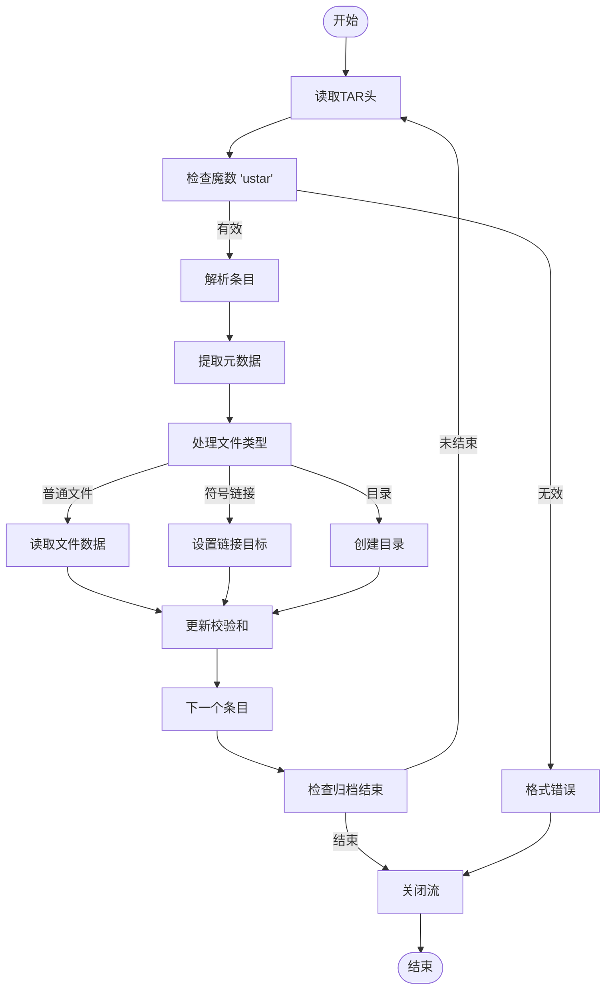
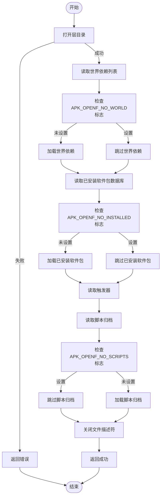

# 数据库层读取

<cite>
**本文档中引用的文件**   
- [database.c](file://src/database.c)
- [apk_database.h](file://src/apk_database.h)
- [tar.c](file://src/tar.c)
</cite>

## 目录
1. [简介](#简介)
2. [核心组件分析](#核心组件分析)
3. [数据库层读取流程](#数据库层读取流程)
4. [标志位控制机制](#标志位控制机制)
5. [数据解析函数](#数据解析函数)
6. [错误处理与依赖关系](#错误处理与依赖关系)
7. [流程图](#流程图)

## 简介
本文档深入解析了APK包管理器中多层数据库的读取机制。重点分析了`apk_db_read_layer`函数如何根据不同的层类型（根层或uvol层）读取数据库文件，并详细说明了该函数如何依次读取世界依赖列表、已安装软件包数据库、触发器和脚本归档。同时，文档还解释了各种标志位如何控制组件的加载过程，以及关键解析函数在处理各自数据格式时的作用。

## 核心组件分析

`apk_db_read_layer`函数是数据库层读取的核心，负责根据指定的层类型从文件系统中读取相应的数据库文件。该函数通过`openat`系统调用打开指定层的目录，并根据`APK_OPENF_NO_WORLD`、`APK_OPENF_NO_INSTALLED`和`APK_OPENF_NO_SCRIPTS`等标志位决定是否读取相应的组件。

**Section sources**
- [database.c](file://src/database.c#L1302-L1350)

## 数据库层读取流程

`apk_db_read_layer`函数按照以下顺序读取数据库组件：

1. **世界依赖列表（world）**：首先读取世界依赖列表，该列表定义了用户显式安装的软件包。对于根层，从`etc/apk/world`文件读取；对于uvol层，则从层目录下的`world`文件读取。
2. **已安装软件包数据库（installed）**：读取已安装软件包的详细信息，包括软件包的元数据和文件列表。
3. **触发器（triggers）**：读取触发器列表，这些触发器在软件包安装或卸载时执行。
4. **脚本归档（scripts.tar.gz）**：读取包含安装和卸载脚本的归档文件。

**Section sources**
- [database.c](file://src/database.c#L1302-L1350)

## 标志位控制机制

`apk_db_read_layer`函数通过以下标志位控制各组件的加载：

- **APK_OPENF_NO_WORLD**：如果设置了此标志位，则跳过世界依赖列表的读取。
- **APK_OPENF_NO_INSTALLED**：如果设置了此标志位，则跳过已安装软件包数据库和触发器的读取。
- **APK_OPENF_NO_SCRIPTS**：如果设置了此标志位，则跳过脚本归档的读取。

这些标志位允许调用者根据需要选择性地加载数据库组件，从而提高性能和灵活性。

**Section sources**
- [database.c](file://src/database.c#L1302-L1350)

## 数据解析函数

### fdb_read函数
`apk_db_fdb_read`函数负责解析已安装软件包数据库（FDB）格式的文件。它逐行读取输入流，解析每个字段，并根据字段类型更新相应的数据结构。该函数处理软件包的元数据、文件列表、权限信息等。

**Section sources**
- [database.c](file://src/database.c#L902-L1050)

### apk_db_add_trigger函数
`apk_db_add_trigger`函数用于解析触发器条目。它从输入流中提取软件包的摘要和触发器命令，并将触发器添加到相应的软件包中。

**Section sources**
- [database.c](file://src/database.c#L1290-L1300)

### apk_tar_parse函数
`apk_tar_parse`函数负责解析TAR归档文件。它读取TAR头信息，提取文件元数据（如大小、权限、所有者等），并根据文件类型调用相应的处理函数。该函数支持标准TAR格式和扩展头（PAX）。

**Diagram sources**
- [tar.c](file://src/tar.c#L113-L260)

## 错误处理与依赖关系

`apk_db_read_layer`函数在读取过程中会进行错误处理。如果某个组件读取失败，函数会记录错误并继续读取其他组件。只有当所有组件都读取成功时，函数才返回成功状态。此外，函数还处理了不同组件之间的依赖关系，例如在读取已安装软件包数据库之前必须先读取世界依赖列表。

**Section sources**
- [database.c](file://src/database.c#L1302-L1350)

## 流程图

**Diagram sources**
- [database.c](file://src/database.c#L1302-L1350)