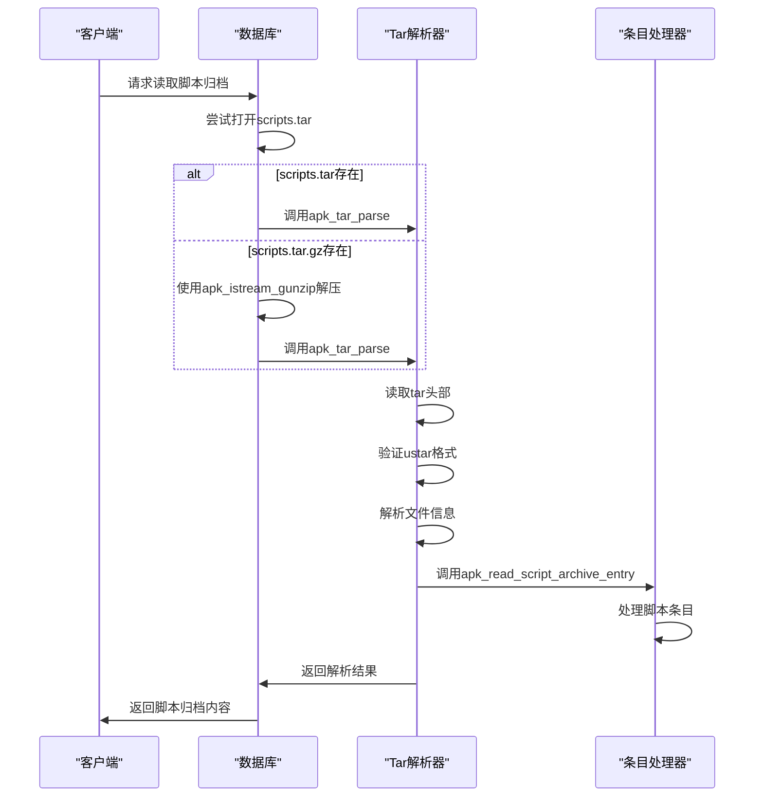

# 脚本归档读取机制

<cite>
**Referenced Files in This Document**   
- [database.c](file://src/database.c)
- [tar.c](file://src/tar.c)
- [io_gunzip.c](file://src/io_gunzip.c)
- [apk_tar.h](file://src/apk_tar.h)
</cite>

## 目录
1. [脚本归档读取流程](#脚本归档读取流程)
2. [压缩流处理机制](#压缩流处理机制)
3. [tar归档解析过程](#tar归档解析过程)
4. [脚本条目处理](#脚本条目处理)
5. [标志位设置逻辑](#标志位设置逻辑)
6. [错误处理与资源清理](#错误处理与资源清理)

## 脚本归档读取流程

脚本归档文件的读取与解析过程始于`apk_db_read_layer`函数，该函数负责从数据库层读取各种数据，包括脚本归档。当处理脚本归档时，系统首先尝试读取`scripts.tar`文件，如果该文件不存在，则尝试读取`scripts.tar.gz`文件。这一过程通过`apk_istream_from_file`和`apk_istream_gunzip`函数实现，确保能够处理未压缩和gzip压缩的归档文件。

**Section sources**
- [database.c](file://src/database.c#L1340-L1347)

## 压缩流处理机制

`apk_istream_gunzip`函数用于处理gzip压缩流。该函数通过调用`apk_istream_zlib`创建一个解压流，该流能够处理gzip格式的输入。`apk_istream_zlib`函数初始化一个`z_stream`结构，用于zlib库的解压操作。解压过程中，`gzi_read`函数负责从输入流中读取数据并解压，同时处理边界变化和错误情况。

**Section sources**
- [io_gunzip.c](file://src/io_gunzip.c#L1-L266)

## tar归档解析过程

`apk_tar_parse`函数是解析tar归档的核心。该函数接收一个输入流、一个条目处理器、上下文指针和一个ID缓存。解析过程包括读取tar头部、验证ustar格式、解析文件信息、处理扩展头和文件条目。对于每个有效的文件条目，`apk_tar_parse`调用条目处理器`apk_read_script_archive_entry`来处理该条目。

**Diagram sources**
- [tar.c](file://src/tar.c#L113-L260)
- [database.c](file://src/database.c#L1340-L1347)

**Section sources**
- [tar.c](file://src/tar.c#L113-L260)

## 脚本条目处理

`apk_read_script_archive_entry`函数作为tar归档的条目处理器，负责处理每个脚本条目。该函数首先检查文件模式是否为常规文件，然后解析文件名以提取包名、版本、校验和和动作类型。通过`apk_script_type`函数确定脚本类型，然后使用`apk_blob_pull_digest`解析校验和。最后，通过`apk_db_get_pkg`获取对应的包，并使用`apk_ipkg_add_script`将脚本添加到包的脚本数组中。

**Section sources**
- [database.c](file://src/database.c#L1218-L1256)

## 标志位设置逻辑

在尝试读取`scripts.tar`文件时，如果文件存在或不是`ENOENT`错误，`db->scripts_tar`标志位被设置为1。这一标志位用于指示数据库层是否包含未压缩的脚本归档。如果`scripts.tar`不存在，则尝试读取`scripts.tar.gz`，并使用`apk_istream_gunzip`处理gzip压缩流。这一逻辑确保了系统能够正确处理两种格式的脚本归档文件。

**Section sources**
- [database.c](file://src/database.c#L1342-L1343)

## 错误处理与资源清理

在整个脚本归档读取和解析过程中，错误处理和资源清理是关键环节。`apk_tar_parse`函数在解析过程中遇到错误时，会通过`goto err`跳转到错误处理部分，释放分配的资源并返回错误码。`apk_istream_close_error`函数用于关闭输入流并返回最终的错误状态。此外，`free(pax.ptr)`和`free(longname.ptr)`确保了在解析结束时释放所有动态分配的内存。

**Section sources**
- [tar.c](file://src/tar.c#L257-L260)
- [database.c](file://src/database.c#L1346-L1347)