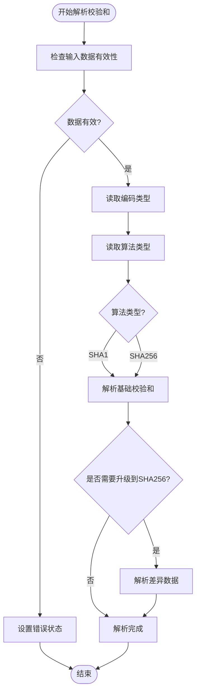
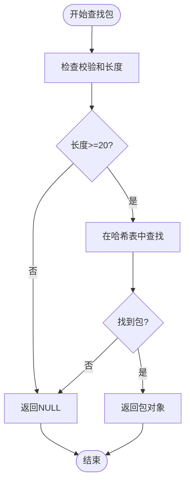
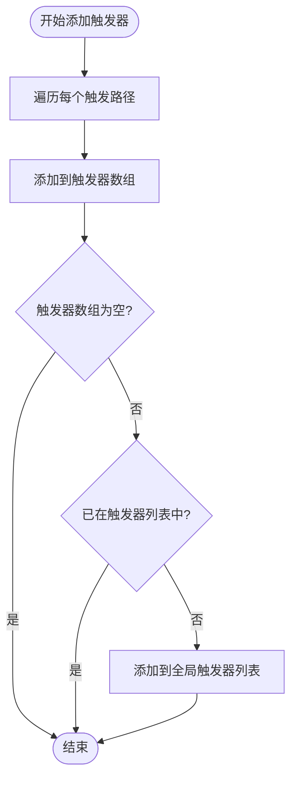
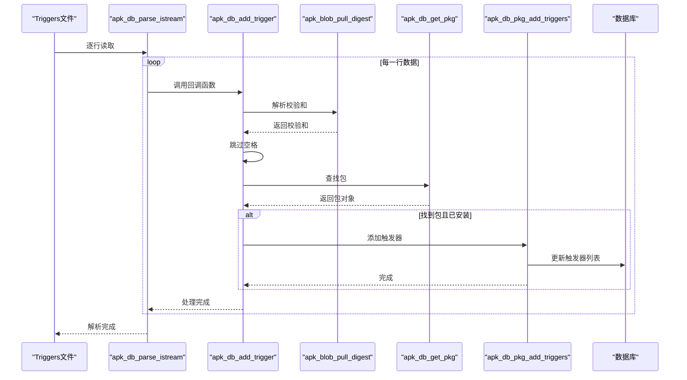

# 触发器读取机制

<cite>
**本文档中引用的文件**   
- [database.c](file://src/database.c)
- [blob.c](file://src/blob.c)
- [apk_database.h](file://src/apk_database.h)
- [apk_blob.h](file://src/apk_blob.h)
- [apk_crypto.h](file://src/apk_crypto.h)
</cite>

## 目录
1. [触发器读取与处理机制](#触发器读取与处理机制)
2. [核心函数分析](#核心函数分析)
3. [触发器工作流程序列图](#触发器工作流程序列图)
4. [包安装后重新配置支持](#包安装后重新配置支持)

## 触发器读取与处理机制

触发器（triggers）机制是apk包管理系统中的重要组成部分，用于支持包安装后需要重新配置的场景。该机制通过逐行解析triggers文件来实现，每行包含一个包的SHA1校验和和触发的文件路径。

系统通过`apk_db_parse_istream`函数读取输入流，该函数使用`apk_istream_get_delim`以换行符为分隔符逐行解析输入流。对于每一行数据，调用回调函数进行处理。在触发器处理场景中，回调函数为`apk_db_add_trigger`，负责解析每行数据并注册相应的触发器。

触发器文件的每一行格式为：校验和 + 空格 + 触发路径列表。系统首先解析校验和，然后根据校验和查找对应的已安装包，最后将触发路径添加到该包的触发器列表中。

**Section sources**
- [database.c](file://src/database.c#L523-L537)

## 核心函数分析

### apk_db_add_trigger函数

`apk_db_add_trigger`函数是触发器处理的核心函数，负责解析单行触发器数据并注册触发器。该函数的处理流程如下：

1. 使用`apk_blob_pull_digest`函数从输入数据中解析出包的校验和
2. 跳过校验和与触发路径之间的空格分隔符
3. 使用`apk_db_get_pkg`函数根据校验和查找对应的已安装包
4. 如果找到对应的已安装包，则调用`apk_db_pkg_add_triggers`函数将触发路径添加到包的触发器列表中

该函数实现了从原始数据到触发器注册的完整转换过程，是触发器机制的关键环节。

**Section sources**
- [database.c](file://src/database.c#L1290-L1300)

### apk_blob_pull_digest函数

`apk_blob_pull_digest`函数负责解析包的校验和数据。该函数支持多种校验和格式，包括SHA1和SHA256。解析过程如下：

1. 检查输入数据的有效性
2. 读取校验和类型标识符（'Q'表示Base64编码，'X'表示十六进制编码）
3. 读取校验和算法标识符（'1'表示SHA1，'2'表示SHA256）
4. 根据编码类型调用相应的解析函数（`apk_blob_pull_base64`或`apk_blob_pull_hexdump`）提取校验和数据
5. 特殊处理SHA1到SHA256的升级情况

该函数的灵活性支持了校验和格式的演进和兼容性。

**Diagram sources **
- [blob.c](file://src/blob.c#L566-L612)
- [apk_blob.h](file://src/apk_blob.h#L100)

### apk_db_get_pkg函数

`apk_db_get_pkg`函数根据包的校验和查找对应的包对象。该函数首先检查校验和长度是否满足SHA1的最小要求，然后使用`apk_hash_get`函数在包哈希表中查找对应的包。查找时使用校验和的前20字节（SHA1长度）作为键。

该函数实现了从校验和到包对象的快速查找，是触发器机制中连接校验和与包的关键环节。

**Diagram sources **
- [database.c](file://src/database.c#L2527-L2531)
- [apk_database.h](file://src/apk_database.h#L299)

### apk_db_pkg_add_triggers函数

`apk_db_pkg_add_triggers`函数负责将触发路径添加到已安装包的触发器列表中。该函数使用`apk_blob_foreach_word`宏遍历触发路径字符串中的每个路径（以空格分隔），并将每个路径添加到包的触发器数组中。

如果包的触发器列表不为空且尚未加入触发器包列表，则将该包加入全局触发器包列表。这使得系统能够高效地跟踪哪些包有触发器需要处理。

**Diagram sources **
- [database.c](file://src/database.c#L1279-L1288)

## 触发器工作流程序列图

**Diagram sources **
- [database.c](file://src/database.c#L523-L537)
- [database.c](file://src/database.c#L1290-L1300)

## 包安装后重新配置支持

触发器机制为包安装后需要重新配置的场景提供了完整的支持。当系统检测到某些文件发生变化时，会触发相应的重新配置过程。

`apk_db_fire_triggers`函数负责触发所有相关的触发器。该函数遍历所有目录，检查每个目录的修改状态，然后查找所有监听该目录的包。对于每个需要触发的包，将其加入待处理触发器列表。

在提交阶段，`run_triggers`函数会检查是否有待处理的触发器。如果有，则依次执行每个包的触发脚本。这确保了在包安装、升级或删除后，相关的配置能够自动更新。

这种机制使得包管理系统能够智能地处理依赖关系和配置更新，提高了系统的可靠性和用户体验。例如，当安装一个新的网络服务包时，可以触发网络配置的重新加载；当更新SSL证书时，可以触发所有依赖证书的服务重新启动。

**Section sources**
- [database.c](file://src/database.c#L2352-L2399)
- [commit.c](file://src/commit.c#L187-L239)