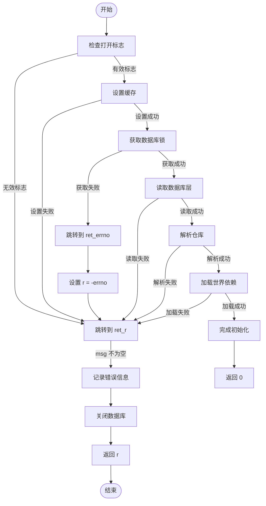

# 数据库打开与加载

<cite>
**本文档中引用的文件**   
- [database.c](file://src/database.c)
- [apk_database.h](file://src/apk_database.h)
- [apk_context.h](file://src/apk_context.h)
- [apk_defines.h](file://src/apk_defines.h)
- [apk_arch.h](file://src/apk_arch.h)
</cite>

## 目录
1. [简介](#简介)
2. [核心执行流程](#核心执行流程)
3. [权限检查与锁机制](#权限检查与锁机制)
4. [缓存设置](#缓存设置)
5. [架构检测与配置](#架构检测与配置)
6. [受保护路径加载](#受保护路径加载)
7. [仓库解析与初始化](#仓库解析与初始化)
8. [数据库层读取](#数据库层读取)
9. [世界依赖加载](#世界依赖加载)
10. [标志位处理](#标志位处理)
11. [错误处理流程](#错误处理流程)

## 简介
`apk_db_open` 函数是 apk-tools 包管理器的核心组件，负责初始化和打开数据库。该函数执行一系列关键操作，包括权限检查、锁机制、缓存设置、架构检测、受保护路径加载、仓库解析和数据库层读取等。本文档深入解析该函数的完整执行流程，详细说明其各个关键步骤和错误处理机制。

## 核心执行流程
`apk_db_open` 函数的执行流程可以分为以下几个主要阶段：
1. **初始化和权限检查**：设置默认的 ACL（访问控制列表），检查打开标志的有效性。
2. **锁机制**：在写模式下获取数据库锁，防止并发写入。
3. **缓存设置**：配置缓存目录和文件描述符。
4. **架构检测与配置**：读取或设置系统架构信息。
5. **受保护路径加载**：加载受保护路径列表，用于文件完整性检查。
6. **仓库解析与初始化**：从命令行、系统配置文件和缓存中合并仓库信息。
7. **数据库层读取**：读取根层和 uvol 层的数据库文件。
8. **世界依赖加载**：解析和加载世界依赖列表。
9. **最终初始化**：完成数据库的最终初始化，设置各种标志位。

**Section sources**
- [database.c](file://src/database.c#L1971-L2160)

## 权限检查与锁机制
### 权限检查
函数首先检查 `open_flags` 是否有效。如果 `open_flags` 为 0，则返回错误。

```c
if (ac->open_flags == 0) {
    msg = "Invalid open flags (internal error)";
    goto ret_r;
}
```

### 锁机制
在写模式下，函数会尝试获取数据库锁。如果锁文件不存在且没有创建标志，则返回错误。如果锁被占用，函数会根据 `lock_wait` 设置等待一段时间。

```c
if (ac->open_flags & APK_OPENF_WRITE) {
    msg = "Unable to lock database";
    db->lock_fd = openat(db->root_fd, apk_lock_file,
                         O_CREAT | O_RDWR | O_CLOEXEC, 0600);
    if (db->lock_fd < 0) {
        if (!(ac->open_flags & APK_OPENF_CREATE))
            goto ret_errno;
    } else if (flock(db->lock_fd, LOCK_EX | LOCK_NB) < 0) {
        struct sigaction sa, old_sa;

        if (!ac->lock_wait) goto ret_errno;

        apk_notice(out, "Waiting for repository lock");
        memset(&sa, 0, sizeof sa);
        sa.sa_handler = handle_alarm;
        sa.sa_flags   = SA_RESETHAND;
        sigaction(SIGALRM, &sa, &old_sa);

        alarm(ac->lock_wait);
        if (flock(db->lock_fd, LOCK_EX) < 0)
            goto ret_errno;

        alarm(0);
        sigaction(SIGALRM, &old_sa, NULL);
    }
}
```

**Section sources**
- [database.c](file://src/database.c#L2026-L2051)

## 缓存设置
函数通过 `setup_cache` 函数配置缓存目录和文件描述符。如果缓存目录不存在且没有设置缓存目录标志，则返回错误。

```c
if (!(db->ctx->flags & APK_NO_CACHE)) {
    if ((r = setup_cache(db)) < 0) {
        msg = "Unable to setup the cache";
        goto ret_r;
    }
}
```

**Section sources**
- [database.c](file://src/database.c#L2068-L2073)

## 架构检测与配置
函数首先检查是否从命令行指定了架构列表。如果有，则使用指定的架构；否则，从 `etc/apk/arch` 文件中读取架构信息。如果没有找到架构信息，则使用默认架构。

```c
if (apk_array_len(ac->arch_list) && (ac->root_set || (ac->open_flags & APK_OPENF_ALLOW_ARCH))) {
    apk_array_foreach_item(arch, ac->arch_list)
        apk_db_add_arch(db, APK_BLOB_STR(arch));
    db->write_arch = ac->root_set;
} else {
    struct apk_istream *is = apk_istream_from_file(db->root_fd, apk_arch_file);
    if (!IS_ERR(is)) apk_db_parse_istream(db, is, apk_db_add_arch);
}
if (apk_array_len(db->arches) == 0) {
    apk_db_add_arch(db, APK_BLOB_STR(APK_DEFAULT_ARCH));
    db->write_arch = 1;
}
```

**Section sources**
- [database.c](file://src/database.c#L2007-L2018)

## 受保护路径加载
函数从 `ac->protected_paths` 流中解析受保护路径，如果没有指定，则使用默认的受保护路径列表。此外，还会从 `etc/apk/protected_paths.d` 目录中加载额外的受保护路径。

```c
if (ac->protected_paths) {
    apk_db_parse_istream(db, ac->protected_paths, apk_db_add_protected_path);
    ac->protected_paths = NULL;
} else {
    apk_db_add_protected_path(db, APK_BLOB_STR("+etc"));
    apk_db_add_protected_path(db, APK_BLOB_STR("@etc/init.d"));
    apk_db_add_protected_path(db, APK_BLOB_STR("!etc/apk"));
    apk_dir_foreach_file(
        db->root_fd, "etc/apk/protected_paths.d",
        add_protected_paths_from_file, db,
        file_not_dot_list);
}
```

**Section sources**
- [database.c](file://src/database.c#L2053-L2064)

## 仓库解析与初始化
函数从命令行、系统配置文件和缓存中合并仓库信息。首先，从命令行参数中解析仓库；然后，从系统配置文件中解析仓库；最后，从缓存中读取已安装的仓库信息。

```c
if (!(ac->open_flags & APK_OPENF_NO_CMDLINE_REPOS)) {
    apk_repoparser_set_file(&db->repoparser, "<command line>");
    apk_array_foreach_item(repo, ac->repository_list)
        apk_repoparser_parse(&db->repoparser, APK_BLOB_STR(repo), false);
    apk_array_foreach_item(config, ac->repository_config_list) {
        apk_blob_foreach_token(line, APK_BLOB_STR(config), APK_BLOB_STRLIT("\n"))
            apk_repoparser_parse(&db->repoparser, line, true);
    }
}

if (!(ac->open_flags & APK_OPENF_NO_SYS_REPOS)) {
    if (ac->repositories_file == NULL) {
        add_repos_from_file(db, db->root_fd, NULL, "etc/apk/repositories");
        apk_dir_foreach_config_file(db->root_fd,
            add_repos_from_file, db,
            file_not_dot_list,
            "etc/apk/repositories.d",
            "lib/apk/repositories.d",
            NULL);
    } else {
        add_repos_from_file(db, AT_FDCWD, NULL, ac->repositories_file);
    }
}
```

**Section sources**
- [database.c](file://src/database.c#L2103-L2125)

## 数据库层读取
函数读取根层和 uvol 层的数据库文件。如果读取失败且不是因为文件不存在或没有创建标志，则返回错误。

```c
if ((db->ctx->open_flags & APK_OPENF_NO_STATE) != APK_OPENF_NO_STATE) {
    for (i = 0; i < APK_DB_LAYER_NUM; i++) {
        r = apk_db_read_layer(db, i);
        if (r) {
            if (i != APK_DB_LAYER_ROOT) continue;
            if (!(r == -ENOENT && (ac->open_flags & APK_OPENF_CREATE))) {
                msg = "Unable to read database";
                goto ret_r;
            }
        }
        db->active_layers |= BIT(i);
    }
} else {
    // Allow applets that use solver without state (fetch) to work correctly
    db->active_layers = ~0;
}
```

**Section sources**
- [database.c](file://src/database.c#L2080-L2095)

## 世界依赖加载
函数从 `world` 文件中读取世界依赖列表，并解析这些依赖。世界依赖列表包含了用户显式安装的包。

```c
if (!(flags & APK_OPENF_NO_WORLD)) {
    if (layer == APK_DB_LAYER_ROOT)
        ret = apk_blob_from_file(db->root_fd, apk_world_file, &world);
    else
        ret = apk_blob_from_file(fd, "world", &world);

    if (!ret) {
        blob = apk_blob_trim(world);
        ret = apk_blob_pull_deps(&blob, db, &db->world, true);
        free(world.ptr);
    } else if (layer == APK_DB_LAYER_ROOT) {
        ret = -ENOENT;
    }
}
```

**Section sources**
- [database.c](file://src/database.c#L1302-L1350)

## 标志位处理
函数处理多种标志位，包括用户模式、自动更新、只读安装等。这些标志位影响数据库的打开方式和行为。

- **用户模式**：如果设置了 `APK_OPENF_USERMODE` 标志，则启用用户模式，禁用 chown、系统 xattrs 和设备文件。
- **自动更新**：如果设置了写标志且没有禁用自动更新，则启用自动更新。
- **只读安装**：如果设置了 `APK_OPENF_NO_INSTALLED` 标志，则不读取已安装的包信息。

```c
db->usermode = !!(ac->open_flags & APK_OPENF_USERMODE);
if (db->usermode) db->extract_flags |= APK_FSEXTRACTF_NO_CHOWN | APK_FSEXTRACTF_NO_SYS_XATTRS | APK_FSEXTRACTF_NO_DEVICES;

if ((ac->open_flags & APK_OPENF_WRITE) &&
    !(ac->open_flags & APK_OPENF_NO_AUTOUPDATE) &&
    !(ac->flags & APK_NO_NETWORK))
    db->autoupdate = 1;
```

**Section sources**
- [database.c](file://src/database.c#L1994-L2003)

## 错误处理流程
函数使用 `goto` 语句进行错误处理，确保在发生错误时能够正确清理资源并返回错误码。主要的错误处理分支包括 `ret_errno` 和 `ret_r`。



**Diagram sources**
- [database.c](file://src/database.c#L1971-L2160)

**Section sources**
- [database.c](file://src/database.c#L1971-L2160)