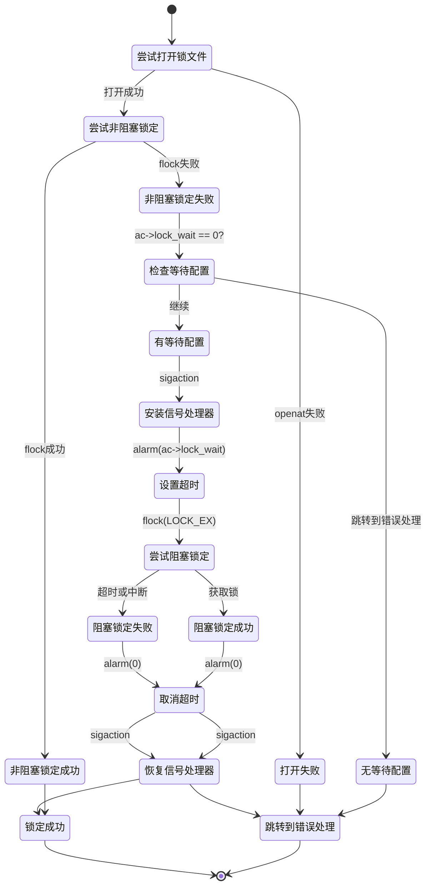

# 数据库锁机制

<cite>
**本文档引用的文件**
- [database.c](file://src/database.c)
- [apk_database.h](file://src/apk_database.h)
</cite>

## 目录
1. [简介](#简介)
2. [锁机制实现](#锁机制实现)
3. [超时等待与信号处理](#超时等待与信号处理)
4. [状态转换图](#状态转换图)
5. [错误处理策略](#错误处理策略)

## 简介
`apk_db_open`函数在APK包管理器中负责打开数据库并确保其一致性。当以写模式打开数据库时，该函数通过文件锁机制防止多个进程同时修改数据库。本文档详细解析该锁机制的实现，包括独占性锁定、非阻塞尝试、超时等待及信号处理。

**Section sources**
- [database.c](file://src/database.c#L1971-L2160)

## 锁机制实现
当`APK_OPENF_WRITE`标志被启用时，`apk_db_open`函数会尝试对`apk_lock_file`进行独占性锁定。首先，函数使用`openat`系统调用在数据库根目录下打开或创建锁文件，权限设置为0600。如果文件描述符有效，函数接着调用`flock`系统调用，传入`LOCK_EX | LOCK_NB`参数，尝试以非阻塞方式获取独占锁。

```c
db->lock_fd = openat(db->root_fd, apk_lock_file, O_CREAT | O_RDWR | O_CLOEXEC, 0600);
if (db->lock_fd < 0) {
    if (!(ac->open_flags & APK_OPENF_CREATE))
        goto ret_errno;
} else if (flock(db->lock_fd, LOCK_EX | LOCK_NB) < 0) {
    // 处理非阻塞锁定失败
}
```

如果非阻塞锁定尝试失败（`flock`返回-1），函数会检查`ac->lock_wait`配置。若未配置等待时间，则直接跳转到错误处理。否则，进入超时等待流程。

**Section sources**
- [database.c](file://src/database.c#L2026-L2033)

## 超时等待与信号处理
当非阻塞锁定失败且配置了`lock_wait`时，函数会安装一个SIGALRM信号处理器，并使用`alarm`系统调用设置超时。具体步骤如下：

1. **安装信号处理器**：函数创建`sigaction`结构体，将`sa_handler`设置为`handle_alarm`，`sa_flags`设置为`SA_RESETHAND`，然后调用`sigaction`保存旧的信号处理器并安装新的处理器。
2. **设置超时**：调用`alarm(ac->lock_wait)`启动定时器。
3. **阻塞锁定**：再次调用`flock(db->lock_fd, LOCK_EX)`，这次是阻塞调用，直到获取锁或超时。
4. **清理**：成功获取锁后，调用`alarm(0)`取消定时器，并通过`sigaction`恢复旧的信号处理器。

```c
struct sigaction sa, old_sa;
if (!ac->lock_wait) goto ret_errno;
apk_notice(out, "Waiting for repository lock");
memset(&sa, 0, sizeof sa);
sa.sa_handler = handle_alarm;
sa.sa_flags   = SA_RESETHAND;
sigaction(SIGALRM, &sa, &old_sa);
alarm(ac->lock_wait);
if (flock(db->lock_fd, LOCK_EX) < 0)
    goto ret_errno;
alarm(0);
sigaction(SIGALRM, &old_sa, NULL);
```

`handle_alarm`函数是一个空函数，其作用仅仅是中断`flock`的阻塞调用，使程序能够检查超时并返回错误。

**Section sources**
- [database.c](file://src/database.c#L2034-L2049)
- [database.c](file://src/database.c#L1431-L1433)

## 状态转换图
以下状态转换图展示了从尝试锁定到成功或超时失败的完整流程。



**Diagram sources**
- [database.c](file://src/database.c#L2026-L2050)

## 错误处理策略
在不同错误场景下，函数采用不同的错误码返回策略：
- 如果`openat`调用失败且`APK_OPENF_CREATE`标志未设置，则返回`-errno`。
- 如果非阻塞`flock`失败且`lock_wait`未配置，同样返回`-errno`。
- 如果阻塞`flock`在超时后失败，也返回`-errno`。
- 所有错误信息通过`apk_err`函数输出，最终调用`apk_db_close`清理资源并返回错误码。

**Section sources**
- [database.c](file://src/database.c#L2153-L2159)