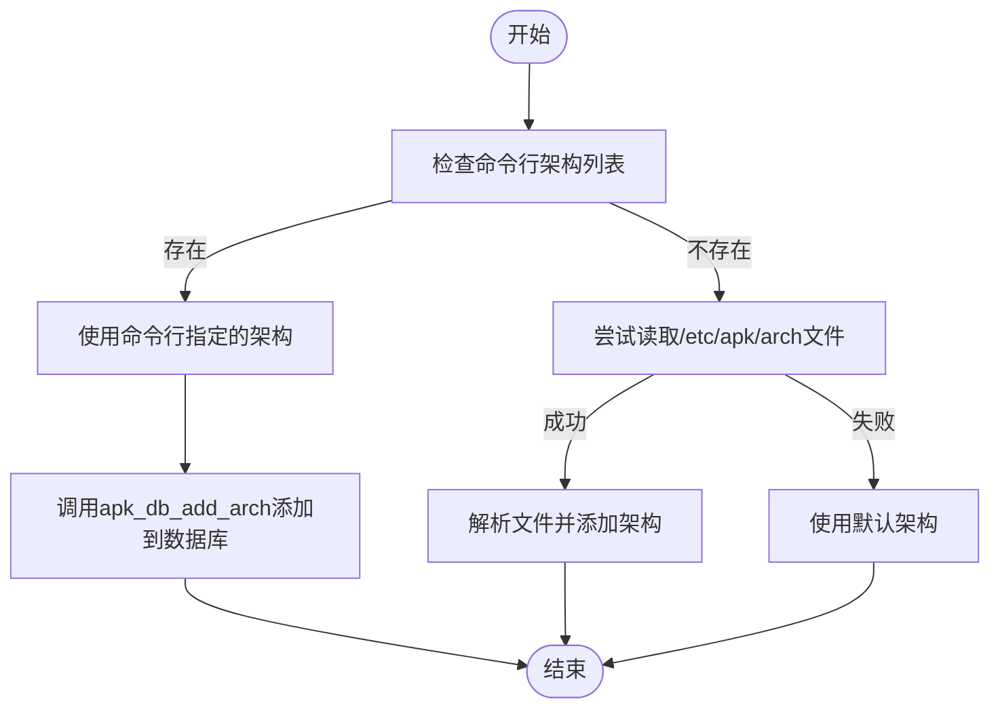
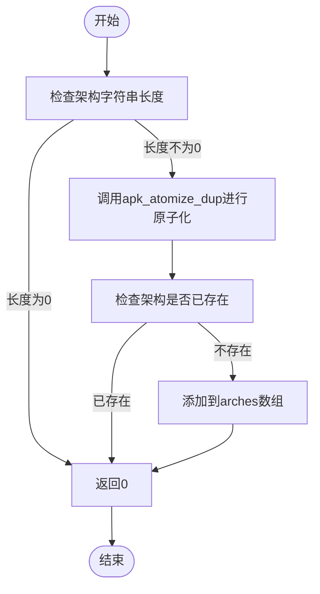
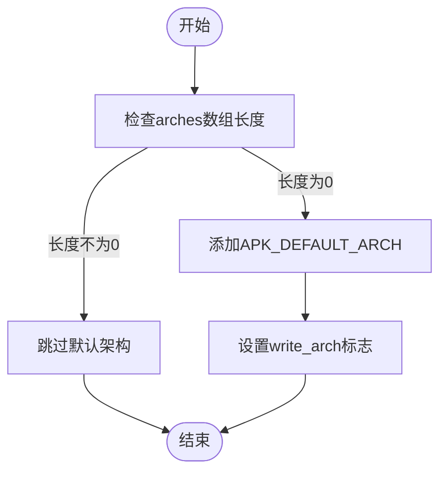
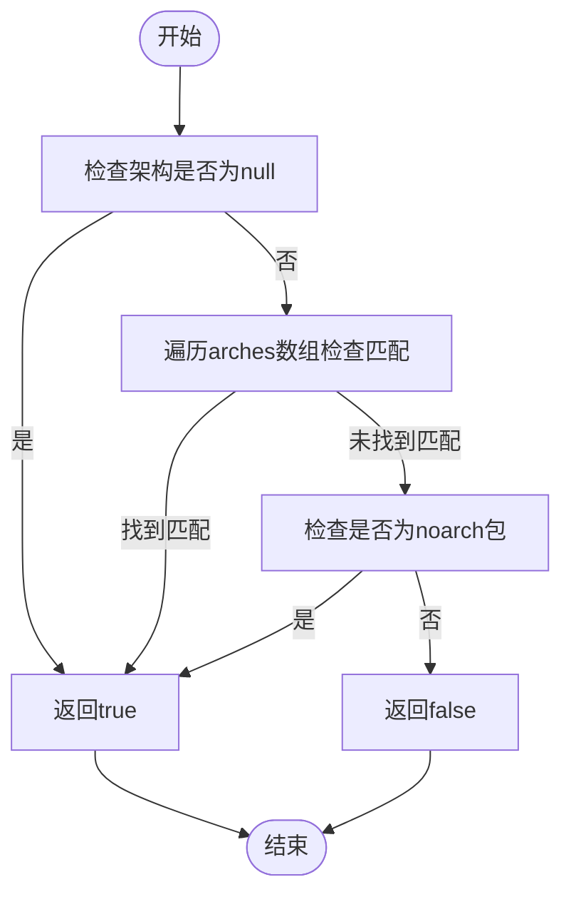
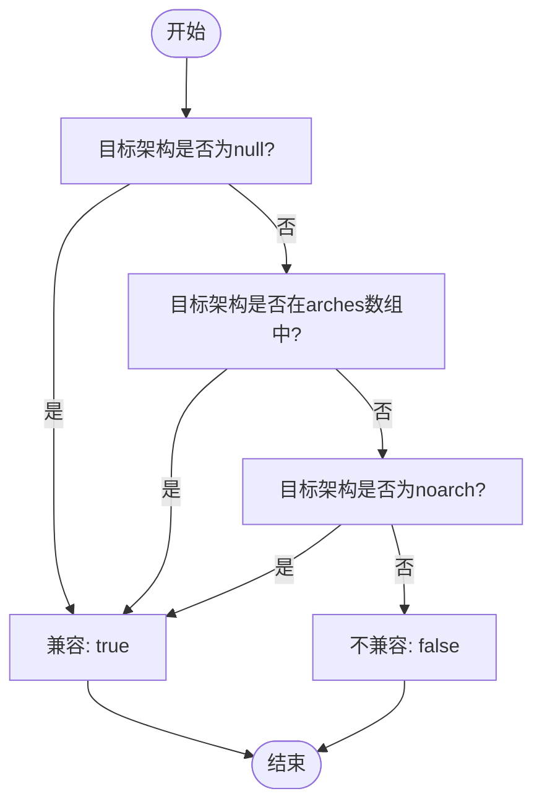

# 架构与兼容性管理

<cite>
**Referenced Files in This Document**   
- [database.c](file://src/database.c)
- [apk_arch.h](file://src/apk_arch.h)
- [atom.c](file://src/atom.c)
</cite>

## 目录
1. [架构加载机制](#架构加载机制)
2. [架构字符串唯一性存储](#架构字符串唯一性存储)
3. [默认架构处理逻辑](#默认架构处理逻辑)
4. [架构兼容性检查](#架构兼容性检查)
5. [架构匹配决策树](#架构匹配决策树)

## 架构加载机制

`apk_db_open`函数负责初始化数据库并加载系统架构信息。该函数首先检查命令行参数中是否指定了架构列表。如果`ac->arch_list`不为空且满足`ac->root_set`或`APK_OPENF_ALLOW_ARCH`标志，则优先使用命令行指定的架构列表。

**Diagram sources**
- [database.c](file://src/database.c#L2007-L2014)

**Section sources**
- [database.c](file://src/database.c#L1972-L2160)

## 架构字符串唯一性存储

`apk_db_add_arch`函数负责将架构字符串添加到数据库的`arches`数组中。该函数使用`apk_atomize_dup`函数确保架构字符串的唯一性存储。首先，函数检查架构字符串长度是否为0，若为0则直接返回。然后，通过`apk_atomize_dup`函数对架构字符串进行原子化处理，确保相同的架构字符串在内存中只有一份副本。

**Diagram sources**
- [database.c](file://src/database.c#L539-L549)
- [atom.c](file://src/atom.c#L42-L59)

**Section sources**
- [database.c](file://src/database.c#L539-L549)

## 默认架构处理逻辑

当系统中没有检测到任何架构时，会使用默认架构`APK_DEFAULT_ARCH`。在`apk_db_open`函数中，通过检查`db->arches`数组的长度来判断是否已加载任何架构。如果长度为0，则调用`apk_db_add_arch`函数添加默认架构。

`APK_DEFAULT_ARCH`的定义位于`apk_arch.h`文件中，其值根据编译时的系统架构自动确定。例如，在x86_64系统上，`APK_DEFAULT_BASE_ARCH`被定义为"x86_64"，最终`APK_DEFAULT_ARCH`也等于"x86_64"。这种设计确保了在没有明确指定架构的情况下，系统能够使用与当前硬件匹配的默认架构。

**Diagram sources**
- [database.c](file://src/database.c#L2015-L2018)
- [apk_arch.h](file://src/apk_arch.h#L62-L68)

**Section sources**
- [database.c](file://src/database.c#L2015-L2018)
- [apk_arch.h](file://src/apk_arch.h#L62-L68)

## 架构兼容性检查

`apk_db_arch_compatible`函数负责检查目标软件包的架构是否与系统支持的架构列表匹配。该函数首先检查目标架构是否为`apk_atom_null`，如果是，则认为兼容并返回true。然后，函数遍历数据库中的`arches`数组，检查是否存在完全匹配的架构。如果找到匹配项，则返回true。

对于特殊架构`noarch`，函数会检查`db->noarch`是否与目标架构相等。`noarch`包是架构无关的软件包，可以在任何架构的系统上安装。这种设计允许系统灵活地处理通用软件包和特定架构软件包的兼容性问题。

**Diagram sources**
- [database.c](file://src/database.c#L551-L557)

**Section sources**
- [database.c](file://src/database.c#L551-L557)

## 架构匹配决策树

以下是架构匹配的完整决策树，展示了不同匹配场景下的返回结果：

该决策树清晰地展示了架构兼容性检查的逻辑流程。首先检查架构是否为null，这是最简单的情况。然后检查架构是否在支持的架构列表中，这是最常见的匹配场景。最后检查是否为`noarch`包，这提供了对架构无关软件包的支持。只有当所有检查都失败时，才判定为不兼容。

**Diagram sources**
- [database.c](file://src/database.c#L551-L557)

**Section sources**
- [database.c](file://src/database.c#L551-L557)