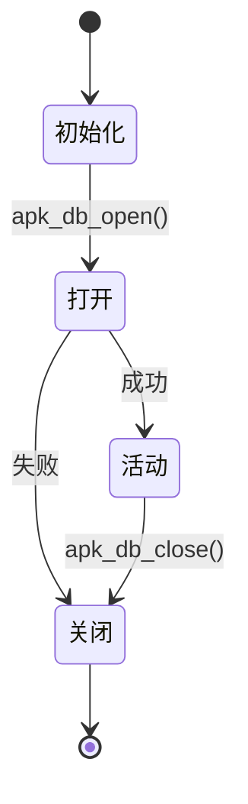
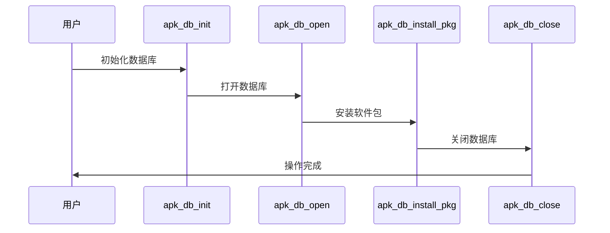

# 数据库核心

<cite>
**Referenced Files in This Document**   
- [apk_database.h](file://src/apk_database.h)
- [database.c](file://src/database.c)
</cite>

## 目录
1. [引言](#引言)
2. [数据库结构设计](#数据库结构设计)
3. [数据库初始化与生命周期](#数据库初始化与生命周期)
4. [软件包管理机制](#软件包管理机制)
5. [依赖关系处理](#依赖关系处理)
6. [事务性操作](#事务性操作)
7. [数据库状态转换图](#数据库状态转换图)
8. [核心函数调用流程图](#核心函数调用流程图)

## 引言
apk-tools 是一个用于管理 Alpine Linux 软件包的工具集，其核心功能依赖于一个精心设计的数据库系统。该数据库不仅存储了已安装和可用软件包的信息，还负责处理依赖关系、事务性操作以及世界依赖（world dependencies）。本文档旨在深入解析 apk-tools 的数据库核心架构，详细说明其数据结构、初始化流程、软件包管理机制以及事务性操作，帮助开发者和用户更好地理解和使用该工具。

## 数据库结构设计
apk-tools 的数据库核心结构由 `struct apk_database` 定义，该结构体包含了多个关键字段，用于管理软件包、依赖关系、文件系统状态等信息。以下是主要字段的详细说明：

- **ctx**: 指向 `struct apk_ctx` 的指针，表示数据库的上下文环境。
- **ba_names**: 用于管理软件包名称的块分配器。
- **ba_pkgs**: 用于管理软件包信息的块分配器。
- **ba_files**: 用于管理文件信息的块分配器。
- **ba_deps**: 用于管理依赖关系的块分配器。
- **root_fd**: 根文件系统的文件描述符。
- **num_repos**: 可用软件仓库的数量。
- **world**: 表示世界依赖关系的数组，记录了用户显式安装的软件包及其依赖。
- **installed**: 包含已安装软件包的哈希表，用于快速查找和管理。
- **available**: 包含可用软件包的哈希表，用于查询和安装。

这些字段共同构成了 apk-tools 数据库的核心，确保了软件包管理的高效性和一致性。

**Section sources**
- [apk_database.h](file://src/apk_database.h#L181-L251)

## 数据库初始化与生命周期
数据库的生命周期包括初始化、打开和关闭三个主要阶段。每个阶段都有特定的函数负责执行相应的操作，确保数据库的正确性和完整性。

### 初始化
`apk_db_init` 函数负责初始化 `struct apk_database` 结构体。该函数首先将结构体清零，然后初始化各个字段，包括块分配器、哈希表、原子池等。具体步骤如下：

1. 将 `db` 结构体清零。
2. 设置 `ctx` 字段。
3. 初始化 `ba_names`、`ba_pkgs`、`ba_files` 和 `ba_deps` 块分配器。
4. 初始化 `available.names`、`available.packages`、`installed.dirs` 和 `installed.files` 哈希表。
5. 初始化 `atoms` 原子池。
6. 初始化 `world` 依赖关系数组。
7. 初始化 `overlay_tmpl` 软件包模板。
8. 初始化 `ic.diris`、`ic.files` 和 `ic.ppaths` 数组。
9. 初始化 `protected_paths` 保护路径数组。
10. 初始化 `filename_array` 文件名数组。
11. 初始化 `arches` 架构数组。
12. 初始化 `available.sorted_names` 排序后的名称数组。
13. 初始化 `installed.sorted_packages` 排序后的软件包数组。
14. 初始化 `repoparser` 仓库解析器。
15. 设置 `permanent` 标志为 1。
16. 设置 `root_fd` 为 -1。
17. 设置 `noarch` 为 "noarch"。

### 打开
`apk_db_open` 函数负责打开数据库并加载必要的数据。该函数首先检查打开标志，然后设置默认的 ACL（访问控制列表），检测是否需要自动更新，设置缓存仓库，获取根文件描述符，检测是否为临时文件系统，设置用户模式，初始化缓存，读取覆盖层，读取各层数据，加载命令行和系统仓库，打开仓库，更新缓存，计算反向依赖，标记缓存中的软件包，最后设置 `open_complete` 标志。

### 关闭
`apk_db_close` 函数负责关闭数据库并释放所有资源。该函数首先卸载所有已安装的软件包，然后释放 `protected_paths`、`arches`、`filename_array`、`overlay_tmpl`、`ic.diris`、`ic.files`、`ic.ppaths` 和 `world` 数组，释放 `repoparser` 仓库解析器，释放 `available.sorted_names` 和 `installed.sorted_packages` 数组，释放 `available.packages`、`available.names`、`installed.files` 和 `installed.dirs` 哈希表，释放 `atoms` 原子池，销毁 `ba_names`、`ba_pkgs`、`ba_files` 和 `ba_deps` 块分配器，卸载缓存，关闭 `cache_fd` 和 `lock_fd` 文件描述符。

**Section sources**
- [database.c](file://src/database.c#L1940-L1969)
- [database.c](file://src/database.c#L1971-L2160)
- [database.c](file://src/database.c#L2287-L2319)

## 软件包管理机制
apk-tools 使用哈希表来管理已安装和可用软件包。`installed` 哈希表存储了已安装软件包的信息，而 `available` 哈希表存储了可用软件包的信息。这些哈希表通过 `apk_hash_init` 函数初始化，并通过 `apk_hash_insert` 和 `apk_hash_get` 函数进行插入和查找操作。

### 已安装软件包
`installed` 哈希表包含以下字段：
- **packages**: 已安装软件包的链表。
- **triggers**: 触发器链表。
- **dirs**: 目录哈希表。
- **files**: 文件哈希表。
- **stats**: 统计信息，包括字节数、文件数、目录数和软件包数。

### 可用软件包
`available` 哈希表包含以下字段：
- **sorted_names**: 排序后的名称数组。
- **names**: 名称哈希表。
- **packages**: 软件包哈希表。

这些哈希表确保了软件包管理的高效性和一致性。

**Section sources**
- [apk_database.h](file://src/apk_database.h#L233-L251)
- [apk_database.h](file://src/apk_database.h#L229-L232)

## 依赖关系处理
apk-tools 通过 `world` 数组和 `rdepends` 字段来处理依赖关系。`world` 数组记录了用户显式安装的软件包及其依赖，而 `rdepends` 字段记录了每个软件包的反向依赖。

### 世界依赖
`world` 数组通过 `apk_dependency_array_init` 函数初始化，并通过 `apk_blob_pull_deps` 函数从文件中读取依赖关系。当用户安装或删除软件包时，`world` 数组会相应地更新。

### 反向依赖
`rdepends` 字段通过 `apk_db_pkg_rdepends` 函数计算。该函数遍历每个软件包的依赖关系，将依赖的软件包添加到 `rdepends` 数组中。这样，当一个软件包被删除时，可以快速找到所有依赖它的软件包。

**Section sources**
- [database.c](file://src/database.c#L509-L522)
- [database.c](file://src/database.c#L1377-L1416)

## 事务性操作
apk-tools 通过事务性操作确保数据的一致性。安装、更新和删除软件包时，数据库会执行一系列原子操作，确保所有更改要么全部成功，要么全部失败。

### 安装
`apk_db_install_pkg` 函数负责安装软件包。该函数首先创建一个 `install_ctx` 上下文，然后调用 `apk_db_unpack_pkg` 函数解压软件包，调用 `apk_db_migrate_files` 函数迁移文件，最后调用 `apk_ipkg_run_script` 函数执行安装脚本。

### 更新
更新操作实际上是先删除旧版本，再安装新版本。`apk_db_install_pkg` 函数会检查 `oldpkg` 和 `newpkg` 是否相同，如果不同，则先调用 `apk_db_purge_pkg` 函数删除旧版本，再调用 `apk_db_unpack_pkg` 函数安装新版本。

### 删除
`apk_db_purge_pkg` 函数负责删除软件包。该函数首先检查 `fileids` 数组，如果存在，则对文件进行排序。然后遍历 `ipkg->diris` 数组，删除每个目录实例中的文件，最后调用 `apk_db_diri_remove` 函数移除目录实例。

**Section sources**
- [database.c](file://src/database.c#L3157-L3229)
- [database.c](file://src/database.c#L2938-L2981)
- [database.c](file://src/database.c#L3087-L3093)

## 数据库状态转换图

**Diagram sources**
- [database.c](file://src/database.c#L1940-L1969)
- [database.c](file://src/database.c#L1971-L2160)
- [database.c](file://src/database.c#L2287-L2319)

## 核心函数调用流程图

**Diagram sources**
- [database.c](file://src/database.c#L1940-L1969)
- [database.c](file://src/database.c#L1971-L2160)
- [database.c](file://src/database.c#L3157-L3229)
- [database.c](file://src/database.c#L2287-L2319)