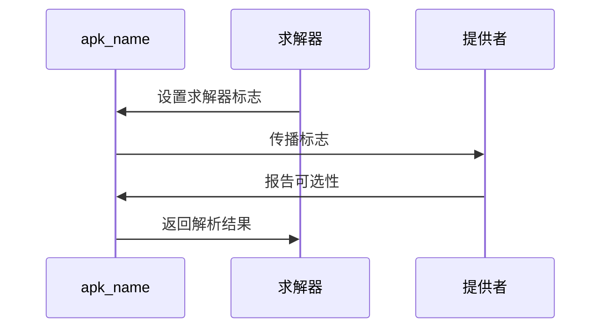
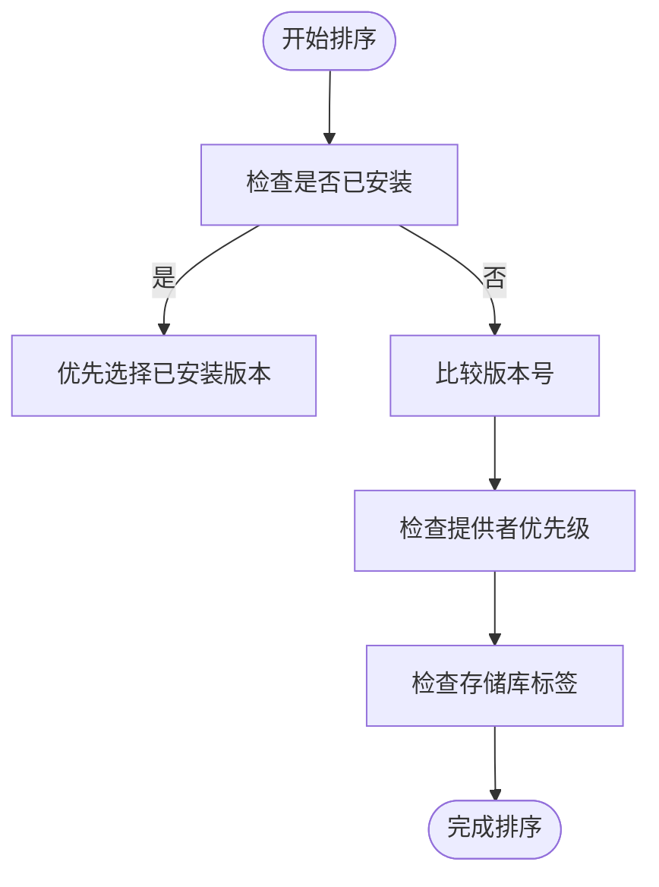
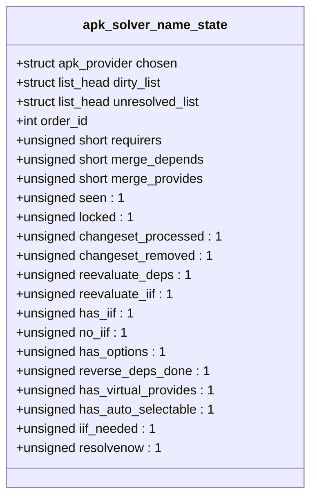
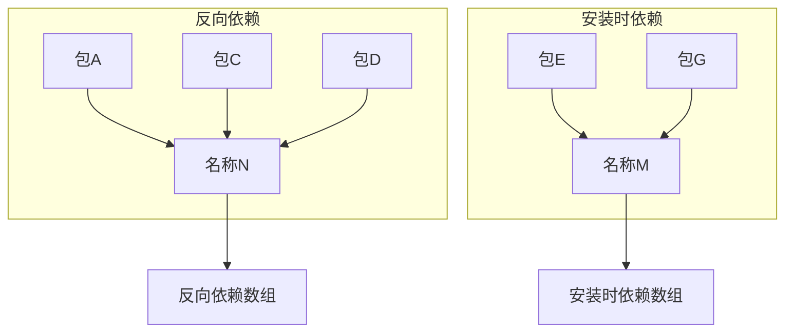
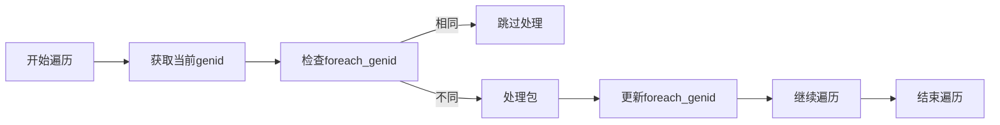

# 名称实体与依赖网络

<cite>
**本文档引用的文件**   
- [apk_database.h](file://src/apk_database.h)
- [apk_solver.h](file://src/apk_solver.h)
- [solver.c](file://src/solver.c)
- [database.c](file://src/database.c)
</cite>

## 目录
1. [引言](#引言)
2. [核心数据结构分析](#核心数据结构分析)
3. [依赖解析机制](#依赖解析机制)
4. [提供者排序逻辑](#提供者排序逻辑)
5. [求解器状态管理](#求解器状态管理)
6. [反向依赖维护](#反向依赖维护)
7. [遍历优化机制](#遍历优化机制)
8. [结论](#结论)

## 引言
本文档深入分析apk-tools项目中`apk_name`结构体的设计与实现，重点阐述其在软件包依赖解析系统中的核心作用。该结构体作为软件包逻辑名称的唯一标识符，通过复杂的关联机制维护着整个依赖网络的完整性与一致性。

## 核心数据结构分析
`apk_name`结构体是apk包管理系统中用于表示软件包逻辑名称的核心数据结构。它不仅存储名称字符串，还通过指针数组关联多个实际包版本，并维护反向依赖链。

```mermaid
classDiagram
class apk_name {
+apk_hash_node hash_node
+struct apk_provider_array *providers
+struct apk_name_array *rdepends
+struct apk_name_array *rinstall_if
+unsigned is_dependency : 1
+unsigned solver_flags_set : 1
+unsigned providers_sorted : 1
+unsigned has_repository_providers : 1
+unsigned int foreach_genid
+union {
struct apk_solver_name_state ss
unsigned long state_buf[4]
int state_int
}
+char name[]
}
```

**Diagram sources**
- [apk_database.h](file://src/apk_database.h#L120-L136)

**Section sources**
- [apk_database.h](file://src/apk_database.h#L120-L136)

## 依赖解析机制
`apk_name`结构体通过`providers`数组关联多个实际包版本，形成"一个名称，多个提供者"的映射关系。`rdepends`和`rinstall_if`数组则分别维护了反向依赖和安装时依赖的反向引用链。

`is_dependency`标志位用于标识该名称是否为依赖项，而`solver_flags_set`标志位则指示求解器标志是否已设置，这两个位字段在依赖解析过程中起着关键的语义作用。



**Diagram sources**
- [apk_database.h](file://src/apk_database.h#L123-L126)
- [apk_solver.h](file://src/apk_solver.h#L37-L39)

**Section sources**
- [apk_database.h](file://src/apk_database.h#L120-L136)
- [solver.c](file://src/solver.c#L50-L62)

## 提供者排序逻辑
`apk_name_sorted_providers`函数负责对提供者数组进行排序，确保在依赖解析过程中能够按照优先级选择最合适的包版本。该函数通过比较提供者的各种属性（如版本号、优先级、安装状态等）来确定排序顺序。

排序逻辑考虑了多个因素，包括：是否为已安装包、版本号大小、提供者优先级、存储库标签等，确保系统能够智能地选择最优的软件包版本。



**Diagram sources**
- [database.c](file://src/database.c#L195-L202)
- [solver.c](file://src/solver.c#L534-L685)

**Section sources**
- [database.c](file://src/database.c#L195-L202)

## 求解器状态管理
`apk_name`结构体中的`ss`联合体用于存储求解器状态，该状态在依赖解析过程中动态变化。`ss`联合体包含多种状态信息，如已选择的提供者、依赖关系计数、重评估标志等。

求解器通过`apk_solver_set_name_flags`函数设置名称的求解器标志，这些标志在解析过程中影响包的选择策略。`solver_flags_set`标志位确保标志只被设置一次，避免重复设置导致的状态混乱。



**Diagram sources**
- [apk_solver_data.h](file://src/apk_solver_data.h#L15-L44)

**Section sources**
- [apk_solver_data.h](file://src/apk_solver_data.h#L15-L44)
- [solver.c](file://src/solver.c#L381-L531)

## 反向依赖维护
`rdepends`和`rinstall_if`数组构成了反向依赖网络的基础。当一个包依赖某个名称时，该包的名称会被添加到被依赖名称的`rdepends`数组中。同样，当一个包的`install_if`条件包含某个名称时，该包的名称会被添加到该名称的`rinstall_if`数组中。

这种反向引用机制使得系统能够高效地追踪依赖关系的变化，当某个包的状态改变时，可以快速找到所有受影响的依赖项并进行相应的处理。



**Diagram sources**
- [apk_database.h](file://src/apk_database.h#L123-L124)
- [database.c](file://src/database.c#L508-L521)

**Section sources**
- [database.c](file://src/database.c#L508-L521)

## 遍历优化机制
`foreach_genid`字段用于防止在遍历过程中出现重复处理的问题。该字段作为一个生成ID，在每次遍历操作前递增，确保每个包在单次遍历中只被处理一次。

这种优化机制避免了在复杂的依赖网络中可能出现的无限循环或重复处理问题，提高了系统的性能和稳定性。当需要遍历某个名称的所有相关包时，系统会检查`foreach_genid`字段，只有当该字段与当前遍历ID不同时才进行处理。



**Diagram sources**
- [apk_database.h](file://src/apk_database.h#L129)
- [apk_package.h](file://src/apk_package.h#L190-L191)

**Section sources**
- [apk_database.h](file://src/apk_database.h#L129)
- [apk_package.h](file://src/apk_package.h#L190-L191)

## 结论
`apk_name`结构体作为apk包管理系统的核心组件，通过精心设计的数据结构和算法实现了高效的依赖解析功能。其提供的唯一标识、反向依赖维护、状态管理和遍历优化等机制，共同构成了一个健壮、高效的包管理基础架构。

该结构体的设计体现了模块化、可扩展和高性能的设计原则，为apk工具的稳定运行提供了坚实的基础。理解`apk_name`的工作原理对于深入掌握apk包管理系统的内部机制具有重要意义。