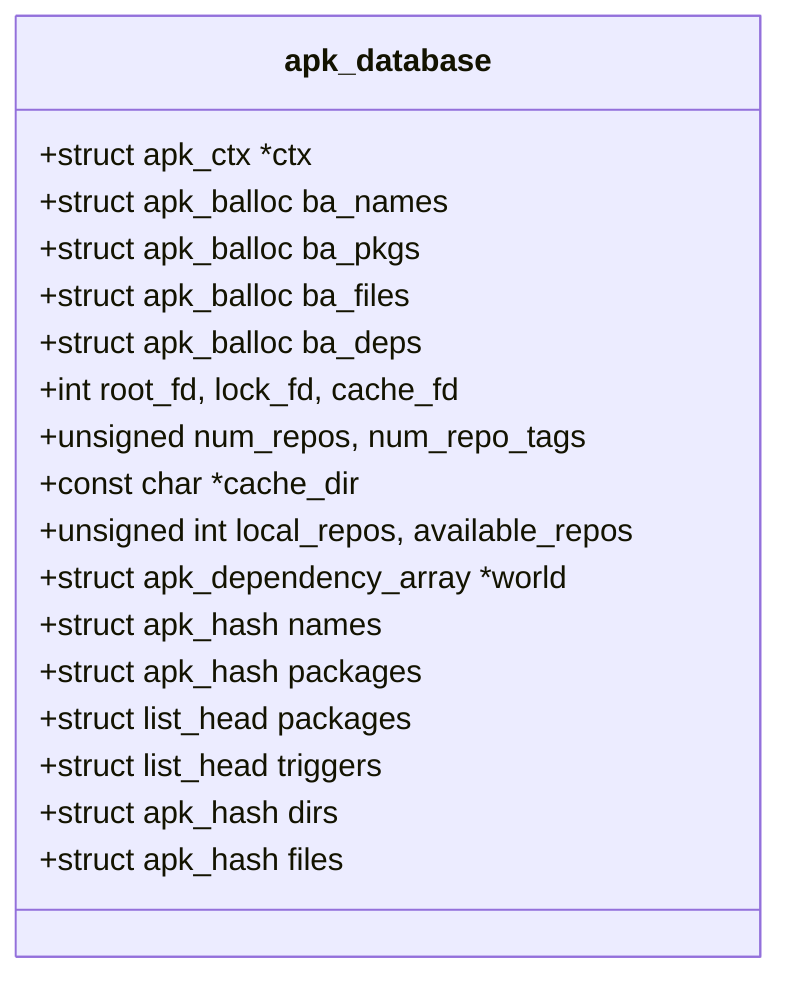
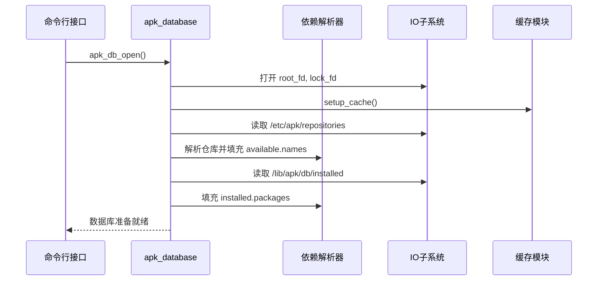

# 数据库核心结构

<cite>
**Referenced Files in This Document**   
- [apk_database.h](file://src/apk_database.h)
- [database.c](file://src/database.c)
- [apk_defines.h](file://src/apk_defines.h)
</cite>

## 目录
1. [引言](#引言)
2. [核心结构体设计](#核心结构体设计)
3. [系统角色与职责](#系统角色与职责)
4. [子系统协调机制](#子系统协调机制)
5. [设计约束与扩展性](#设计约束与扩展性)
6. [系统上下文图](#系统上下文图)

## 引言
`apk_database` 结构体是 Alpine Package Keeper (APK) 软件包管理系统的核心数据容器。它不仅管理着已安装和可用软件包的元数据，还协调着依赖解析、包安装、缓存管理和安全验证等多个子系统。本文档将深入分析该结构体的整体设计，详细说明其作为系统核心的职责与交互关系。

## 核心结构体设计
`apk_database` 结构体是一个复杂的聚合体，集成了上下文管理、内存分配池、文件描述符、仓库元数据以及命名空间划分等关键组件。



**Diagram sources**
- [apk_database.h](file://src/apk_database.h#L181-L251)

**Section sources**
- [apk_database.h](file://src/apk_database.h#L181-L251)

## 系统角色与职责
`apk_database` 作为系统的核心，承担着多重关键职责：

1.  **上下文管理 (ctx)**: 通过 `ctx` 字段 (`struct apk_ctx *ctx`) 与外部环境交互，管理输出、错误、配置标志和文件系统根目录等全局状态。
2.  **内存分配池 (ba_*系列)**: 使用 `ba_names`, `ba_pkgs`, `ba_files`, `ba_deps` 四个 `struct apk_balloc` 类型的内存池，为名称、包、文件和依赖项等对象提供高效、连续的内存分配，减少内存碎片。
3.  **文件描述符管理**: 通过 `root_fd`, `lock_fd`, `cache_fd` 三个文件描述符，分别管理对根文件系统的访问、数据库锁文件和包缓存目录的访问。
4.  **仓库元数据管理**: `num_repos` 和 `num_repo_tags` 字段记录了远程仓库和标签的数量。`local_repos` 和 `available_repos` 位掩码用于标识本地和可用的仓库，是包选择和依赖解析的基础。
5.  **命名空间划分**: 结构体通过 `available` 和 `installed` 两个匿名子结构体清晰地划分了两个核心命名空间：
    *   **available 命名空间**: 包含从远程仓库索引中读取的可用软件包信息，由 `names` 和 `packages` 哈希表管理。
    *   **installed 命名空间**: 包含当前系统上已安装的软件包及其文件、目录信息，由 `packages` 链表、`dirs` 和 `files` 哈希表管理。

**Section sources**
- [apk_database.h](file://src/apk_database.h#L181-L251)

## 子系统协调机制
`apk_database` 结构体通过其丰富的 API 函数，协调多个子系统的运作：

*   **依赖解析与包安装**: `apk_db_install_pkg` 函数是包安装的核心，它协调了脚本执行 (`apk_db_run_script`)、文件解压 (`apk_db_unpack_pkg`) 和触发器管理 (`apk_db_fire_triggers`) 等操作。
*   **缓存管理**: `apk_db_cache_active` 函数检查缓存是否激活，`apk_cache_download` 函数负责从远程仓库下载包并缓存到本地。
*   **安全验证**: 在安装过程中，`apk_db_install_file` 函数会验证文件的完整性，并通过 `apk_db_acl_atomize_digest` 等函数管理访问控制列表 (ACL) 来确保文件权限的安全。
*   **查询与查找**: 提供了 `apk_db_get_name`, `apk_db_get_pkg_by_name`, `apk_db_get_file_owner` 等一系列查找函数，用于在 `available` 和 `installed` 命名空间中快速定位数据。



**Diagram sources**
- [database.c](file://src/database.c#L1971-L2160)
- [database.c](file://src/database.c#L3157-L3229)
- [database.c](file://src/database.c#L671-L714)

**Section sources**
- [database.c](file://src/database.c#L1971-L2160)
- [database.c](file://src/database.c#L3157-L3229)

## 设计约束与扩展性
该结构体的设计通过宏定义明确了其扩展性边界：

*   **APK_MAX_REPOS**: 定义在 `src/apk_defines.h` 中，值为 32。这限制了系统最多可以管理 32 个远程仓库，该值直接决定了 `repos[APK_MAX_REPOS]` 数组的大小。
*   **APK_REPO_DB_INSTALLED**: 定义在 `src/apk_database.h` 中，值为 -1。这是一个特殊的仓库标识符，用于表示已安装的软件包，与远程仓库 (`repos[]`) 和缓存仓库 (`cache_repository`) 相区分。这种设计允许系统统一处理不同来源的包。

这些宏定义确保了数据结构的大小是固定的，便于内存管理和性能优化，同时也为未来的扩展（如增加仓库数量）提供了清晰的修改点。

**Section sources**
- [apk_defines.h](file://src/apk_defines.h#L140-L141)
- [apk_database.h](file://src/apk_database.h#L160-L161)

## 系统上下文图
下图展示了 `apk_database` 与系统其他主要组件的交互关系。

```mermaid
graph TD
subgraph "外部接口"
CLI[命令行接口]
Plugin[插件]
end
subgraph "核心数据库"
DB[apk_database]
end
subgraph "子系统"
IO[IO子系统<br>(文件/网络)]
Crypto[加密模块]
Solver[依赖解析器]
Cache[缓存管理]
end
CLI --> DB
Plugin --> DB
DB --> IO
DB --> Crypto
DB --> Solver
DB --> Cache
IO --> DB
Crypto --> DB
Solver --> DB
Cache --> DB
```

**Diagram sources**
- [apk_database.h](file://src/apk_database.h#L181-L251)
- [database.c](file://src/database.c)

**Section sources**
- [apk_database.h](file://src/apk_database.h#L181-L251)
- [database.c](file://src/database.c)