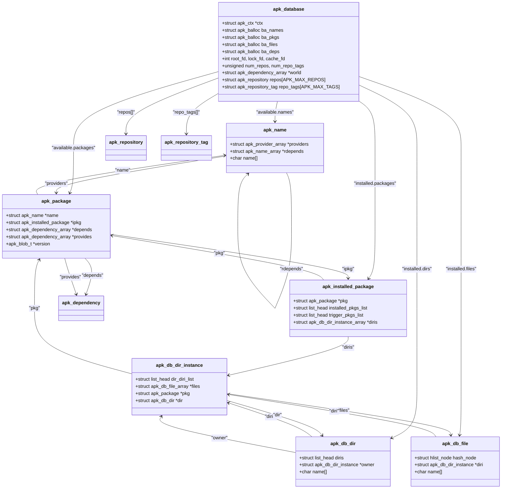

# 数据模型与核心结构

<cite>
**本文档引用的文件**   
- [apk_database.h](file://src/apk_database.h)
- [database.c](file://src/database.c)
- [apk_package.h](file://src/apk_package.h)
</cite>

## 目录
1. [引言](#引言)
2. [核心数据结构](#核心数据结构)
3. [数据库上下文与内存池](#数据库上下文与内存池)
4. [文件描述符与仓库管理](#文件描述符与仓库管理)
5. [命名空间与依赖列表](#命名空间与依赖列表)
6. [数据结构关系图](#数据结构关系图)

## 引言
`apk_database` 结构体是 Alpine Package Keeper (APK) 包管理系统的核心数据结构，它充当了整个系统状态的中央存储库。该结构体不仅管理着已安装和可用的软件包，还负责处理文件系统元数据、仓库配置、依赖关系解析以及安装过程中的各种状态。本文档将深入解析 `apk_database` 结构体及其相关组件，详细阐述其内部字段的用途和相互关系。

## 核心数据结构

`apk_database` 结构体是 APK 系统的基石，它整合了所有与包管理相关的数据和状态。其设计旨在高效地管理软件包的安装、查询和依赖解析。

**Section sources**
- [apk_database.h](file://src/apk_database.h#L182-L251)

## 数据库上下文与内存池

### 上下文 (ctx)
`ctx` 字段是一个指向 `struct apk_ctx` 的指针，它代表了当前操作的上下文。这个上下文包含了全局配置、输出流、错误处理机制以及命令行标志等信息。`apk_database` 通过 `ctx` 与外部环境（如用户界面、日志系统）进行交互，确保所有操作都遵循统一的配置和策略。

### 内存池 (ba_*系列)
`apk_database` 使用了多个内存池（`balloc`）来高效地管理不同类型对象的内存分配，以减少内存碎片并提高性能。
*   **ba_names**: 用于分配 `struct apk_name` 对象的内存池。`apk_name` 表示一个软件包的名称，是依赖关系解析中的基本单元。
*   **ba_pkgs**: 用于分配 `struct apk_package` 对象的内存池。`apk_package` 是描述一个软件包所有信息的核心结构体。
*   **ba_files**: 用于分配 `struct apk_db_file` 和 `struct apk_db_dir` 等文件系统元数据对象的内存池。
*   **ba_deps**: 用于分配 `struct apk_dependency` 对象的内存池。依赖关系是包管理的核心，此内存池专门用于管理这些对象。

**Section sources**
- [apk_database.h](file://src/apk_database.h#L183-L187)
- [database.c](file://src/database.c#L204-L217)

## 文件描述符与仓库管理

### 文件描述符 (root_fd, lock_fd, cache_fd)
这三个整型字段是文件描述符，用于与文件系统进行交互。
*   **root_fd**: 指向根文件系统的文件描述符，用于在 chroot 环境或特定根目录下进行文件操作。
*   **lock_fd**: 指向锁文件的文件描述符，用于实现进程间互斥，防止多个 `apk` 进程同时修改数据库。
*   **cache_fd**: 指向缓存目录的文件描述符，用于高效地访问和管理下载的软件包缓存。

### 仓库与标签 (num_repos, repos, repo_tags)
`apk_database` 通过 `repos` 数组和 `repo_tags` 数组来管理软件包仓库。
*   **num_repos**: 当前配置的仓库数量。
*   **repos**: 一个 `struct apk_repository` 的数组，每个元素代表一个软件包仓库，包含仓库的 URL、最后修改时间、哈希值等信息。
*   **num_repo_tags**: 当前配置的仓库标签数量。
*   **repo_tags**: 一个 `struct apk_repository_tag` 的数组，用于对仓库进行分组和标记（如 `@main`, `@community`），并控制软件包的优先级和可见性。

**Section sources**
- [apk_database.h](file://src/apk_database.h#L188-L189)
- [apk_database.h](file://src/apk_database.h#L222-L223)
- [apk_database.h](file://src/apk_database.h#L187-L187)

## 命名空间与依赖列表

### world 依赖列表
`world` 字段是一个 `struct apk_dependency_array` 指针，它代表了用户明确安装的软件包列表，即“世界依赖”。这个列表是系统状态的起点，所有的依赖解析和升级操作都以此为基础。

### installed 命名空间
`installed` 命名空间管理所有已安装的软件包及其文件系统状态。
*   **packages**: 一个链表 (`list_head`)，包含了所有已安装的 `struct apk_installed_package` 对象。
*   **triggers**: 一个链表 (`list_head`)，包含了需要在特定文件系统事件（如目录修改）后触发的脚本。
*   **dirs**: 一个哈希表 (`apk_hash`)，存储了所有已安装软件包所创建的目录 (`struct apk_db_dir`)，用于快速查找和权限管理。
*   **files**: 一个哈希表 (`apk_hash`)，存储了所有已安装的文件 (`struct apk_db_file`)，用于审计和冲突检测。

### available 命名空间
`available` 命名空间管理所有可安装的软件包信息。
*   **names**: 一个哈希表 (`apk_hash`)，存储了所有已知软件包名称 (`struct apk_name`)，是依赖解析的入口。
*   **packages**: 一个哈希表 (`apk_hash`)，存储了所有可安装的 `struct apk_package` 对象，通过其唯一标识（如 SHA1 哈希）进行索引。

**Section sources**
- [apk_database.h](file://src/apk_database.h#L214-L215)
- [apk_database.h](file://src/apk_database.h#L240-L251)
- [apk_database.h](file://src/apk_database.h#L234-L237)

## 数据结构关系图

**Diagram sources **
- [apk_database.h](file://src/apk_database.h#L182-L251)
- [apk_package.h](file://src/apk_package.h#L73-L101)
- [apk_database.h](file://src/apk_database.h#L85-L106)