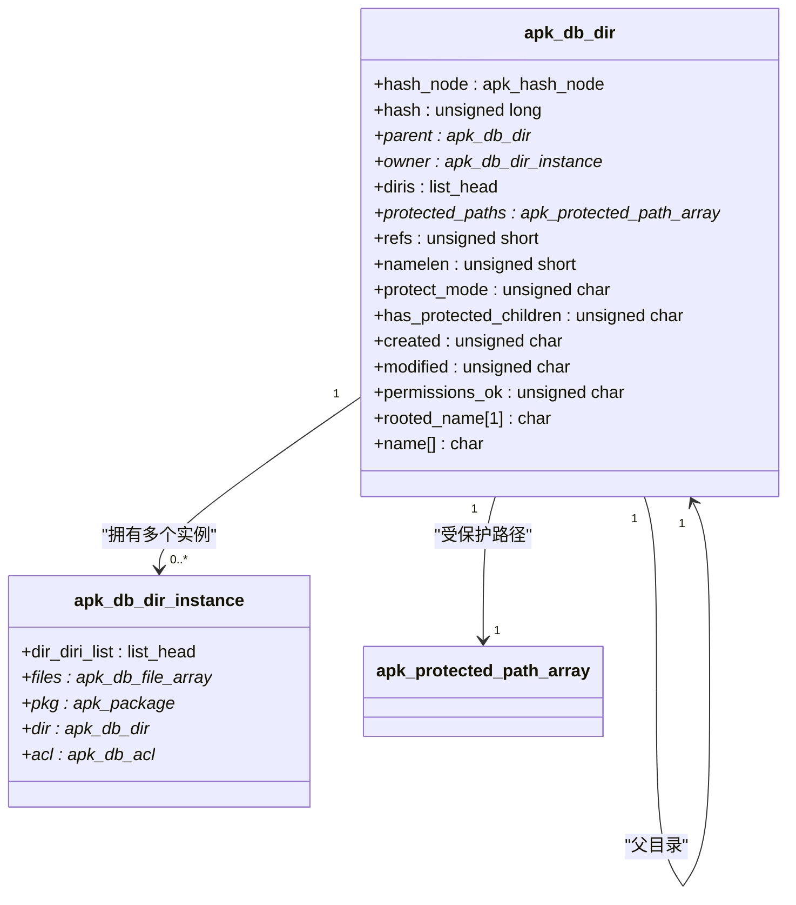
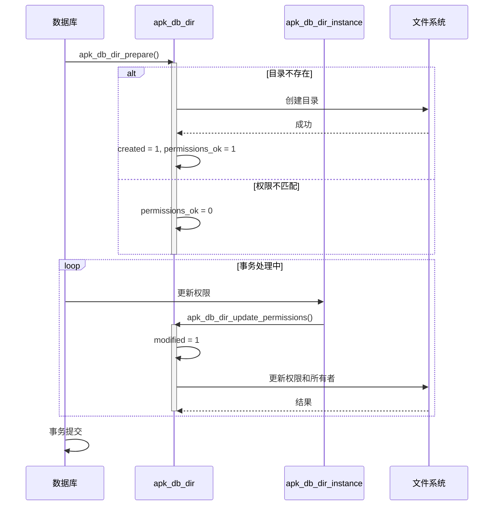
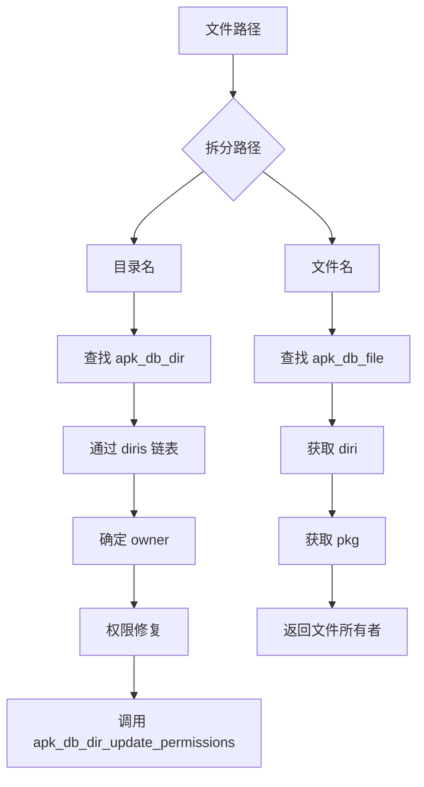

# 目录与文件系统跟踪

<cite>
**本文档引用的文件**   
- [apk_database.h](file://src/apk_database.h)
- [database.c](file://src/database.c)
</cite>

## 目录

1. [引言](#引言)
2. [核心数据结构](#核心数据结构)
3. [目录树结构与受保护路径](#目录树结构与受保护路径)
4. [文件状态与事务管理](#文件状态与事务管理)
5. [文件结构与权限控制](#文件结构与权限控制)
6. [协同工作机制](#协同工作机制)
7. [运行时行为分析](#运行时行为分析)
8. [生命周期与安装场景](#生命周期与安装场景)

## 引言
本文档旨在详细阐述 `apk-tools` 项目中用于精确跟踪文件系统的两个核心数据结构：`apk_db_dir` 和 `apk_db_file`。文档将深入解析 `apk_db_dir` 如何通过其内部字段构建目录树结构，`protect_mode` 字段如何关联受保护路径，以及 `created` 和 `modified` 等状态位在事务管理中的意义。同时，文档将说明 `apk_db_file` 中的 ACL 权限控制、摘要校验和 `namelen` 优化等设计。最终，文档将阐明这两个结构如何协同工作以支持文件归属查询、权限修复和完整性验证，并通过 `apk_db_dir_update_permissions` 函数和实际安装场景来展示其运行时行为和生命周期。

## 核心数据结构

`apk_db_dir` 和 `apk_db_file` 是 `apk-tools` 数据库中用于精确跟踪文件系统状态的核心结构体。`apk_db_dir` 负责管理目录及其元数据，而 `apk_db_file` 则负责管理文件及其元数据。它们通过 `apk_db_dir_instance` 结构体进行关联，共同构成了一个完整的文件系统跟踪模型。

**Section sources**
- [apk_database.h](file://src/apk_database.h#L85-L106)
- [apk_database.h](file://src/apk_database.h#L39-L50)

## 目录树结构与受保护路径

`apk_db_dir` 结构体通过 `parent` 和 `diris` 字段构建了一个精确的目录树结构。`parent` 指针指向其父目录，从而形成树的层级关系。`hash_node` 字段则用于在哈希表中快速查找目录。`hash` 字段存储了目录名的哈希值，用于加速哈希表操作。

**Diagram sources**
- [apk_database.h](file://src/apk_database.h#L85-L106)
- [apk_database.h](file://src/apk_database.h#L111-L117)

`protect_mode` 字段定义了目录的保护模式，其值来自 `enum apk_protect_mode` 枚举，包括 `APK_PROTECT_NONE`、`APK_PROTECT_IGNORE`、`APK_PROTECT_CHANGED`、`APK_PROTECT_SYMLINKS_ONLY` 和 `APK_PROTECT_ALL`。该模式决定了在系统升级或审计时，对该目录下文件的处理方式。`protected_paths` 字段是一个指向 `apk_protected_path_array` 的指针，它存储了从配置文件（如 `/etc/apk/protected_paths.d`）中加载的受保护路径列表。当创建一个 `apk_db_dir` 实例时，`apk_db_dir_get` 函数会遍历这些受保护路径，根据目录名是否匹配路径模式来设置其 `protect_mode`。

**Section sources**
- [apk_database.h](file://src/apk_database.h#L67-L83)
- [database.c](file://src/database.c#L307-L369)

## 文件状态与事务管理

`apk_db_dir` 结构体中的 `created`、`modified` 和 `permissions_ok` 字段是实现事务管理的关键。`created` 标志表示该目录是否是本次操作中新建的。`modified` 标志表示该目录的元数据（如权限、所有者）已被修改，需要在事务结束时同步到文件系统。`permissions_ok` 标志表示该目录的权限和所有者是否与数据库记录一致。

这些状态位在 `apk_db_dir_prepare` 和 `apk_db_dir_update_permissions` 等函数中被使用。`apk_db_dir_prepare` 函数在安装或升级包时被调用，用于准备目录的创建和权限检查。如果目录不存在，则 `created` 被置位，并尝试创建目录。`apk_db_dir_update_permissions` 函数则负责将数据库中记录的权限应用到实际的文件系统上。它会检查 `permissions_ok` 标志，如果为真，则将 `modified` 置位，并调用底层文件系统 API 来更新目录的权限和所有者。

**Diagram sources**
- [database.c](file://src/database.c#L213-L250)
- [database.c](file://src/database.c#L371-L389)

## 文件结构与权限控制

`apk_db_file` 结构体用于跟踪单个文件的信息。`hash_node` 字段使其能够被存储在哈希表中，通过文件名和所在目录的组合键进行快速查找。`diri` 字段指向其所属的 `apk_db_dir_instance`，从而与目录结构关联。`acl` 字段指向一个 `apk_db_acl` 结构体，该结构体定义了文件的访问控制列表，包括模式（mode）、用户ID（uid）、组ID（gid）以及扩展属性（xattr）的哈希值。

`digest` 字段和 `digest_alg` 字段用于文件的完整性校验。`digest_alg` 指定了摘要算法（如 SHA1），`digest` 数组则存储了文件内容的哈希值。`apk_dbf_digest_set` 函数用于设置这些值。`namelen` 字段存储了文件名的长度，这是一个重要的优化，避免了在每次访问文件名时都调用 `strlen` 函数，从而提高了性能。

**Section sources**
- [apk_database.h](file://src/apk_database.h#L39-L50)
- [apk_database.h](file://src/apk_database.h#L54-L65)

## 协同工作机制

`apk_db_dir` 和 `apk_db_file` 通过 `apk_db_dir_instance` 结构体协同工作。`apk_db_dir_instance` 代表了一个包（`pkg`）对某个目录（`dir`）的“实例”。一个 `apk_db_dir` 可以有多个 `apk_db_dir_instance`（通过 `diris` 链表连接），这对应于多个包安装了同一目录的情况。`owner` 字段指向当前拥有该目录的 `apk_db_dir_instance`。

文件归属查询通过 `apk_db_get_file_owner` 函数实现。该函数接收一个文件路径，将其拆分为目录名和文件名，然后在 `installed.files` 哈希表中查找对应的 `apk_db_file`。找到后，通过 `apk_db_file` 的 `diri` 字段找到其 `apk_db_dir_instance`，再通过 `apk_db_dir_instance` 的 `pkg` 字段返回文件的所有者包。

**Diagram sources**
- [database.c](file://src/database.c#L2573-L2587)
- [database.c](file://src/database.c#L371-L389)

## 运行时行为分析

`apk_db_dir_update_permissions` 函数是运行时行为的核心。当一个包安装或升级时，系统会为该包创建一系列 `apk_db_dir_instance`。在事务处理过程中，如果某个 `apk_db_dir_instance` 被确定为某个目录的 `owner`，并且其权限与当前目录的权限不一致，系统就会调用此函数。

该函数首先检查 `permissions_ok` 标志，如果为假，则跳过。然后，它将 `modified` 标志置位，表示该目录已被修改。接着，它通过 `apk_fsdir_get` 获取一个指向文件系统中该目录的句柄，最后调用 `apk_fsdir_update_perms` 来实际更新文件系统上的权限和所有者。如果更新失败，会记录错误并增加错误计数。

**Section sources**
- [database.c](file://src/database.c#L371-L389)

## 生命周期与安装场景

`apk_db_dir_instance` 的生命周期始于包的安装过程。当 `apk_db_install_pkg` 函数处理一个包时，它会解析包内的文件列表。对于每个文件，它会调用 `apk_db_diri_get` 来获取或创建一个 `apk_db_dir_instance`。这个函数会检查当前上下文（`ic`）中是否有缓存的实例，如果没有，则在 `diris` 数组中搜索，如果还找不到，就创建一个新的实例并将其添加到数组中。

在实际安装场景中，当一个新包被安装时，系统会遍历其所有文件。对于每个文件，系统会找到其所属的目录实例，并创建一个 `apk_db_file` 来记录文件的元数据（如权限、哈希值）。在事务结束时，所有 `modified` 的目录都会通过 `apk_db_dir_update_permissions` 函数来更新其权限，从而完成整个安装过程。

**Section sources**
- [database.c](file://src/database.c#L813-L844)
- [database.c](file://src/database.c#L2740-L2893)