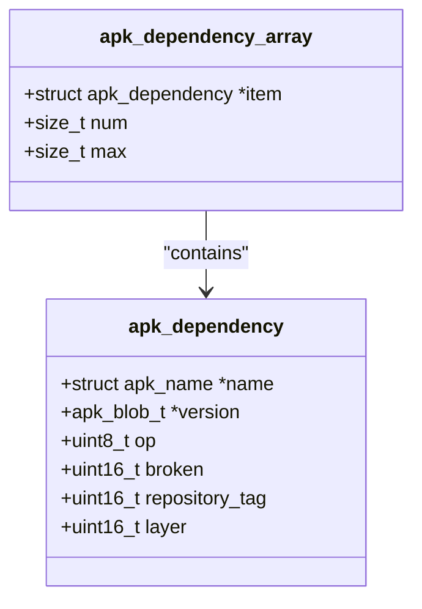

# 软件包数据模型

<cite>
**Referenced Files in This Document**   
- [apk_package.h](file://src/apk_package.h)
- [database.c](file://src/database.c)
- [package.c](file://src/package.c)
</cite>

## 目录
1. [apk_package结构体详解](#apk_package结构体详解)
2. [核心字段解析](#核心字段解析)
3. [依赖关系实现机制](#依赖关系实现机制)
4. [数据模型关系图](#数据模型关系图)
5. [查询逻辑示例](#查询逻辑示例)

## apk_package结构体详解

`apk_package` 结构体是APK包管理系统的核心数据结构，用于表示一个软件包的完整信息。该结构体通过哈希表进行索引，实现了高效的包查找和依赖解析功能。

```mermaid
classDiagram
class apk_package {
+apk_hash_node hash_node
+struct apk_name *name
+struct apk_installed_package *ipkg
+struct apk_dependency_array *depends
+struct apk_dependency_array *install_if
+struct apk_dependency_array *provides
+struct apk_blobptr_array *tags
+apk_blob_t *version
+apk_blob_t *arch
+apk_blob_t *license
+apk_blob_t *origin
+apk_blob_t *maintainer
+apk_blob_t *url
+apk_blob_t *description
+apk_blob_t *commit
+uint64_t installed_size
+uint64_t size
+time_t build_time
+union { struct apk_solver_package_state ss; int state_int; }
+unsigned int foreach_genid
+uint32_t repos
+unsigned short provider_priority
+unsigned short filename_ndx
+unsigned char seen
+unsigned char marked
+unsigned char uninstallable
+unsigned char cached_non_repository
+unsigned char cached
+unsigned char layer
+uint8_t digest_alg
+uint8_t digest[]
}
```

**Diagram sources**
- [apk_package.h](file://src/apk_package.h#L74-L101)

**Section sources**
- [apk_package.h](file://src/apk_package.h#L74-L101)

## 核心字段解析

### 哈希表索引字段
`hash_node` 字段是 `apk_package` 结构体在哈希表中的节点，用于快速查找和索引软件包。该字段使得软件包的查找操作具有O(1)的时间复杂度。

### 软件包名称
`name` 字段指向 `apk_name` 结构体，表示软件包的名称实体。每个软件包名称在系统中是唯一的，通过名称可以快速定位到对应的软件包。

### 安装状态
`ipkg` 字段指向 `apk_installed_package` 结构体，存储软件包的安装状态信息。如果软件包未安装，该字段为NULL。

### 依赖关系数组
`depends`、`install_if` 和 `provides` 字段是 `apk_dependency_array` 类型的指针，分别表示软件包的依赖、条件安装和提供关系。这些数组实现了软件包之间的多对多依赖关系网。

### 元数据字段
`version`、`arch`、`license`、`origin`、`maintainer`、`url`、`description` 和 `commit` 字段存储软件包的元数据信息，包括版本号、架构、许可证、来源、维护者、URL、描述和提交信息。

### 仓库位图
`repos` 字段是一个32位整数，用作位图来标识软件包所属的仓库。每一位代表一个仓库，通过位操作可以快速判断软件包是否属于某个仓库。

### 联合体字段
`union` 中的 `ss` 和 `state_int` 字段用于不同的求解器状态。`ss` 是 `apk_solver_package_state` 结构体，用于存储求解器相关的状态信息；`state_int` 是整数，用于存储通用的状态信息。

**Section sources**
- [apk_package.h](file://src/apk_package.h#L74-L101)

## 依赖关系实现机制

### apk_dependency_array分析
`apk_dependency_array` 是一个动态数组，用于存储多个 `apk_dependency` 结构体。每个 `apk_dependency` 结构体包含依赖的名称、版本、操作符等信息。



**Diagram sources**
- [apk_package.h](file://src/apk_package.h#L44-L51)

**Section sources**
- [apk_package.h](file://src/apk_package.h#L44-L51)

### 多对多依赖关系
通过 `depends`、`install_if` 和 `provides` 数组，实现了软件包之间的多对多依赖关系。例如，一个软件包可以依赖多个其他软件包，同时也可以被多个软件包依赖。

## 数据模型关系图

```mermaid
erDiagram
apk_package {
apk_hash_node hash_node
struct apk_name *name
struct apk_installed_package *ipkg
struct apk_dependency_array *depends
struct apk_dependency_array *install_if
struct apk_dependency_array *provides
struct apk_blobptr_array *tags
apk_blob_t *version
apk_blob_t *arch
apk_blob_t *license
apk_blob_t *origin
apk_blob_t *maintainer
apk_blob_t *url
apk_blob_t *description
apk_blob_t *commit
uint64_t installed_size
uint64_t size
time_t build_time
union { struct apk_solver_package_state ss; int state_int; }
unsigned int foreach_genid
uint32_t repos
unsigned short provider_priority
unsigned short filename_ndx
unsigned char seen
unsigned char marked
unsigned char uninstallable
unsigned char cached_non_repository
unsigned char cached
unsigned char layer
uint8_t digest_alg
uint8_t digest[]
}
apk_name {
apk_hash_node hash_node
char *name
struct apk_provider_array *providers
struct apk_name_array *rdepends
struct apk_name_array *rinstall_if
unsigned char has_repository_providers
unsigned int state_int
}
apk_dependency {
struct apk_name *name
apk_blob_t *version
uint8_t op
uint16_t broken
uint16_t repository_tag
uint16_t layer
}
apk_db_file {
apk_hash_node hash_node
char *name
size_t namelen
struct apk_db_dir_instance *diri
struct apk_db_acl *acl
uint8_t digest_alg
uint8_t digest[APK_DIGEST_LENGTH_MAX]
}
apk_package ||--o{ apk_name : "name"
apk_package ||--o{ apk_dependency : "depends"
apk_package ||--o{ apk_dependency : "install_if"
apk_package ||--o{ apk_dependency : "provides"
apk_name ||--o{ apk_package : "providers"
apk_dependency }|--|| apk_name : "name"
apk_db_file }|--|| apk_package : "diri.pkg"
```

**Diagram sources**
- [apk_package.h](file://src/apk_package.h#L74-L101)
- [apk_package.h](file://src/apk_package.h#L44-L51)
- [database.c](file://src/database.c#L114)

**Section sources**
- [apk_package.h](file://src/apk_package.h#L74-L101)
- [apk_package.h](file://src/apk_package.h#L44-L51)
- [database.c](file://src/database.c#L114)

## 查询逻辑示例

### apk_db_pkg_upgradable函数
`apk_db_pkg_upgradable` 函数用于判断一个软件包是否可以升级。该函数通过比较已安装软件包的版本和可用软件包的版本来确定是否可以升级。

```c
const struct apk_package *apk_db_pkg_upgradable(const struct apk_database *db, const struct apk_package *pkg)
{
    struct apk_name *name = pkg->name;
    struct apk_package *ipkg = apk_pkg_get_installed(name);

    if (!ipkg) return NULL;

    unsigned short allowed_repos = db->repo_tags[ipkg->ipkg->repository_tag].allowed_repos;
    if (!(pkg->repos & allowed_repos)) return NULL;

    return apk_version_match(*ipkg->version, APK_VERSION_LESS, *pkg->version) ? ipkg : NULL;
}
```

**Section sources**
- [database.c](file://src/database.c#L560-L571)