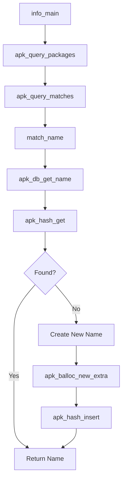
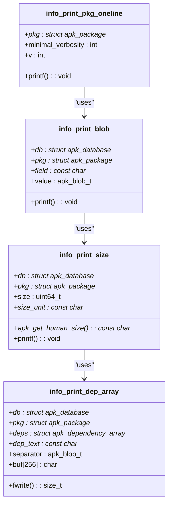
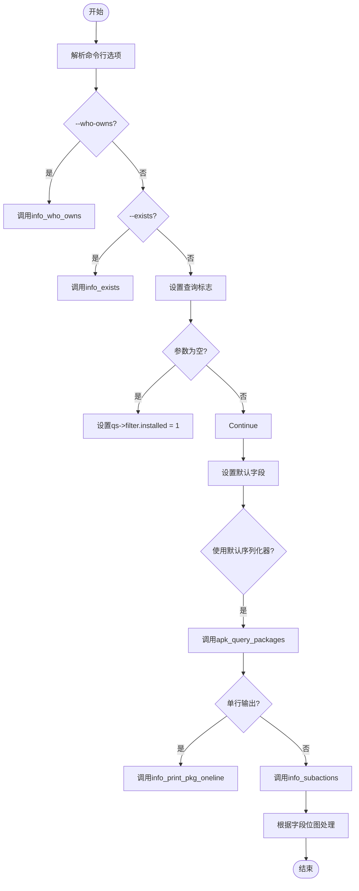
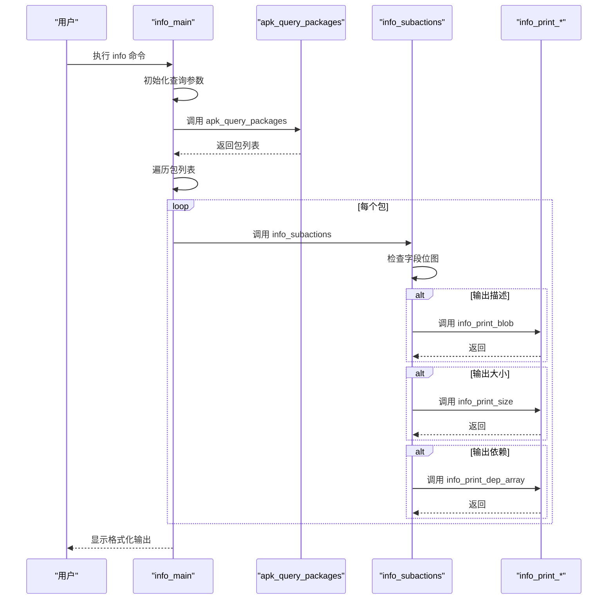

# 信息功能 (info)

<cite>
**本文档引用的文件**   
- [app_info.c](file://src/app_info.c)
- [apk_database.h](file://src/apk_database.h)
- [apk_print.h](file://src/apk_print.h)
- [database.c](file://src/database.c)
- [query.c](file://src/query.c)
- [apk_query.h](file://src/apk_query.h)
</cite>

## 目录
1. [简介](#简介)
2. [信息提取与格式化机制](#信息提取与格式化机制)
3. [本地包与远程包信息获取](#本地包与远程包信息获取)
4. [数据库元数据读取](#数据库元数据读取)
5. [输出格式化处理](#输出格式化处理)
6. [命令行选项影响](#命令行选项影响)
7. [调用关系示例](#调用关系示例)
8. [脚本编写建议](#脚本编写建议)
9. [自定义模板扩展](#自定义模板扩展)

## 简介
`info`功能是apk-tools中用于展示软件包详细信息的核心组件。该功能通过`app_info.c`文件实现，能够从数据库中提取包的元数据（如版本、大小、依赖关系等），并根据用户需求进行格式化输出。系统支持本地包和远程包的信息查询，通过`apk_db_get_package`从数据库读取数据，并使用`apk_print`模块进行输出格式化。用户可以通过`--verbose`、`--installed`等选项控制输出内容的详细程度。

**Section sources**
- [app_info.c](file://src/app_info.c#L1-L385)

## 信息提取与格式化机制
`info`功能的核心机制是通过`info_main`函数协调信息提取和格式化过程。该函数首先初始化查询参数，设置`qs->filter.revdeps_installed = 1`和`qs->revdeps_field = APK_Q_FIELD_PACKAGE`，确保只查询已安装包的反向依赖。系统根据命令行参数决定查询模式：当`ictx->who_owns`为真时，调用`info_who_owns`查询文件所有者；当`ictx->exists_test`为真时，调用`info_exists`测试包是否存在。

信息提取的核心是`apk_query_packages`函数，它根据查询规范从数据库中检索匹配的包。检索到的包通过`info_subactions`函数进行处理，该函数根据`qs->fields`字段位图决定输出哪些信息。系统使用`BIT()`宏来操作字段标志，如`BIT(APK_Q_FIELD_DESCRIPTION)`表示描述字段。

**Section sources**
- [app_info.c](file://src/app_info.c#L330-L371)
- [app_info.c](file://src/app_info.c#L221-L247)

## 本地包与远程包信息获取
系统通过`ac->open_flags`标志位来区分本地和远程包的查询。当使用`--installed`或`--exists`选项时，系统设置`APK_OPENF_NO_REPOS`标志，只查询本地已安装的包，避免访问远程仓库。这通过在`info_parse_option`函数中设置`ac->open_flags |= APK_OPENF_NO_REPOS`实现。

对于远程包信息，系统默认会查询所有可用的仓库。`apk_db_pkg_add`函数负责将包添加到数据库中，它会检查包的架构兼容性，并处理包的依赖关系。当包从远程仓库下载时，`apk_cache_download`函数负责缓存管理，确保包信息的及时更新。

**Section sources**
- [app_info.c](file://src/app_info.c#L275-L329)
- [database.c](file://src/database.c#L573-L621)

## 数据库元数据读取
包元数据的读取通过`apk_database`结构实现，该结构包含`available`和`installed`两个主要部分。`available`部分存储所有可用包的信息，使用哈希表`packages`进行快速查找；`installed`部分存储已安装包的信息，包括文件、目录和触发器。

`apk_db_get_name`函数用于从数据库中获取包名信息，它首先尝试从哈希表中查找，如果不存在则创建新的`apk_name`结构。`apk_db_pkg_add`函数负责将包模板添加到数据库中，处理包的依赖、提供和标签等元数据。系统使用`apk_hash_insert`和`apk_array_bclone`等函数来维护数据结构的完整性。

**Diagram sources **
- [app_info.c](file://src/app_info.c#L330-L371)
- [database.c](file://src/database.c#L161-L188)
- [query.c](file://src/query.c#L753-L754)

## 输出格式化处理
输出格式化由`apk_print`模块负责，通过`info_print_*`系列函数实现。`info_print_pkg_oneline`函数根据`verbosity`级别输出单行信息：级别1输出包名，级别2增加版本，级别3增加描述。`info_print_blob`函数用于输出文本型元数据，如描述和许可证，根据`verbosity`决定输出格式。

`info_print_size`函数使用`apk_get_human_size`将字节大小转换为人类可读的格式（如KB、MB）。`info_print_dep_array`函数处理依赖关系输出，根据`verbosity`决定使用空格分隔还是换行分隔。`info_print_required_by`函数通过`apk_pkg_foreach_reverse_dependency`遍历反向依赖，并调用`print_rdep_pkg`进行输出。

**Diagram sources **
- [app_info.c](file://src/app_info.c#L26-L34)
- [app_info.c](file://src/app_info.c#L117-L136)
- [app_info.c](file://src/app_info.c#L138-L154)
- [app_info.c](file://src/app_info.c#L161-L169)

## 命令行选项影响
命令行选项通过`INFO_OPTIONS`宏定义，并在`info_parse_option`函数中处理。`--verbose`选项通过`apk_out_verbosity`函数获取详细级别，影响`info_print_pkg_oneline`等函数的输出内容。`--installed`选项设置`qs->filter.installed = 1`，只查询已安装的包。

`--all`选项设置`qs->fields = APK_Q_FIELDS_ALL`，输出所有可用信息。`--depends`、`--provides`等选项分别设置对应的`BIT()`标志，控制输出特定的依赖信息。`--who-owns`选项触发特殊模式，查询文件的所有者包，而不是包本身的信息。

**Diagram sources **
- [app_info.c](file://src/app_info.c#L250-L266)
- [app_info.c](file://src/app_info.c#L270-L329)
- [app_info.c](file://src/app_info.c#L330-L371)

## 调用关系示例
`apk_db_get_package`和`apk_print_package_info`的调用关系体现在`info_main`函数中。虽然代码中没有直接的`apk_print_package_info`函数，但`info_subactions`起到了类似作用。`info_main`首先调用`apk_query_packages`获取包列表，然后对每个包调用`info_subactions`。

`info_subactions`根据`qs->fields`的位图，选择性地调用`info_print_blob`、`info_print_size`、`info_print_dep_array`等函数。这种设计实现了关注点分离：`info_main`负责流程控制，`info_subactions`负责逻辑分发，具体的`info_print_*`函数负责格式化输出。

**Diagram sources **
- [app_info.c](file://src/app_info.c#L330-L371)
- [app_info.c](file://src/app_info.c#L221-L247)

## 脚本编写建议
为解析`info`命令的输出，建议使用以下脚本编写策略：首先使用`--verbose`选项获取结构化输出，然后使用正则表达式或字段分隔符进行解析。对于单行输出（`-a`选项），可以按空格分割；对于多行输出，可以按冒号分隔键值对。

建议使用`--format`选项（如果可用）输出JSON或YAML格式，便于程序化处理。对于依赖关系解析，注意处理多行输出，使用状态机或行缓冲区来正确关联包名和其依赖列表。在脚本中应处理错误输出，检查`ERROR:`前缀的行。

**Section sources**
- [app_info.c](file://src/app_info.c#L26-L34)
- [app_info.c](file://src/app_info.c#L117-L154)

## 自定义模板扩展
开发者可以通过扩展`apk_print`模块来自定义信息展示模板。可以在`app_info.c`中添加新的`info_print_*`函数，并在`INFO_OPTIONS`宏中定义相应的命令行选项。然后在`info_parse_option`中处理新选项，设置对应的`qs->fields`位。

对于更复杂的模板，可以实现自定义的`struct apk_serializer_ops`，类似于`serialize_match`，然后通过`--format`选项使用。这允许完全控制输出格式，支持HTML、XML或其他自定义格式。扩展时应遵循现有代码的风格，使用`apk_ser_*`系列函数进行序列化。

**Section sources**
- [app_info.c](file://src/app_info.c#L250-L266)
- [app_info.c](file://src/app_info.c#L270-L329)
- [query.c](file://src/query.c#L678-L683)