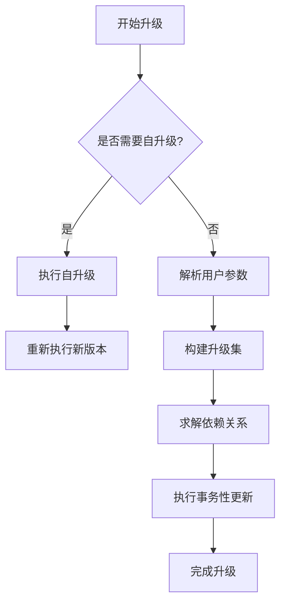
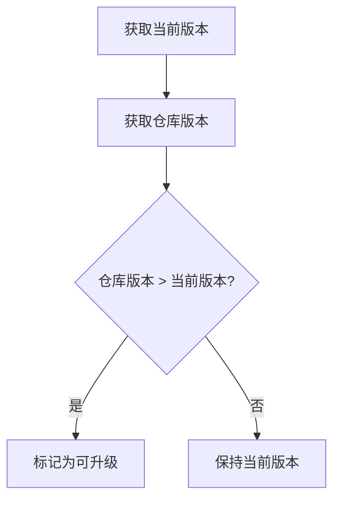
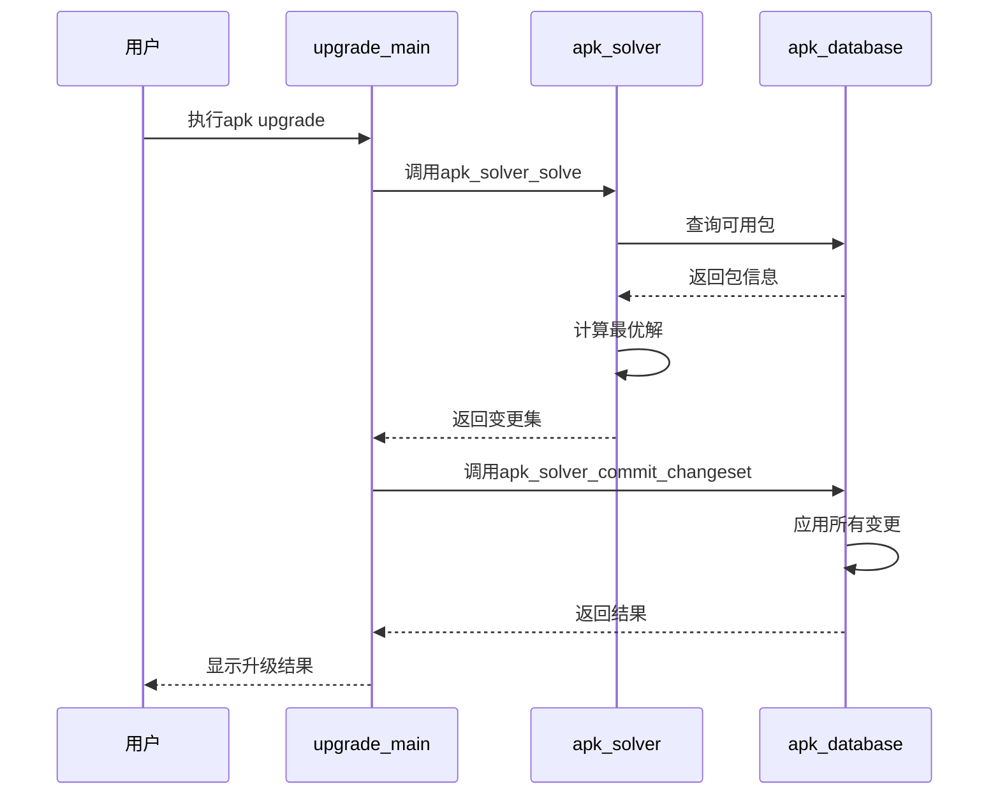
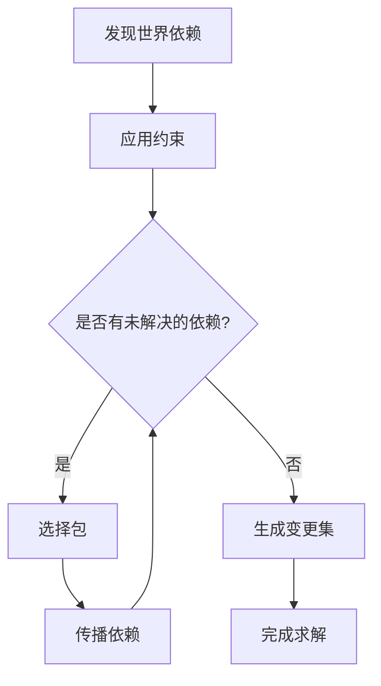

# 升级功能 (upgrade)

<cite>
**本文档引用的文件**  
- [app_upgrade.c](file://src/app_upgrade.c)
- [apk_database.h](file://src/apk_database.h)
- [apk_solver.h](file://src/apk_solver.h)
- [version.c](file://src/version.c)
- [database.c](file://src/database.c)
- [solver.c](file://src/solver.c)
</cite>

## 目录
1. [引言](#引言)
2. [升级流程概述](#升级流程概述)
3. [核心组件分析](#核心组件分析)
4. [版本比对与升级集构建](#版本比对与升级集构建)
5. [事务性更新流程](#事务性更新流程)
6. [依赖求解器工作机制](#依赖求解器工作机制)
7. [参数影响分析](#参数影响分析)
8. [中断恢复与回滚策略](#中断恢复与回滚策略)
9. [开发者扩展点](#开发者扩展点)
10. [结论](#结论)

## 引言
apk-tools的升级功能是系统维护的核心机制，负责管理软件包的版本更新和依赖关系调整。该功能通过`app_upgrade.c`中的`apk_upgrade_main`函数实现，结合数据库查询、依赖求解和事务性更新，确保系统在升级过程中的稳定性和一致性。本文档详细解析该功能的内部工作机制，为用户提供深入的技术理解。

## 升级流程概述
apk-tools的升级流程分为三个主要阶段：自升级检查、依赖求解和事务性更新。首先，系统检查`apk-tools`自身是否有新版本可用，若有则优先执行自升级。随后，依赖求解器根据用户指定的参数和系统状态，计算最优的升级方案。最后，系统以事务方式应用变更，确保升级过程的原子性和一致性。

**Diagram sources**
- [app_upgrade.c](file://src/app_upgrade.c#L166-L240)
- [database.c](file://src/database.c#L800-L1599)

## 核心组件分析

### apk_upgrade_main函数
`apk_upgrade_main`是升级功能的入口点，负责协调整个升级流程。该函数首先检查系统状态，然后根据用户参数决定是否执行自升级。若无需自升级，则调用依赖求解器计算升级方案，并最终应用变更。

**Section sources**
- [app_upgrade.c](file://src/app_upgrade.c#L166-L240)

### apk_do_self_upgrade函数
`apk_do_self_upgrade`函数专门处理`apk-tools`自身的升级。该函数通过查询`/proc/self/exe`确定当前运行的程序，然后在可用仓库中查找是否有更新的版本。若有，则创建一个仅包含`apk-tools`升级的最小变更集并立即应用。

**Section sources**
- [app_upgrade.c](file://src/app_upgrade.c#L82-L149)

## 版本比对与升级集构建

### 版本比对机制
系统通过`apk_version_match`函数进行版本比对，该函数实现了Alpine版本号的复杂比较逻辑。版本号由数字、字母和后缀组成，比较时按组件逐个进行，确保精确的版本排序。

**Diagram sources**
- [version.c](file://src/version.c#L318-L330)
- [app_upgrade.c](file://src/app_upgrade.c#L102-L104)

### 升级集构建
升级集的构建始于`apk_db_foreach_matching_name`函数的调用，该函数遍历用户指定的包名，并为每个包设置升级标志。随后，系统根据这些标志和全局求解器标志，构建完整的升级计划。

**Section sources**
- [app_upgrade.c](file://src/app_upgrade.c#L220-L222)
- [apk_database.h](file://src/apk_database.h#L328-L332)

## 事务性更新流程
事务性更新是确保系统稳定的关键。系统首先计算所有必要的变更，包括安装、删除和调整操作，然后在一个原子事务中应用这些变更。若任何步骤失败，整个事务将回滚，保持系统状态的一致性。

**Diagram sources**
- [app_upgrade.c](file://src/app_upgrade.c#L224-L227)
- [solver.c](file://src/solver.c#L1070-L1146)
- [database.c](file://src/database.c#L2168-L2238)

## 依赖求解器工作机制
依赖求解器是apk-tools最复杂的组件之一，采用前向传播和后向传播相结合的算法。求解器首先发现所有相关的包，然后应用约束条件，最后选择最优的包版本。该过程确保了依赖关系的完整性和系统的一致性。

**Diagram sources**
- [solver.c](file://src/solver.c#L1070-L1146)
- [apk_solver.h](file://src/apk_solver.h#L41-L44)

### apk_solver_solve函数
`apk_solver_solve`是依赖求解的核心函数，实现了复杂的求解算法。该函数首先对世界依赖进行排序，然后发现所有相关的包，应用约束条件，并最终生成变更集。求解过程是迭代的，直到所有依赖都得到满足。

**Section sources**
- [solver.c](file://src/solver.c#L1070-L1146)

## 参数影响分析

### --available参数
`--available`参数通过设置`APK_SOLVERF_AVAILABLE`标志，影响求解器的行为。当此标志被设置时，求解器会考虑所有可用的包，而不仅仅是已安装的包。这在处理`install_if`依赖时尤为重要，确保只有可用的包才会被考虑。

**Section sources**
- [app_upgrade.c](file://src/app_upgrade.c#L70-L72)
- [solver.c](file://src/solver.c#L224-L228)

### --latest参数
`--latest`参数通过设置`APK_SOLVERF_LATEST`标志，指示求解器选择最新版本的包。此参数优先于其他选择标准，确保系统尽可能使用最新的软件版本。

**Section sources**
- [app_upgrade.c](file://src/app_upgrade.c#L73-L75)
- [solver.c](file://src/solver.c#L549-L552)

## 中断恢复与回滚策略
apk-tools的升级过程具有良好的容错性。由于升级操作是事务性的，任何中断都会导致事务回滚，系统将保持升级前的状态。用户可以安全地重新执行升级命令，系统会从头开始整个过程。

**Section sources**
- [app_upgrade.c](file://src/app_upgrade.c#L129-L130)
- [database.c](file://src/database.c#L2254-L2286)

## 开发者扩展点
开发者可以通过修改求解器的标志和回调函数来干预升级决策过程。例如，可以通过`apk_solver_set_name_flags`函数为特定包设置自定义的求解标志，从而影响求解器的选择行为。

**Section sources**
- [app_upgrade.c](file://src/app_upgrade.c#L162-L163)
- [apk_solver.h](file://src/apk_solver.h#L38-L40)

## 结论
apk-tools的升级功能是一个复杂而精密的系统，通过自升级、依赖求解和事务性更新三个阶段，确保了系统的稳定性和一致性。理解其内部工作机制对于系统管理员和开发者都至关重要，有助于更好地管理和维护Alpine Linux系统。