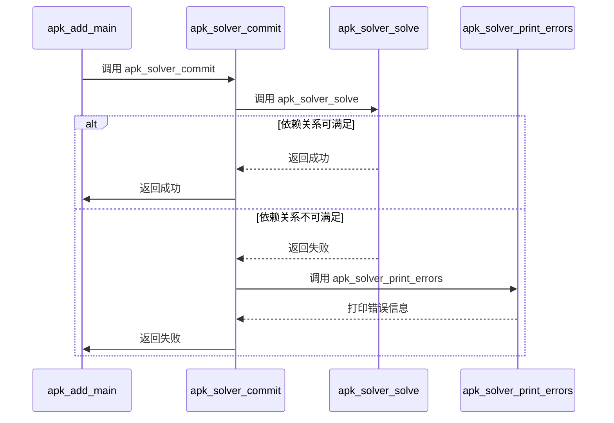
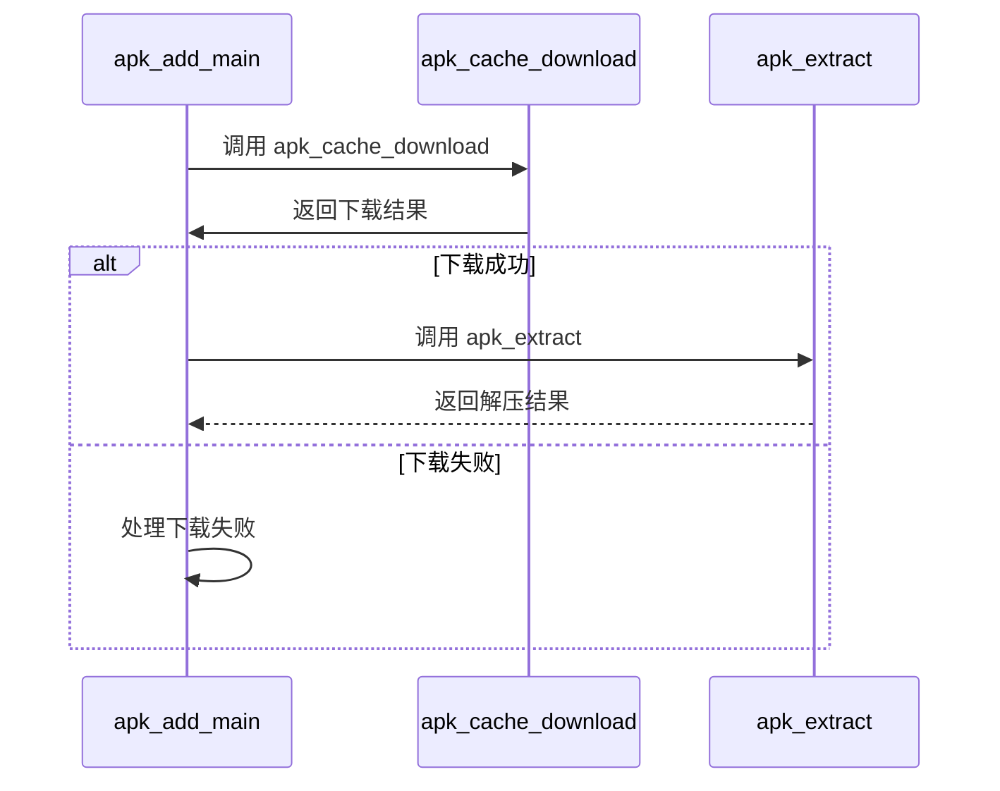
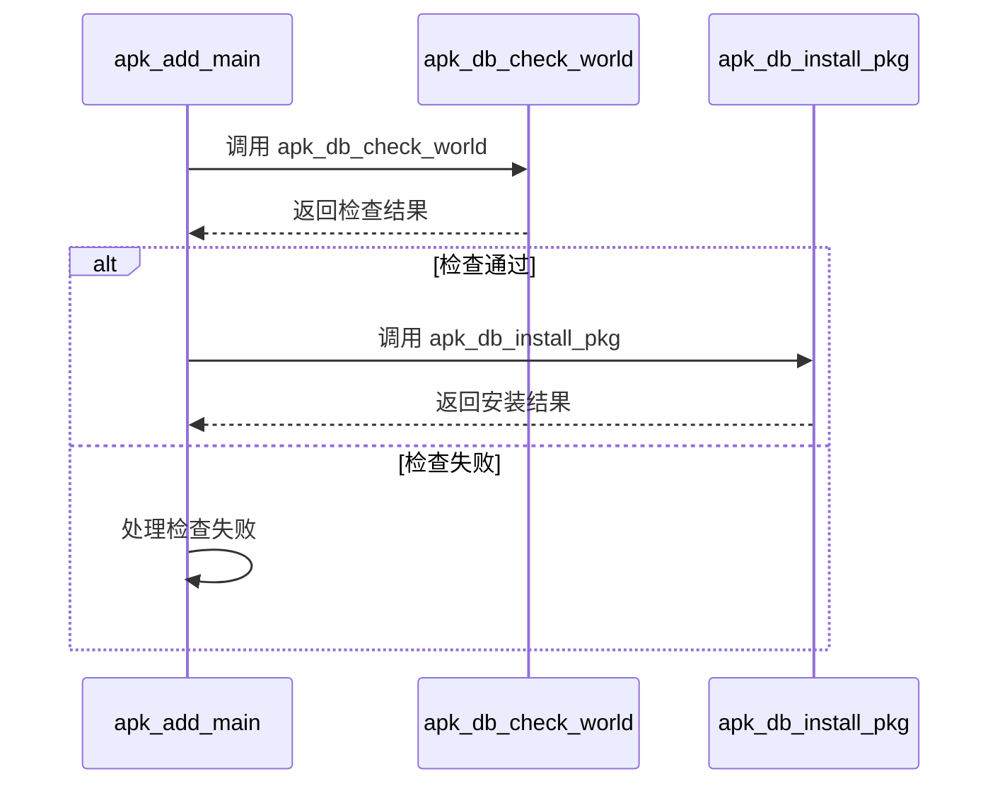

# 安装功能 (add)

<cite>
**本文档引用的文件**   
- [app_add.c](file://src/app_add.c)
- [solver.c](file://src/solver.c)
- [database.c](file://src/database.c)
- [apk_solver.h](file://src/apk_solver.h)
- [apk_database.h](file://src/apk_database.h)
- [apk.c](file://src/apk.c)
</cite>

## 目录
1. [简介](#简介)
2. [执行流程分析](#执行流程分析)
3. [依赖解析](#依赖解析)
4. [包下载与文件解压](#包下载与文件解压)
5. [数据库更新](#数据库更新)
6. [配置选项影响](#配置选项影响)
7. [常见问题排查](#常见问题排查)
8. [开发者扩展路径](#开发者扩展路径)

## 简介
`apk add` 命令是 Alpine Package Keeper (APK) 的核心功能之一，用于安装软件包。该功能通过 `app_add.c` 文件中的 `apk_add_main` 函数实现，涵盖了从依赖解析、包下载、文件解压到数据库更新的完整流程。此文档详细解析了 `apk_add_main` 函数的执行流程，以及其与依赖求解器的交互机制，确保依赖关系的完整性。

## 执行流程分析
`apk_add_main` 函数的执行流程可以分为以下几个阶段：
1. **参数解析**：解析命令行参数，如 `--initdb`、`--latest`、`--upgrade` 等。
2. **依赖解析**：调用依赖求解器，解析并解决软件包的依赖关系。
3. **包下载**：从指定的仓库下载所需的软件包。
4. **文件解压**：将下载的软件包解压到目标目录。
5. **数据库更新**：更新本地数据库，记录已安装的软件包信息。

**Section sources**
- [app_add.c](file://src/app_add.c#L107-L196)

## 依赖解析
依赖解析是 `apk add` 命令的核心部分，确保安装的软件包及其依赖项都能正确安装。依赖解析主要通过 `apk_solver_commit` 函数实现，该函数位于 `src/commit.c` 文件中。

### 依赖求解器交互
`apk_solver_commit` 函数首先检查世界依赖（world dependencies），然后调用 `apk_solver_solve` 函数来解决依赖关系。如果依赖关系无法满足，`apk_solver_print_errors` 函数会打印错误信息。

**Diagram sources**
- [commit.c](file://src/commit.c#L908-L929)
- [apk_solver.h](file://src/apk_solver.h#L54-L55)

**Section sources**
- [commit.c](file://src/commit.c#L908-L929)
- [apk_solver.h](file://src/apk_solver.h#L54-L55)

## 包下载与文件解压
包下载和文件解压是 `apk add` 命令的另一个重要环节，确保软件包能够正确地从远程仓库下载并解压到目标目录。

### 包下载
包下载通过 `apk_cache_download` 函数实现，该函数位于 `src/database.c` 文件中。它首先检查缓存目录，如果缓存中没有所需的软件包，则从远程仓库下载。

### 文件解压
文件解压通过 `apk_extract` 函数实现，该函数位于 `src/extract_v3.c` 文件中。它将下载的软件包解压到目标目录，并处理文件的权限和属性。

**Diagram sources**
- [database.c](file://src/database.c#L683-L722)
- [extract_v3.c](file://src/extract_v3.c#L129-L179)

**Section sources**
- [database.c](file://src/database.c#L683-L722)
- [extract_v3.c](file://src/extract_v3.c#L129-L179)

## 数据库更新
数据库更新是 `apk add` 命令的最后一步，确保已安装的软件包信息被正确记录在本地数据库中。数据库更新通过 `apk_db_install_pkg` 函数实现，该函数位于 `src/database.c` 文件中。

### 数据库更新流程
1. **检查世界依赖**：调用 `apk_db_check_world` 函数，确保世界依赖的完整性。
2. **安装软件包**：调用 `apk_db_install_pkg` 函数，将软件包安装到目标目录，并更新数据库记录。

**Diagram sources**
- [database.c](file://src/database.c#L2858-L2900)
- [apk_database.h](file://src/apk_database.h#L285-L286)

**Section sources**
- [database.c](file://src/database.c#L2858-L2900)
- [apk_database.h](file://src/apk_database.h#L285-L286)

## 配置选项影响
`apk add` 命令支持多种配置选项，这些选项可以影响安装行为。以下是一些常见的配置选项及其影响：

- `--no-cache`：禁用缓存，每次安装都会从远程仓库下载软件包。
- `--force-overwrite`：强制覆盖已存在的文件。
- `--force-non-repository`：允许安装非仓库中的软件包。
- `--latest`：安装最新版本的软件包。
- `--upgrade`：升级已安装的软件包。

**Section sources**
- [apk.c](file://src/apk.c#L38-L63)
- [app_add.c](file://src/app_add.c#L23-L29)

## 常见问题排查
在使用 `apk add` 命令时，可能会遇到一些常见问题。以下是一些常见问题及其解决方法：

- **依赖冲突**：如果出现依赖冲突，可以尝试使用 `--force-overwrite` 选项强制覆盖冲突的文件，或者使用 `--no-cache` 选项重新下载软件包。
- **网络失败**：如果网络连接失败，可以检查网络设置，确保能够访问远程仓库。也可以尝试使用 `--force-refresh` 选项强制刷新缓存。
- **权限问题**：如果遇到权限问题，可以使用 `sudo` 命令以管理员权限运行 `apk add` 命令。

**Section sources**
- [apk.c](file://src/apk.c#L128-L182)
- [app_add.c](file://src/app_add.c#L60-L75)

## 开发者扩展路径
对于开发者来说，可以通过扩展 `apk add` 命令的功能来满足特定需求。以下是一些可能的扩展路径：

- **自定义依赖求解器**：可以实现自定义的依赖求解器，以支持更复杂的依赖关系。
- **插件系统**：可以开发插件系统，允许用户通过插件扩展 `apk add` 命令的功能。
- **日志记录**：可以增强日志记录功能，提供更详细的安装过程信息。

**Section sources**
- [app_add.c](file://src/app_add.c#L107-L196)
- [solver.c](file://src/solver.c#L170-L201)