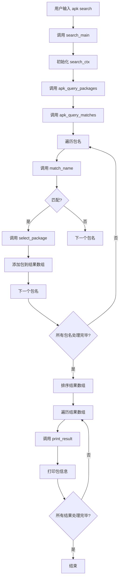

# 搜索功能 (search)

<cite>
**Referenced Files in This Document**   
- [app_search.c](file://src/app_search.c)
- [apk_query.h](file://src/apk_query.h)
- [query.c](file://src/query.c)
- [database.c](file://src/database.c)
</cite>

## 目录
1. [搜索逻辑实现](#搜索逻辑实现)
2. [查询请求处理](#查询请求处理)
3. [调用流程示例](#调用流程示例)
4. [选项行为差异](#选项行为差异)
5. [性能优化建议](#性能优化建议)
6. [自定义搜索算法接口](#自定义搜索算法接口)

## 搜索逻辑实现

`app_search.c` 文件中的搜索逻辑实现了正则表达式匹配、模糊查找和元数据过滤机制。搜索功能通过 `search_main` 函数执行，该函数利用 `apk_query_packages` 接口访问数据库索引并返回匹配结果。

搜索上下文结构体 `search_ctx` 定义了打印结果和包信息的回调函数、详细程度级别、匹配计数以及过滤器数组。`print_package_name` 和 `print_origin_name` 函数分别用于打印包名和源名称，根据详细程度级别决定是否包含版本号和描述信息。

模糊查找通过 `fnmatch` 函数实现，支持通配符匹配。当启用 `--search` 模式时，查询字符串会被转换为 `*query*` 格式进行模糊匹配。精确匹配则直接比较字符串。

元数据过滤通过 `apk_query_spec` 结构体中的 `match` 位域实现，可以指定在名称、描述、提供者等字段中进行匹配。`search_parse_option` 函数处理命令行选项，设置相应的查询模式和过滤条件。

**Section sources**
- [app_search.c](file://src/app_search.c#L17-L151)

## 查询请求处理

查询请求通过 `apk_query_packages` 函数处理，该函数位于 `query.c` 文件中。此函数接收 `apk_ctx` 上下文、查询规范、参数数组和包数组指针作为参数。

查询规范 `apk_query_spec` 包含模式标志（如搜索、递归、汇总）、过滤条件（如所有匹配、可用、已安装）、反向依赖字段、匹配位域、字段位域、序列化器操作等。这些参数共同决定了查询的行为和结果格式。

`apk_query_matches` 函数遍历数据库中的所有包名，对每个包名调用 `match_name` 函数进行匹配检查。匹配过程考虑了简单过滤器（如孤儿包）、可用性、已安装状态和可升级状态。对于每个提供者，如果满足所有条件，则将其添加到结果集中。

当 `--summarize` 选项被使用时，`apk_query_summarize` 函数会被调用，它会生成一个汇总报告，列出所有匹配的包名或包版本。

**Section sources**
- [query.c](file://src/query.c#L851-L956)
- [apk_query.h](file://src/apk_query.h#L90-L109)

## 调用流程示例

`apk_db_search` 和 `apk_print_package` 的调用流程如下：

1. 用户调用 `apk search` 命令，触发 `search_main` 函数。
2. `search_main` 初始化搜索上下文，并设置默认的打印函数。
3. 调用 `apk_query_packages`，传入查询规范和参数数组。
4. `apk_query_packages` 调用 `apk_query_matches` 遍历所有包名。
5. 对每个包名，`match_name` 函数检查是否匹配查询条件。
6. 如果匹配，`select_package` 回调函数将包添加到结果数组中。
7. 所有匹配完成后，结果数组按包名排序。
8. 最后，`search_main` 遍历结果数组，对每个包调用 `print_result` 函数。
9. `print_result` 函数（通常是 `print_package_name`）打印包信息。

**Diagram sources**
- [app_search.c](file://src/app_search.c#L111-L138)
- [query.c](file://src/query.c#L851-L859)

## 选项行为差异

不同选项的行为差异如下：

- `--exact`: 禁用搜索模式，进行精确字符串匹配。不使用通配符，直接比较查询字符串与包名。
- `--description`: 在名称和描述字段中进行搜索。设置 `match` 位域包含 `APK_Q_FIELD_NAME` 和 `APK_Q_FIELD_DESCRIPTION`。
- `--all`: 显示所有匹配，而不仅仅是最佳匹配。设置 `filter.all_matches` 标志。
- `--origin`: 打印源名称而不是包名。将 `print_package` 回调设置为 `print_origin_name`。
- `--rdepends`: 显示反向依赖关系。将 `print_result` 回调设置为 `print_rdepends`。
- `--has-origin`: 只匹配具有源的包。设置 `match` 位域为 `APK_Q_FIELD_ORIGIN`，并禁用搜索模式。

这些选项通过 `search_parse_option` 函数解析和设置，影响查询的匹配模式、过滤条件和输出格式。

**Section sources**
- [app_search.c](file://src/app_search.c#L77-L107)

## 性能优化建议

为了提高搜索性能，建议采取以下措施：

1. **使用索引**: 确保数据库索引是最新的，避免每次搜索都重新解析包信息。
2. **限制搜索范围**: 使用 `--installed` 或 `--available` 选项限制搜索范围，减少需要检查的包数量。
3. **避免全表扫描**: 尽量使用精确匹配而非模糊搜索，特别是在大型仓库中。
4. **批量查询**: 如果需要搜索多个包，一次性传递所有查询参数，而不是逐个查询。
5. **缓存结果**: 对于频繁执行的相同查询，考虑缓存结果以避免重复计算。
6. **优化数据结构**: 确保 `apk_database` 中的哈希表和数组结构高效，减少查找时间。
7. **并行处理**: 在多核系统上，考虑并行处理多个查询或并行扫描不同的仓库。

通过合理使用这些优化策略，可以显著提高搜索操作的性能，特别是在处理大量包数据时。

**Section sources**
- [database.c](file://src/database.c#L171-L185)
- [query.c](file://src/query.c#L773-L776)

## 自定义搜索算法接口

开发者可以通过以下接口自定义搜索算法：

1. **`apk_query_matches`**: 这是核心的匹配函数，接受一个回调函数作为参数。开发者可以提供自己的匹配逻辑，遍历所有包并决定哪些包应该包含在结果中。
2. **`struct apk_query_spec`**: 开发者可以修改查询规范，自定义匹配字段、过滤条件和输出格式。
3. **回调函数**: 可以提供自定义的 `match` 回调函数，实现特定的匹配逻辑。例如，基于包大小、依赖关系复杂度或其他元数据进行过滤。
4. **序列化器**: 通过 `apk_serializer` 接口，开发者可以自定义输出格式，生成JSON、XML或其他格式的结果。
5. **`apk_hash_foreach`**: 直接遍历数据库中的包名哈希表，实现自定义的搜索算法。

要实现自定义搜索，开发者应该：
- 创建一个新的应用小程序（applet）
- 实现自己的 `main` 函数
- 使用 `apk_query_matches` 或直接操作数据库API
- 提供自定义的匹配和输出逻辑
- 注册新的命令行选项（如果需要）

这种设计允许高度的灵活性和扩展性，同时保持与现有系统的一致性和兼容性。

**Section sources**
- [query.c](file://src/query.c#L755-L837)
- [apk_query.h](file://src/apk_query.h#L132-L133)