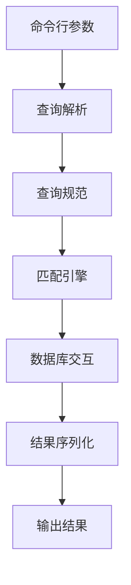
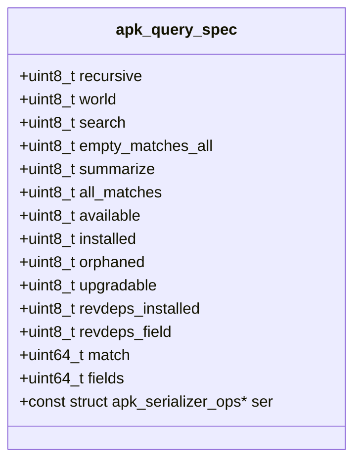
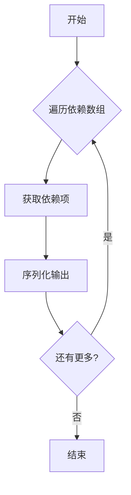
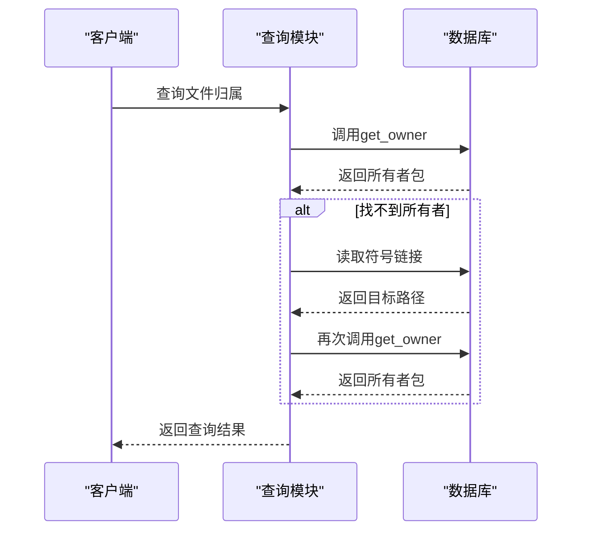
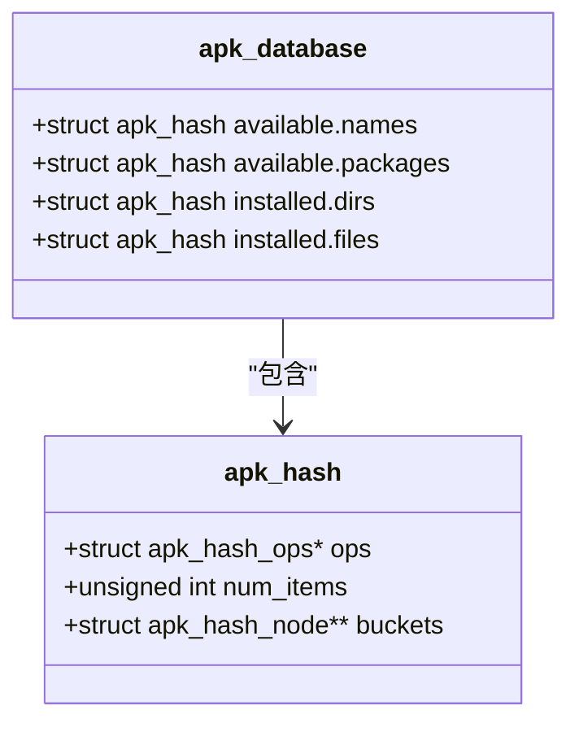
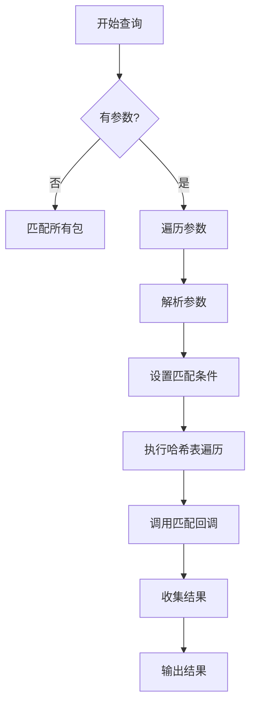
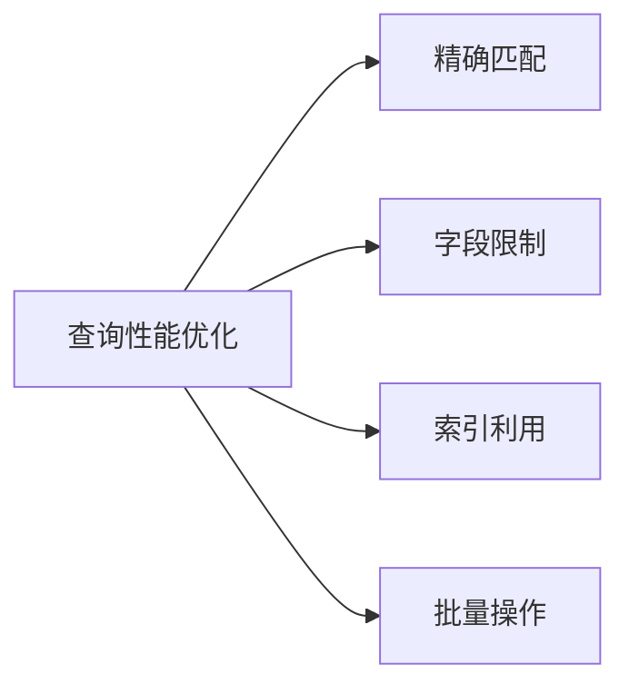

# 查询功能 (query)

<cite>
**Referenced Files in This Document**   
- [app_query.c](file://src/app_query.c)
- [query.c](file://src/query.c)
- [apk_query.h](file://src/apk_query.h)
- [database.c](file://src/database.c)
</cite>

## 目录
1. [简介](#简介)
2. [查询功能架构](#查询功能架构)
3. [核心组件分析](#核心组件分析)
4. [查询模式实现](#查询模式实现)
5. [数据库交互机制](#数据库交互机制)
6. [API使用示例](#api使用示例)
7. [高级查询选项技术实现](#高级查询选项技术实现)
8. [最佳实践](#最佳实践)
9. [扩展开发指南](#扩展开发指南)
10. [总结](#总结)

## 简介
apk-tools的查询功能提供了一套强大的包管理查询系统，支持多种查询模式和复杂的数据检索操作。该功能通过`app_query.c`和`query.c`模块实现，能够执行包状态查询、依赖关系查询和文件归属查询等高级操作。查询系统与数据库紧密集成，通过`apk_query`模块与`apk_database`交互获取结构化数据。

**Section sources**
- [app_query.c](file://src/app_query.c#L1-L27)

## 查询功能架构
查询功能采用模块化设计，主要由查询解析、匹配引擎和序列化输出三部分组成。系统通过`apk_query_spec`结构体定义查询规范，包含查询模式、过滤条件、字段选择等参数。查询执行流程从命令行参数解析开始，经过查询匹配，最终通过序列化器输出结果。



**Diagram sources **
- [apk_query.h](file://src/apk_query.h#L90-L110)
- [query.c](file://src/query.c#L172-L244)

## 核心组件分析
查询功能的核心组件包括查询规范结构体、匹配回调机制和序列化框架。`apk_query_spec`定义了查询的各种参数，`apk_query_match_cb`回调函数用于处理匹配结果，而序列化框架则负责将结果转换为指定格式。

### 查询规范结构体


**Diagram sources **
- [apk_query.h](file://src/apk_query.h#L90-L110)

**Section sources**
- [apk_query.h](file://src/apk_query.h#L90-L110)

## 查询模式实现
查询系统支持多种查询模式，每种模式通过不同的算法实现。包状态查询直接访问数据库中的安装状态信息，依赖关系查询通过分析包的依赖数组，而文件归属查询则通过文件路径映射到包。

### 包状态查询
包状态查询通过检查`apk_installed_package`结构体中的状态标志位来确定包的安装状态。系统会检查`broken_files`、`broken_script`等字段来判断包的完整性。

**Section sources**
- [query.c](file://src/query.c#L475-L483)

### 依赖关系查询
依赖关系查询通过遍历包的`depends`、`provides`和`recommends`数组来获取依赖信息。系统使用`apk_array_foreach`宏来迭代这些数组，并将结果序列化输出。



**Diagram sources **
- [query.c](file://src/query.c#L379-L382)

### 文件归属查询
文件归属查询通过`apk_query_who_owns`函数实现，该函数将文件路径映射到对应的包。系统首先尝试直接匹配，如果失败则检查符号链接目标。



**Diagram sources **
- [query.c](file://src/query.c#L570-L586)

## 数据库交互机制
查询功能与数据库的交互通过`apk_database`结构体提供的API实现。系统使用哈希表来快速查找包和文件信息，通过`apk_hash_foreach`函数遍历所有可用包进行匹配。

### 哈希表查询


**Diagram sources **
- [database.c](file://src/database.c#L110-L159)

### 查询匹配流程
查询匹配流程首先根据查询条件过滤包，然后对每个候选包进行详细匹配。系统使用`match_name`函数作为哈希表枚举器，对每个包名进行匹配检查。



**Diagram sources **
- [query.c](file://src/query.c#L754-L836)

## API使用示例
查询功能提供了两个主要的API函数：`apk_query_package`和`apk_db_query`，用于执行复杂的查询操作。

### apk_query_package使用
```c
// 示例：查询特定包的信息
struct apk_query_spec qs = {0};
qs.fields = BIT(APK_Q_FIELD_NAME) | BIT(APK_Q_FIELD_VERSION);
qs.ser = &apk_serializer_query;

struct apk_serializer *ser = apk_serializer_init_alloca(qs.ser, 
    apk_ostream_to_fd(STDOUT_FILENO));
if (!IS_ERR(ser)) {
    apk_query_package(pkg, db, &qs, ser);
    apk_serializer_cleanup(ser);
}
```

**Section sources**
- [query.c](file://src/query.c#L487-L497)

### apk_db_query使用
```c
// 示例：执行数据库查询
struct apk_query_spec qs = {0};
qs.match = BIT(APK_Q_FIELD_NAME);
qs.fields = APK_Q_FIELDS_DEFAULT_PKG;

int result = apk_db_query(db, &qs, args, match_callback, ctx);
```

**Section sources**
- [query.c](file://src/query.c#L754-L836)

## 高级查询选项技术实现
查询功能支持多个高级选项，每个选项都有特定的技术实现。

### --who-owns选项
`--who-owns`选项通过`apk_query_who_owns`函数实现，该函数首先尝试直接查找文件的所有者，如果失败则检查符号链接。

**Section sources**
- [query.c](file://src/query.c#L570-L586)

### --depends选项
`--depends`选项通过分析包的`depends`数组实现，系统会遍历所有依赖项并将其序列化输出。

**Section sources**
- [query.c](file://src/query.c#L379-L382)

### --recursive选项
`--recursive`选项通过`solver`模块实现，系统会解析依赖关系图并返回所有相关的包。

**Section sources**
- [query.c](file://src/query.c#L524-L569)

## 最佳实践
为了编写高效的查询语句，建议遵循以下最佳实践：

1. **使用精确匹配**：尽量使用精确匹配而非通配符，以提高查询性能
2. **限制查询字段**：只请求需要的字段，减少数据处理开销
3. **利用索引**：查询包名等索引字段可以获得最佳性能
4. **批量查询**：将多个查询合并为一个批量操作



**Diagram sources **
- [query.c](file://src/query.c#L801-L803)

## 扩展开发指南
开发者可以通过以下方式扩展查询功能：

1. **添加新字段**：在`apk_query.h`中定义新的字段常量
2. **实现新查询模式**：在`query.c`中添加新的查询处理逻辑
3. **扩展序列化器**：实现新的输出格式支持

**Section sources**
- [apk_query.h](file://src/apk_query.h#L20-L69)

## 总结
apk-tools的查询功能提供了一套完整而灵活的包管理查询系统。通过深入分析`app_query.c`和`query.c`的实现，我们了解了各种查询模式的技术细节，包括包状态查询、依赖关系查询和文件归属查询。系统通过高效的数据库交互机制和灵活的API设计，为用户和开发者提供了强大的查询能力。