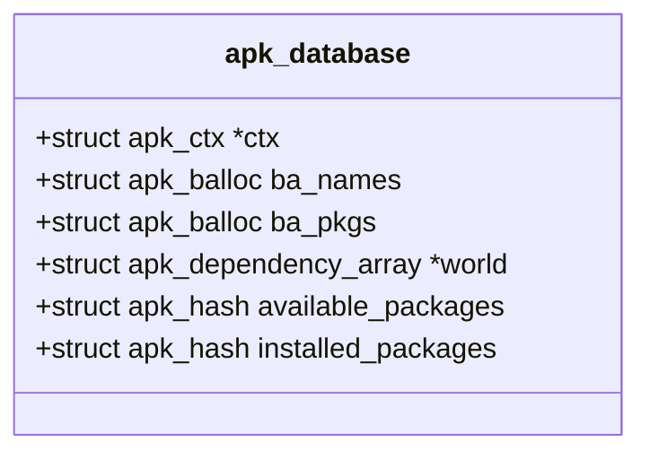
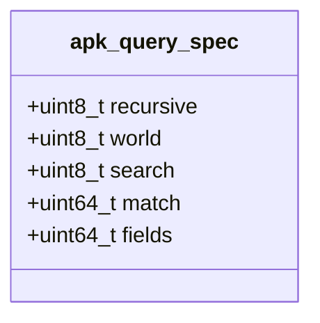
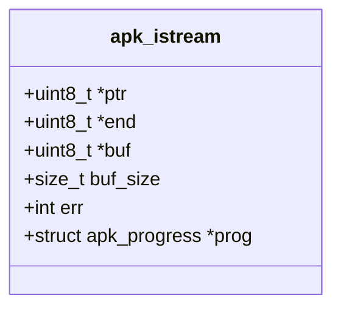
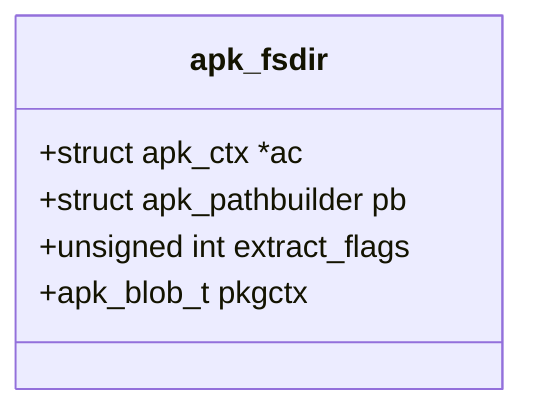
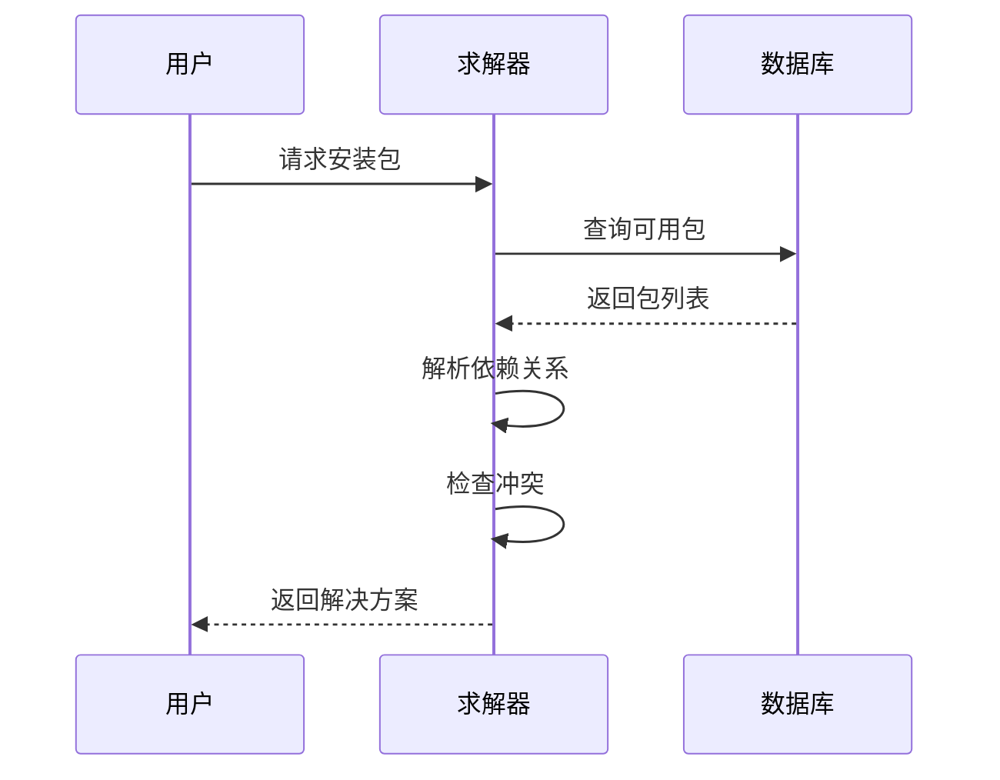
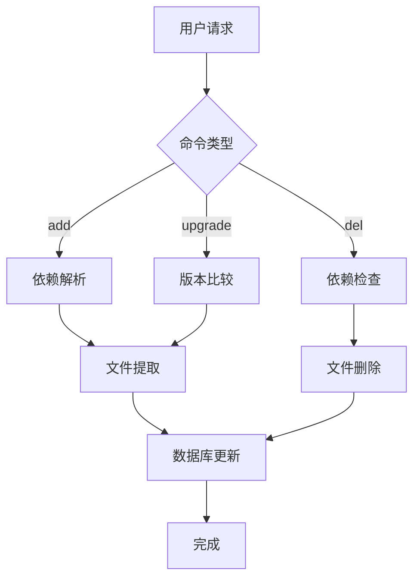
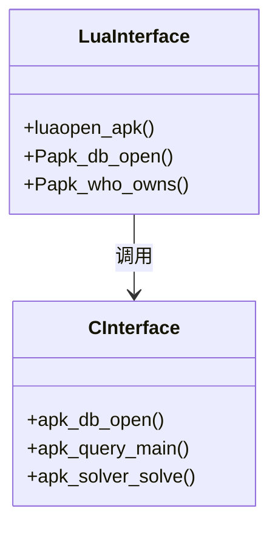

# 核心功能

<cite>
**本文档中引用的文件**  
- [app_add.c](file://src/app_add.c)
- [app_del.c](file://src/app_del.c)
- [app_upgrade.c](file://src/app_upgrade.c)
- [app_search.c](file://src/app_search.c)
- [app_query.c](file://src/app_query.c)
- [app_info.c](file://src/app_info.c)
- [app_list.c](file://src/app_list.c)
- [app_fetch.c](file://src/app_fetch.c)
- [app_cache.c](file://src/app_cache.c)
- [apk_database.h](file://src/apk_database.h)
- [apk_query.h](file://src/apk_query.h)
- [apk_io.h](file://src/apk_io.h)
- [apk_solver.c](file://src/solver.c)
- [apk.c](file://src/apk.c)
- [io.c](file://src/io.c)
</cite>

## 目录
1. [简介](#简介)
2. [核心子命令功能详解](#核心子命令功能详解)
3. [数据库交互机制](#数据库交互机制)
4. [网络IO与文件系统操作](#网络io与文件系统操作)
5. [依赖解析与协同工作](#依赖解析与协同工作)
6. [使用指南](#使用指南)
7. [开发者扩展接口](#开发者扩展接口)

## 简介
apk-tools 是 Alpine Linux 的核心包管理工具，提供了一套完整的软件包管理功能。本文档深入分析其核心功能实现，涵盖 add、del、upgrade、search、query、info、list、fetch、cache 等子命令的内部工作流程。通过详细解析代码结构和数据流，为用户提供清晰的使用指导，为开发者提供可扩展的技术细节。

## 核心子命令功能详解

### add 命令
add 命令用于安装软件包，其核心逻辑在 `app_add.c` 中实现。该命令通过解析选项设置求解器标志，如 `APK_SOLVERF_LATEST` 用于获取最新版本，`APK_SOLVERF_UPGRADE` 用于升级现有包。安装过程涉及数据库打开、依赖解析和文件提取等步骤。

**Section sources**
- [app_add.c](file://src/app_add.c#L1-L58)

### del 命令
del 命令用于删除已安装的软件包，实现在 `app_del.c` 中。该命令支持递归删除依赖项，通过 `recursive_delete` 标志控制。删除操作会检查包的安装状态，并从世界依赖中移除相应条目。

**Section sources**
- [app_del.c](file://src/app_del.c#L1-L59)

### upgrade 命令
upgrade 命令用于升级系统中的软件包，其逻辑在 `app_upgrade.c` 中。该命令支持自升级功能，通过环境变量 `APK_SELFUPGRADE_TOKEN` 控制。升级过程包括检查可用版本、创建变更集和提交更改等步骤。

**Section sources**
- [app_upgrade.c](file://src/app_upgrade.c#L1-L48)

### search 命令
search 命令用于搜索软件包，实现在 `app_search.c` 中。该命令支持多种搜索模式，包括名称、提供者和反向依赖等。搜索结果通过回调函数处理，支持不同格式的输出。

**Section sources**
- [app_search.c](file://src/app_search.c#L1-L51)

### query 命令
query 命令用于查询软件包信息，其核心功能在 `app_query.c` 中。该命令通过 `apk_query_main` 函数处理查询请求，支持多种输出格式和字段选择。查询逻辑涉及数据库遍历和结果序列化。

**Section sources**
- [app_query.c](file://src/app_query.c#L1-L26)
- [query.c](file://src/query.c#L966-L999)

### info 命令
info 命令用于显示软件包详细信息，实现在 `app_info.c` 中。该命令支持多种信息类型，包括依赖、提供、反向依赖等。信息显示通过条件判断控制，支持简洁和详细两种模式。

**Section sources**
- [app_info.c](file://src/app_info.c#L1-L50)

### list 命令
list 命令用于列出软件包，其逻辑在 `app_list.c` 中。该命令支持多种列表模式，包括可用包、已安装包和可升级包等。列表结果通过哈希表去重，支持排序输出。

**Section sources**
- [app_list.c](file://src/app_list.c#L1-L56)

### fetch 命令
fetch 命令用于下载软件包，实现在 `app_fetch.c` 中。该命令支持递归下载依赖项，通过 `FETCH_LINK` 标志控制。下载过程涉及 URL 解析、文件写入和进度显示等步骤。

**Section sources**
- [app_fetch.c](file://src/app_fetch.c#L1-L35)

### cache 命令
cache 命令用于管理包缓存，其核心逻辑在 `app_cache.c` 中。该命令支持清理和下载缓存，通过 `CACHE_CLEAN` 和 `CACHE_DOWNLOAD` 标志控制。缓存管理涉及文件遍历和删除操作。

**Section sources**
- [app_cache.c](file://src/app_cache.c#L1-L43)

## 数据库交互机制

### 数据库结构
apk-tools 使用 `struct apk_database` 管理包数据库，该结构包含可用包和已安装包的哈希表、依赖数组和世界依赖等。数据库通过 `apk_db_open` 和 `apk_db_close` 函数管理生命周期。



**Diagram sources**
- [apk_database.h](file://src/apk_database.h#L181-L251)

### 查询接口
查询功能通过 `struct apk_query_spec` 定义查询规范，支持多种匹配模式和字段选择。查询结果通过 `apk_query_run` 函数处理，支持 JSON、YAML 等多种输出格式。



**Diagram sources**
- [apk_query.h](file://src/apk_query.h#L90-L129)

## 网络IO与文件系统操作

### IO 流处理
网络IO操作通过 `struct apk_istream` 实现，支持多种数据源，包括文件、URL 和内存块。IO 流提供统一的读取接口，支持进度显示和错误处理。



**Diagram sources**
- [apk_io.h](file://src/apk_io.h#L64-L93)

### 文件系统操作
文件系统操作通过 `apk_fsdir` 结构管理，支持目录创建、文件提取和权限更新等。文件提取过程涉及元数据解析和内容写入，支持设备文件和符号链接。



**Diagram sources**
- [apk_fs.h](file://src/apk_fs.h#L1-L52)

## 依赖解析与协同工作

### 依赖求解器
依赖解析通过 `struct apk_solver_state` 实现，支持多种求解策略，包括最新版本、升级和忽略冲突等。求解过程涉及包选择、依赖检查和冲突处理。



**Diagram sources**
- [solver.c](file://src/solver.c#L135-L201)

### 协同工作流程
各功能通过共享数据库和上下文协同工作。例如，安装操作触发依赖解析，查询操作基于已安装包数据库。这种设计确保了功能间的一致性和数据完整性。



**Diagram sources**
- [apk.c](file://src/apk.c#L518-L588)

## 使用指南

### 基本用法
```bash
# 安装包
apk add package_name

# 删除包
apk del package_name

# 升级系统
apk upgrade

# 搜索包
apk search package_name

# 查询包信息
apk info package_name
```

### 高级选项
- `--latest`: 安装最新版本
- `--recursive`: 递归操作
- `--simulate`: 模拟执行
- `--verbose`: 详细输出

## 开发者扩展接口

### API 接口
apk-tools 提供了丰富的 API 接口，支持 Lua 和 Python 扩展。通过 `luaopen_apk` 函数可以创建 Lua 模块，通过 `apk_db_open` 可以访问数据库。



**Diagram sources**
- [lua-apk.c](file://lua/lua-apk.c#L298-L337)

### 扩展开发
开发者可以通过注册新的子命令扩展功能。使用 `APK_DEFINE_APPLET` 宏定义新命令，实现 `parse` 和 `main` 函数。新命令将自动集成到主程序中。

## 结论
apk-tools 通过模块化设计和清晰的接口定义，实现了高效的软件包管理功能。其核心机制包括数据库管理、依赖解析和IO操作，为用户提供可靠的服务，为开发者提供灵活的扩展能力。