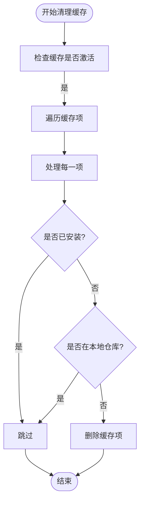
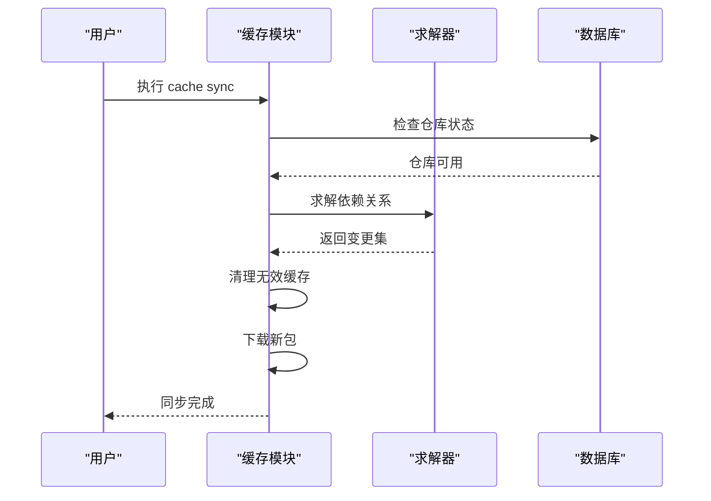

# 缓存功能 (cache)

<cite>
**本文档中引用的文件**  
- [app_cache.c](file://src/app_cache.c)
- [apk_database.h](file://src/apk_database.h)
- [database.c](file://src/database.c)
- [apk_package.h](file://src/apk_package.h)
- [apk_solver.h](file://src/apk_solver.h)
</cite>

## 目录
1. [简介](#简介)
2. [缓存管理机制](#缓存管理机制)
3. [缓存清理实现](#缓存清理实现)
4. [缓存验证与同步](#缓存验证与同步)
5. [文件系统操作与缓存一致性](#文件系统操作与缓存一致性)
6. [命令行为差异说明](#命令行为差异说明)
7. [缓存空间优化建议](#缓存空间优化建议)
8. [扩展接口文档](#扩展接口文档)

## 简介
apk-tools 的本地缓存管理功能旨在高效管理下载包缓存和元数据缓存，确保系统在安装、更新和删除软件包时的性能和一致性。该功能通过 `app_cache.c` 模块中的 `apk_cache_clean` 和 `apk_db_sync_cache` 等核心函数实现，支持 `--clean`、`--update-cache` 等命令，为用户提供灵活的缓存控制选项。本文档详细说明了缓存清理、验证和同步的实现机制，并为开发者提供自定义缓存策略的扩展接口。

## 缓存管理机制
apk-tools 的缓存管理机制围绕 `struct apk_database` 结构展开，该结构包含缓存目录、文件描述符和相关标志。缓存功能通过 `apk_db_cache_active` 函数判断缓存是否激活，并通过 `apk_db_cache_foreach_item` 遍历缓存项。`struct cache_ctx` 结构用于存储解析命令行选项后的上下文，包括求解器标志和依赖关系添加标志。缓存操作由 `cache_main` 函数统一调度，根据用户输入的命令（如 `clean`、`download`）执行相应的清理或下载操作。

**Section sources**
- [app_cache.c](file://src/app_cache.c#L26-L33)
- [apk_database.h](file://src/apk_database.h#L188-L190)

## 缓存清理实现
缓存清理功能通过 `cache_clean` 函数实现，该函数调用 `apk_db_cache_foreach_item` 遍历缓存目录中的所有项，并对每一项执行 `cache_clean_item` 回调函数。`cache_clean_item` 函数根据包的状态和数据库配置决定是否删除缓存项。例如，如果包已安装或存在于本地仓库，则不会被删除。此外，`--purge` 命令会设置 `APK_PURGE` 标志，强制清理所有非永久性缓存。

**Diagram sources**
- [app_cache.c](file://src/app_cache.c#L132-L135)
- [app_cache.c](file://src/app_cache.c#L104-L130)

**Section sources**
- [app_cache.c](file://src/app_cache.c#L132-L136)
- [database.c](file://src/database.c#L2481-L2501)

## 缓存验证与同步
缓存验证与同步功能通过 `cache_download` 函数实现，该函数首先调用 `apk_solver_solve` 求解依赖关系，然后调用 `apk_solver_precache_changeset` 预缓存变更集。在执行同步操作前，`cache_main` 函数会检查仓库状态，确保仓库可用。`--update-cache` 命令会触发 `CACHE_CLEAN | CACHE_DOWNLOAD` 操作，先清理无效缓存，再下载最新的包信息。

**Diagram sources**
- [app_cache.c](file://src/app_cache.c#L70-L102)
- [app_cache.c](file://src/app_cache.c#L147-L155)

**Section sources**
- [app_cache.c](file://src/app_cache.c#L70-L102)
- [apk_solver.h](file://src/apk_solver.h#L41-L46)

## 文件系统操作与缓存一致性
apk-tools 通过文件系统操作管理缓存，确保缓存一致性。`cache_clean_item` 函数使用 `unlinkat` 删除缓存文件或目录，`apk_db_cache_foreach_item` 函数通过 `openat` 和 `fstat` 检查缓存目录的状态。缓存一致性通过 `apk_db_cache_active` 函数维护，该函数检查缓存文件描述符和 `cache_packages` 标志。此外，`--simulate` 选项会设置 `APK_SIMULATE` 标志，模拟操作而不实际修改文件系统。

**Section sources**
- [app_cache.c](file://src/app_cache.c#L127-L129)
- [database.c](file://src/database.c#L2481-L2501)

## 命令行为差异说明
| 命令 | 行为 | 相关标志 |
|------|------|----------|
| `--clean` | 清理无效缓存项 | `CACHE_CLEAN` |
| `--update-cache` | 清理并下载最新包信息 | `CACHE_CLEAN \| CACHE_DOWNLOAD` |
| `--purge` | 强制清理所有非永久性缓存 | `APK_PURGE` |
| `--simulate` | 模拟操作，不实际修改文件系统 | `APK_SIMULATE` |

**Section sources**
- [app_cache.c](file://src/app_cache.c#L147-L157)

## 缓存空间优化建议
为优化缓存空间，建议定期执行 `apk cache clean` 命令，清理不再需要的包缓存。对于磁盘空间有限的系统，可以将缓存目录挂载到 tmpfs 上，以减少对持久存储的影响。此外，使用 `--no-cache` 选项可以禁用缓存，适用于一次性操作或临时环境。

## 扩展接口文档
开发者可以通过实现自定义的 `apk_cache_item_cb` 回调函数来扩展缓存策略。例如，可以实现远程缓存策略，将缓存项存储在远程服务器上。`apk_db_cache_foreach_item` 函数提供了遍历缓存项的接口，开发者可以在回调函数中实现自定义的清理或同步逻辑。此外，`struct apk_database` 结构中的 `cache_dir` 和 `cache_fd` 字段可以用于访问和修改缓存配置。

**Section sources**
- [apk_database.h](file://src/apk_database.h#L316-L319)
- [app_cache.c](file://src/app_cache.c#L104-L130)