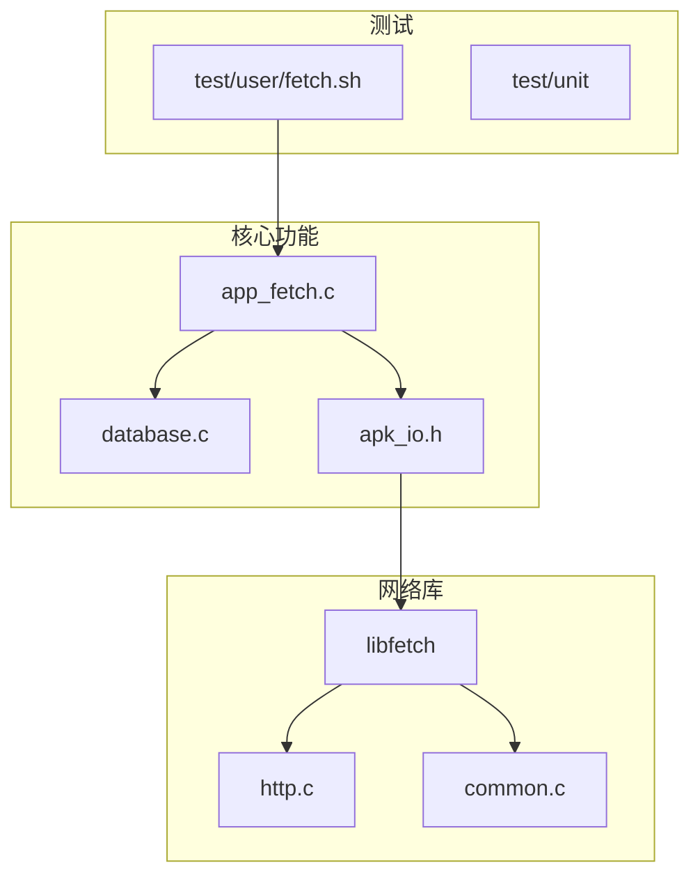
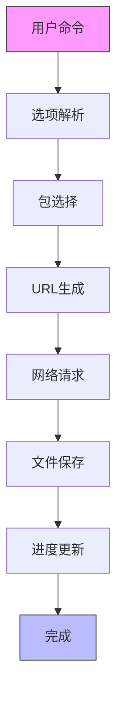
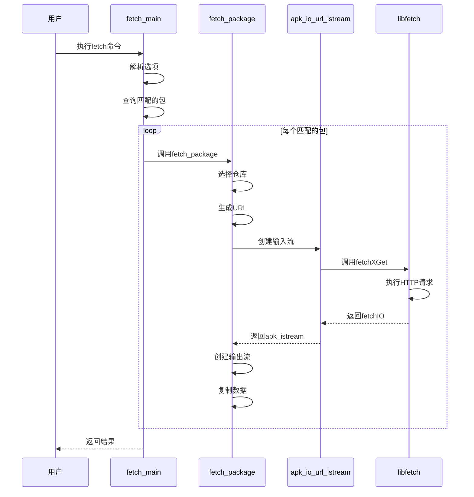
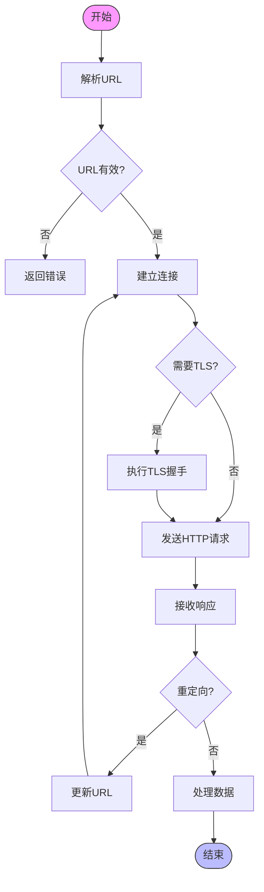
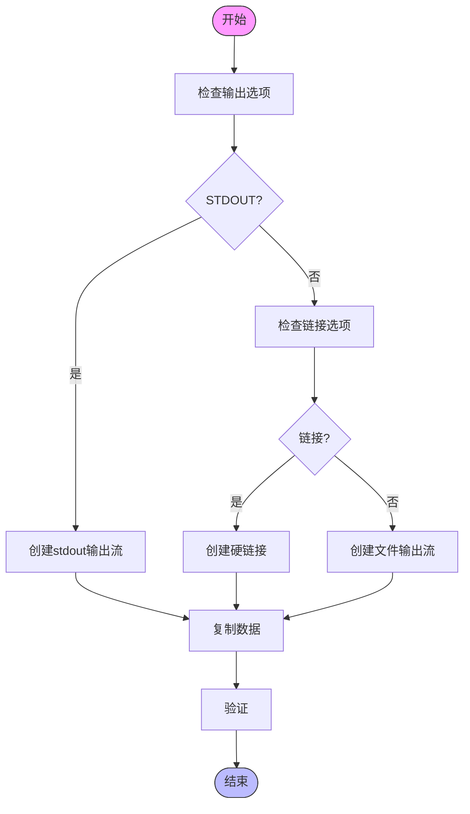
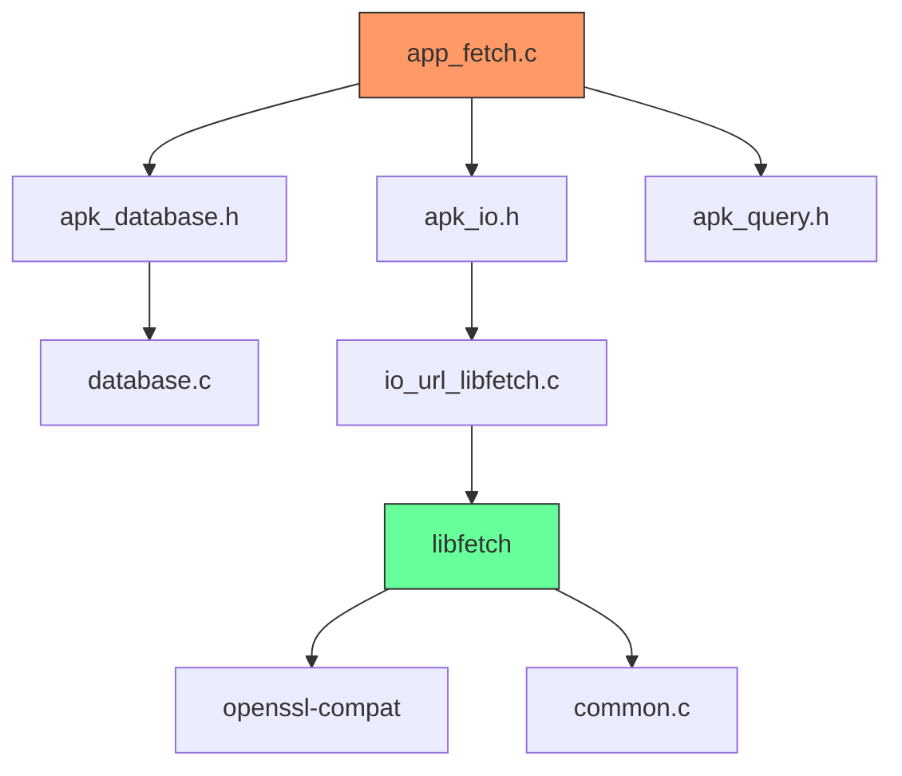

# 获取功能 (fetch)

<cite>
**本文档中引用的文件**  
- [app_fetch.c](file://src/app_fetch.c)
- [io_url_libfetch.c](file://src/io_url_libfetch.c)
- [apk_io.h](file://src/apk_io.h)
- [fetch.h](file://libfetch/fetch.h)
- [database.c](file://src/database.c)
</cite>

## 目录
1. [简介](#简介)
2. [项目结构](#项目结构)
3. [核心组件](#核心组件)
4. [架构概述](#架构概述)
5. [详细组件分析](#详细组件分析)
6. [依赖分析](#依赖分析)
7. [性能考虑](#性能考虑)
8. [故障排除指南](#故障排除指南)
9. [结论](#结论)

## 简介
本文档深入分析apk-tools的获取功能，重点研究`app_fetch.c`中下载逻辑的实现。文档涵盖URL解析、HTTP请求构建和文件保存流程，解释如何通过libfetch库执行网络IO操作，并处理重定向、断点续传等网络场景。同时说明`--repository`、`--no-cache`等选项对下载行为的影响，并为用户提供网络故障排查指南，为开发者提供替换或扩展网络后端的技术路径说明。

## 项目结构
apk-tools项目采用模块化设计，主要分为以下几个部分：
- `doc/`: 文档文件
- `libfetch/`: 网络IO库，提供URL解析和HTTP请求功能
- `lua/`: Lua脚本支持
- `portability/`: 跨平台兼容性代码
- `python/`: Python绑定
- `scripts/`: 构建脚本
- `src/`: 核心源代码，包含app_fetch.c等主要功能模块
- `test/`: 测试代码

**Diagram sources**
- [app_fetch.c](file://src/app_fetch.c#L1-L298)
- [io_url_libfetch.c](file://src/io_url_libfetch.c#L1-L219)

**Section sources**
- [app_fetch.c](file://src/app_fetch.c#L1-L298)
- [database.c](file://src/database.c#L649-L669)

## 核心组件
获取功能的核心组件包括：
- `fetch_ctx`: 获取上下文结构，存储获取操作的状态和配置
- `fetch_parse_option`: 解析获取命令行选项
- `fetch_package`: 执行单个包的获取操作
- `fetch_main`: 获取命令的主函数
- `apk_io_url_istream`: 通过libfetch库创建网络输入流

这些组件协同工作，实现从远程仓库下载APK包的功能。

**Section sources**
- [app_fetch.c](file://src/app_fetch.c#L25-L298)
- [apk_io.h](file://src/apk_io.h#L136-L140)

## 架构概述
apk-tools的获取功能采用分层架构设计，从上到下分为：
1. 命令行接口层：处理用户输入和选项解析
2. 业务逻辑层：管理获取流程和状态
3. 网络IO层：通过libfetch库执行实际的网络操作
4. 文件系统层：处理下载文件的保存

**Diagram sources**
- [app_fetch.c](file://src/app_fetch.c#L97-L152)
- [io_url_libfetch.c](file://src/io_url_libfetch.c#L130-L169)

## 详细组件分析

### 下载流程分析
获取功能的下载流程从`fetch_main`函数开始，经过一系列步骤完成包的下载：

**Diagram sources**
- [app_fetch.c](file://src/app_fetch.c#L248-L284)
- [io_url_libfetch.c](file://src/io_url_libfetch.c#L130-L169)

### URL解析与HTTP请求
URL解析和HTTP请求是获取功能的核心，通过libfetch库实现：

**Diagram sources**
- [io_url_libfetch.c](file://src/io_url_libfetch.c#L138-L154)
- [libfetch/http.c](file://libfetch/http.c#L800-L862)

### 文件保存流程
下载的文件通过输出流保存到本地文件系统：

**Diagram sources**
- [app_fetch.c](file://src/app_fetch.c#L173-L186)
- [src/io.c](file://src/io.c#L1091-L1111)

## 依赖分析
获取功能依赖于多个组件和库：

**Diagram sources**
- [app_fetch.c](file://src/app_fetch.c#L16-L20)
- [io_url_libfetch.c](file://src/io_url_libfetch.c#L16-L17)
- [libfetch/fetch.h](file://libfetch/fetch.h#L39-L186)

## 性能考虑
获取功能在设计时考虑了多个性能因素：
- 连接缓存：使用`fetchConnectionCacheInit`初始化连接缓存，减少重复连接开销
- 批量操作：一次性处理多个包，减少系统调用次数
- 内存管理：使用固定大小的缓冲区，避免频繁内存分配
- 进度跟踪：通过`apk_progress`结构跟踪下载进度，提供实时反馈

## 故障排除指南
当获取功能出现问题时，可以按照以下步骤进行排查：

### 常见错误及解决方案
| 错误类型 | 可能原因 | 解决方案 |
|---------|--------|--------|
| URL格式错误 | URL格式不正确 | 检查URL格式，确保符合标准 |
| DNS解析失败 | 网络连接问题或DNS服务器问题 | 检查网络连接，尝试使用不同的DNS服务器 |
| TLS握手失败 | 证书问题或不支持的加密套件 | 使用`--no-check-certificate`选项跳过证书检查 |
| HTTP 404错误 | 资源不存在 | 检查仓库URL和包名是否正确 |
| 连接超时 | 网络延迟过高 | 增加超时时间或检查网络状况 |

### 调试技巧
1. 使用`--simulate`选项模拟下载过程，查看将要执行的操作
2. 使用`--verbosity`选项增加输出详细程度
3. 检查`/var/cache/apk/`目录下的缓存文件
4. 使用`strace`工具跟踪系统调用
5. 启用libfetch的调试模式，查看详细的网络交互

**Section sources**
- [app_fetch.c](file://src/app_fetch.c#L110-L111)
- [io_url_libfetch.c](file://src/io_url_libfetch.c#L198-L201)

## 结论
apk-tools的获取功能通过精心设计的架构和高效的实现，提供了可靠的包下载能力。通过libfetch库的支持，能够处理各种网络场景，包括重定向、断点续传和TLS加密连接。`--repository`、`--no-cache`等选项提供了灵活的配置能力，满足不同使用场景的需求。对于开发者而言，清晰的模块划分和良好的接口设计使得网络后端的替换或扩展成为可能，为未来的功能增强提供了基础。