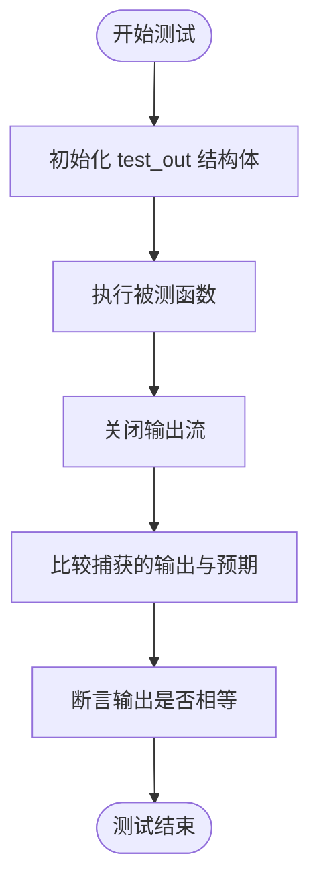
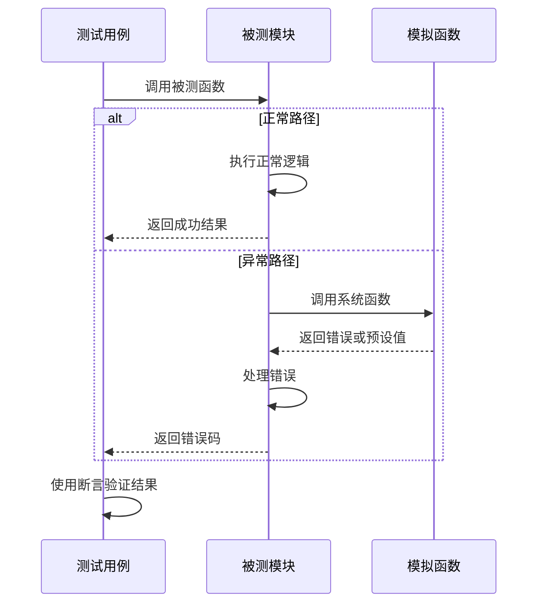

# 单元测试

<cite>
**本文档中引用的文件**   
- [apk_test.h](file://test/unit/apk_test.h)
- [main.c](file://test/unit/main.c)
- [blob_test.c](file://test/unit/blob_test.c)
- [io_test.c](file://test/unit/io_test.c)
- [package_test.c](file://test/unit/package_test.c)
- [apk_blob.h](file://src/apk_blob.h)
- [apk_io.h](file://src/apk_io.h)
- [apk_package.h](file://src/apk_package.h)
- [blob.c](file://src/blob.c)
- [io.c](file://src/io.c)
- [package.c](file://src/package.c)
</cite>

## 目录
1. [测试架构设计](#测试架构设计)
2. [断言宏与验证机制](#断言宏与验证机制)
3. [测试文件组织与隔离测试](#测试文件组织与隔离测试)
4. [新单元测试编写指南](#新单元测试编写指南)
5. [边界条件与异常路径测试](#边界条件与异常路径测试)
6. [测试结果验证方法](#测试结果验证方法)

## 测试架构设计

apk-tools项目的单元测试基于cmocka框架构建，其核心设计原则是通过隔离测试来验证核心数据结构和模块的行为。测试架构由`test/unit/main.c`作为入口点，负责初始化测试环境并运行所有注册的测试用例。该文件中的`main`函数调用`_cmocka_run_group_tests`来执行测试套件，并通过`init_next_funcs`函数使用`dlsym`加载系统库中的原始函数（如`openat`和`dup`），以便在测试中进行函数拦截和模拟。

测试用例的注册机制通过`APK_TEST`宏实现，该宏利用GCC的`__attribute__((constructor))`特性，在程序启动时自动将测试函数注册到全局的`all_tests`数组中。这种设计避免了手动注册的繁琐，确保所有标记为`APK_TEST`的函数都能被自动发现和执行。`test_register`函数负责将测试函数添加到`all_tests`数组中，由`APK_TEST`宏在编译时生成的构造函数调用。

**Section sources**
- [main.c](file://test/unit/main.c#L1-L54)
- [apk_test.h](file://test/unit/apk_test.h#L26-L29)

## 断言宏与验证机制

`apk_test.h`头文件定义了一系列用于验证的断言宏，这些宏是测试框架的核心组成部分，用于检查函数输出和数据结构的正确性。

`assert_blob_equal`宏用于验证两个`apk_blob_t`结构体是否相等。它首先比较两个blob的长度，然后使用`_assert_memory_equal`比较其内容的内存块。该宏通过`__FILE__`和`__LINE__`参数提供详细的错误位置信息，便于调试。`assert_blob_identical`宏则更为严格，它不仅要求内容相等，还要求两个blob的指针指向相同的内存地址，用于验证数据是否被正确引用而非复制。

`assert_output_equal`宏用于捕获和验证函数的输出。它通过`test_out_open`函数初始化一个`test_out`结构体，该结构体包含两个`fmemopen`创建的内存流，分别用于捕获标准输出和标准错误。在测试函数执行后，`assert_output_equal`会关闭这些流，并使用`assert_string_equal`比较捕获的输出与预期的字符串。这种机制使得可以精确地测试那些依赖于I/O操作的函数。

**Diagram sources**
- [main.c](file://test/unit/main.c#L30-L39)
- [apk_test.h](file://test/unit/apk_test.h#L36-L37)

**Section sources**
- [apk_test.h](file://test/unit/apk_test.h#L10-L22)
- [main.c](file://test/unit/main.c#L21-L29)

## 测试文件组织与隔离测试

单元测试文件按照被测模块进行组织，每个文件专注于一个或多个相关的模块，实现了良好的隔离性。例如，`blob_test.c`专门测试`apk_blob`模块，`io_test.c`测试`apk_io`模块，`package_test.c`测试`apk_package`模块。

`blob_test.c`中的测试用例直接调用`apk_blob`模块的内部函数，如`apk_blob_contains`和`apk_blob_split`，并使用`assert_int_equal`和`assert_blob_equal`等断言宏来验证其行为。这些测试不依赖于任何外部状态，确保了测试的可重复性和可靠性。

`io_test.c`展示了如何通过函数拦截（function interception）来实现对`apk_io`模块的隔离测试。该文件重新定义了`openat`、`dup`、`fdopendir`等系统调用，使其在接收到特定的文件描述符（如`MOCKFD`）时返回预设的值或调用cmocka的mocking函数（如`will_return`和`expect_value`）。这使得测试可以在不实际访问文件系统的情况下，模拟各种I/O操作和边界条件。

`package_test.c`则测试了`apk_package`模块中与字符串替换相关的函数，如`apk_blob_subst`。它通过`alloca`在栈上分配内存来创建测试数据，并使用`assert_string_equal`来验证替换后的字符串是否符合预期。

**Section sources**
- [blob_test.c](file://test/unit/blob_test.c#L6-L68)
- [io_test.c](file://test/unit/io_test.c#L8-L121)
- [package_test.c](file://test/unit/package_test.c#L6-L52)

## 新单元测试编写指南

要为apk-tools编写新的单元测试，应遵循以下步骤：

1.  **创建测试文件**：在`test/unit/`目录下创建一个新的`.c`文件，命名应与被测模块对应（如`new_module_test.c`）。
2.  **包含头文件**：在文件开头包含`"apk_test.h"`和被测模块的头文件（如`"apk_new_module.h"`）。
3.  **编写测试函数**：使用`APK_TEST(test_name)`宏来定义测试函数。该宏会自动处理测试的注册。
4.  **准备测试数据**：根据需要，使用`alloca`、`malloc`或直接定义常量来创建测试输入数据。
5.  **执行被测函数**：调用被测模块的函数，并将结果存储在变量中。
6.  **验证结果**：使用合适的断言宏（如`assert_int_equal`、`assert_string_equal`、`assert_blob_equal`）来验证函数的输出是否符合预期。
7.  **处理I/O和系统调用**：如果被测函数涉及I/O操作，参考`io_test.c`，通过重新定义系统调用并使用cmocka的mocking功能来模拟行为。

**Section sources**
- [apk_test.h](file://test/unit/apk_test.h#L26-L29)
- [io_test.c](file://test/unit/io_test.c#L8-L121)

## 边界条件与异常路径测试

单元测试的一个重要方面是验证代码在边界条件和异常路径下的行为。`io_test.c`中的`io_foreach_file_filter`测试用例演示了如何测试过滤功能。它使用`will_return`预设`readdir`的返回值，包括以`.`开头的隐藏文件（如`.two`），并验证`apk_dir_foreach_file`函数是否正确地跳过了这些文件。

`package_test.c`中的`blob_subst`测试用例则展示了异常路径的测试。它不仅测试了正确的格式字符串（如`${name}-${version}`），还测试了无效的格式（如`${invalid}`和`${hash:8s}`），并使用`assert_int_equal`验证这些调用返回了预期的错误码（如`-APKE_PACKAGE_NAME_SPEC`和`-APKE_FORMAT_INVALID`）。这确保了函数的健壮性。

**Diagram sources**
- [package_test.c](file://test/unit/package_test.c#L39-L40)
- [io_test.c](file://test/unit/io_test.c#L72-L82)

**Section sources**
- [package_test.c](file://test/unit/package_test.c#L39-L41)
- [io_test.c](file://test/unit/io_test.c#L72-L82)

## 测试结果验证方法

测试结果的验证主要依赖于`cmocka.h`提供的断言函数和`apk_test.h`中定义的专用宏。基本的验证方法包括：
*   **数值验证**：使用`assert_int_equal`、`assert_true`等函数验证返回值或状态码。
*   **字符串验证**：使用`assert_string_equal`验证C字符串的相等性。
*   **内存块验证**：使用`assert_memory_equal`验证两个内存块的内容是否一致。
*   **Blob结构验证**：使用`assert_blob_equal`宏，它结合了长度和内存内容的检查。
*   **输出流验证**：使用`assert_output_equal`宏，通过捕获标准输出和标准错误流，并与预期字符串进行比较。

这些验证方法共同构成了一个全面的测试框架，能够有效地确保apk-tools核心模块的正确性和稳定性。

**Section sources**
- [apk_test.h](file://test/unit/apk_test.h#L10-L22)
- [main.c](file://test/unit/main.c#L31-L39)