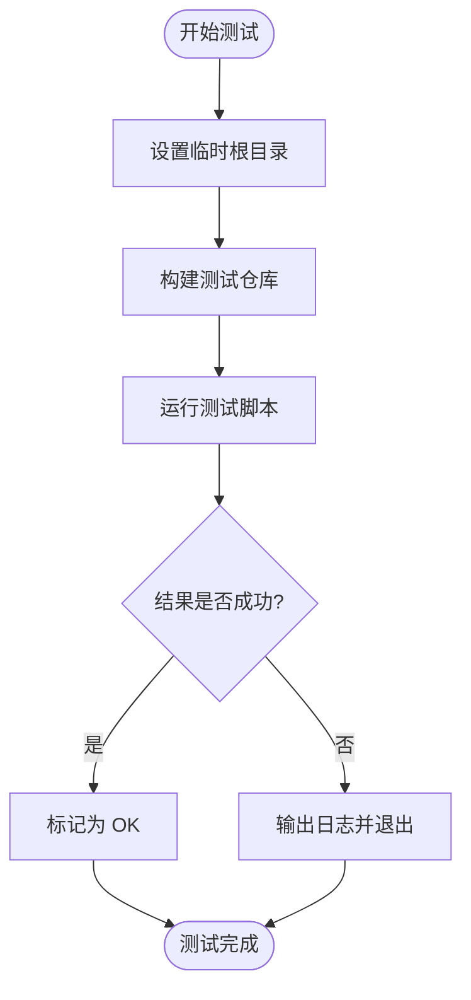

# 测试与验证

<cite>
**本文档中引用的文件**  
- [apk_test.h](file://test/unit/apk_test.h)
- [main.c](file://test/unit/main.c)
- [blob_test.c](file://test/unit/blob_test.c)
- [package_test.c](file://test/unit/package_test.c)
- [process_test.c](file://test/unit/process_test.c)
- [repoparser_test.c](file://test/unit/repoparser_test.c)
- [version_test.c](file://test/unit/version_test.c)
- [testlib.sh](file://test/testlib.sh)
- [update.sh](file://test/user/update.sh)
- [test1.sh](file://test/alpine/test1.sh)
- [Makefile](file://test/Makefile)
- [alpine/Makefile](file://test/alpine/Makefile)
</cite>

## 目录
1. [引言](#引言)
2. [单元测试结构](#单元测试结构)
3. [用户场景测试设计](#用户场景测试设计)
4. [集成测试执行方式](#集成测试执行方式)
5. [测试套件运行指南](#测试套件运行指南)
6. [贡献者最佳实践](#贡献者最佳实践)
7. [持续集成中的测试策略](#持续集成中的测试策略)

## 引言
apk-tools 项目采用多层次的测试策略，确保核心功能的稳定性与可靠性。本项目包含单元测试、用户场景测试和集成测试三类主要测试类型，分别覆盖代码逻辑、用户操作模拟和完整软件包管理流程验证。测试框架基于 CMocka 构建，并结合 shell 脚本实现跨层级验证。

## 单元测试结构
单元测试位于 `test/unit/` 目录下，使用 CMocka 框架进行断言和测试管理。通过 `apk_test.h` 提供的宏定义简化测试注册流程，利用 `APK_TEST` 宏自动将测试函数注册到全局测试列表中。

测试用例主要针对核心数据结构和算法，如 blob 处理、版本比较、进程控制、包解析等。每个测试文件专注于特定模块，例如 `blob_test.c` 验证字符串和 URL 的处理逻辑，`version_test.c` 测试版本号解析与比较功能。

测试输出通过 `test_out` 结构捕获标准输出和错误流，使用 `assert_output_equal` 进行内容比对，确保命令行输出符合预期。

**Section sources**
- [apk_test.h](file://test/unit/apk_test.h#L1-L37)
- [main.c](file://test/unit/main.c#L1-L54)
- [blob_test.c](file://test/unit/blob_test.c#L5-L67)
- [version_test.c](file://test/unit/version_test.c#L33-L46)

## 用户场景测试设计
用户场景测试位于 `test/user/` 目录，以 shell 脚本形式编写，模拟真实用户在日常使用 apk-tools 时的操作流程。这些脚本覆盖常见命令如 `update`、`fetch`、`query`、`add`、`del` 等。

测试脚本依赖 `testlib.sh` 提供的辅助函数，如 `setup_apkroot` 用于初始化临时根目录环境，`glob_one` 用于查找匹配文件。每个脚本独立运行，设置专用的测试环境，避免相互干扰。

例如 `update.sh` 测试脚本验证 `apk update` 命令的行为，包括缓存机制、索引更新和时间戳检查，确保在不同选项（`--cache-max-age`、`--update-cache`、`--no-cache`）下的行为正确。

**Section sources**
- [testlib.sh](file://test/testlib.sh#L1-L53)
- [update.sh](file://test/user/update.sh#L1-L36)

## 集成测试执行方式
集成测试位于 `test/alpine/` 目录，通过 shell 脚本在接近真实系统的环境中验证整个软件包管理流程。这类测试通常需要 root 权限，使用 `sudo` 执行，并通过 `chroot` 模拟系统环境。

测试脚本通过 Makefile 中的规则触发，每个 `.sh` 文件代表一个独立测试用例。例如 `test1.sh` 验证基本的安装、升级和删除流程，`test2.sh` 验证依赖关系的自动处理。

`alpine/Makefile` 负责构建测试所需的仓库（repo1、repo2），并为每个测试创建临时根目录。测试失败时会输出详细日志，便于调试。



**Diagram sources**
- [test1.sh](file://test/alpine/test1.sh#L1-L16)
- [alpine/Makefile](file://test/alpine/Makefile#L1-L63)

**Section sources**
- [test1.sh](file://test/alpine/test1.sh#L1-L16)
- [test2.sh](file://test/alpine/test2.sh#L1-L23)
- [alpine/Makefile](file://test/alpine/Makefile#L1-L63)

## 测试套件运行指南
要运行完整的测试套件，请确保已正确编译 `src/apk` 可执行文件。测试入口为根目录下的 `Makefile`，执行以下命令即可运行所有测试：

```bash
make test
```

该命令会依次执行 `user/*.sh` 和 `solver.sh` 脚本，输出每个测试的结果。若某个测试失败，脚本将打印错误日志并终止执行。

对于集成测试（`alpine/` 目录下的测试），需使用 `make alpine-tests` 并确保具有 root 权限：

```bash
make alpine-tests
```

测试结果分析应关注标准输出中的 `OK:` 和 `FAIL:` 标记。失败时查看生成的 `test.log` 文件获取详细错误信息。

**Section sources**
- [Makefile](file://test/Makefile#L1-L19)
- [alpine/Makefile](file://test/alpine/Makefile#L1-L63)

## 贡献者最佳实践
为 apk-tools 编写新测试时，请遵循以下最佳实践：

- **单元测试**：使用 `APK_TEST(name)` 宏定义测试函数，避免手动注册；优先使用 `assert_blob_equal`、`assert_output_equal` 等封装断言。
- **用户测试**：复用 `testlib.sh` 中的 `setup_apkroot` 和 `setup_tmp` 函数管理临时环境；确保脚本具有可移植性，避免硬编码路径。
- **命名规范**：测试文件名应清晰反映其目的，如 `command-parsing.sh` 表示解析命令行参数的测试。
- **资源清理**：确保测试结束后自动清理临时文件，利用 `trap` 注册退出处理函数。
- **边界情况**：覆盖空输入、无效参数、网络异常等边缘场景。

**Section sources**
- [apk_test.h](file://test/unit/apk_test.h#L26-L29)
- [testlib.sh](file://test/testlib.sh#L23-L53)

## 持续集成中的测试策略
在持续集成（CI）环境中，测试套件被分为多个阶段执行：

1. **编译后立即运行单元测试**：快速反馈核心逻辑是否正常。
2. **用户场景测试作为主要验证层**：覆盖绝大多数用户操作路径。
3. **集成测试在特权环境中运行**：确保系统级行为正确。
4. **Python 绑定测试**：验证 `python/apk_module.c` 的接口可用性。

CI 系统会自动设置 `APK`、`LD_LIBRARY_PATH` 等环境变量，确保测试使用最新构建的二进制文件。所有测试必须在无交互模式下运行，避免阻塞 CI 流程。

**Section sources**
- [Makefile](file://test/Makefile#L1-L19)
- [python/tests/test_apk.py](file://python/tests/test_apk.py#L1-L21)