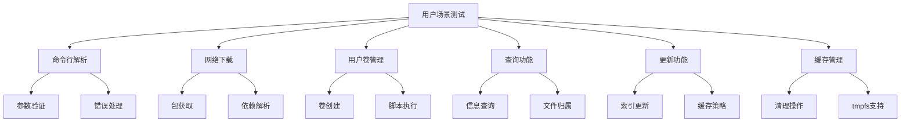
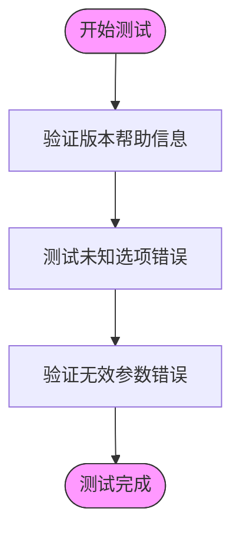
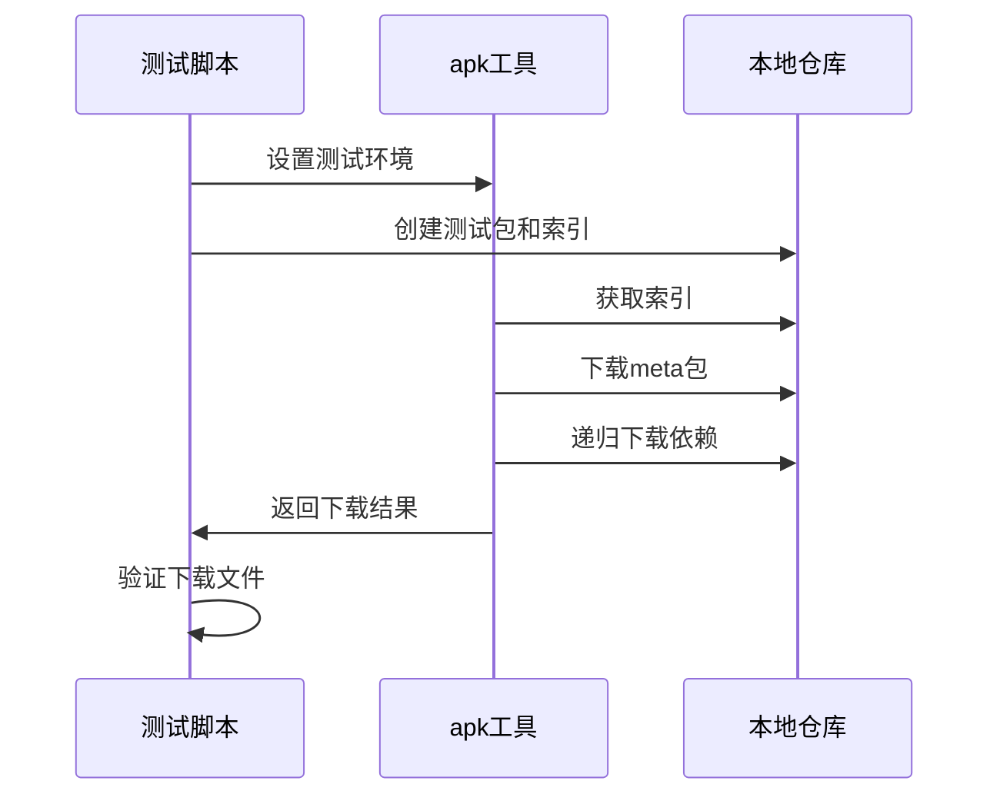
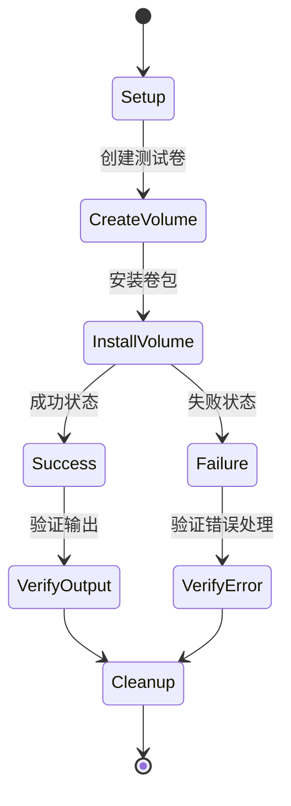
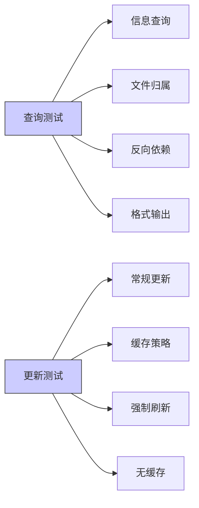
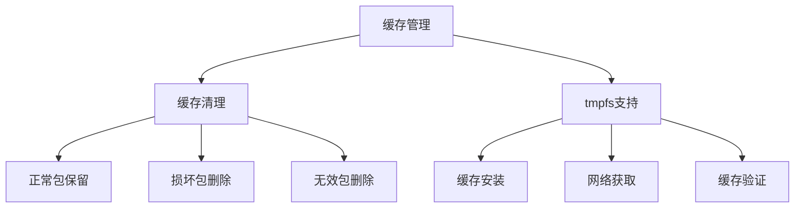
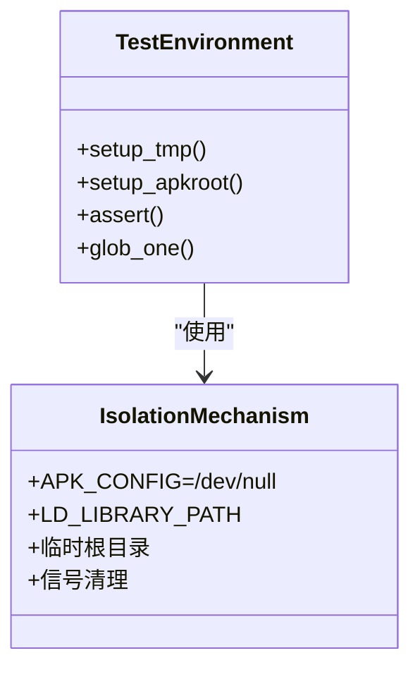

# 用户场景测试

<cite>
**Referenced Files in This Document**   
- [test/user/command-parsing.sh](file://test/user/command-parsing.sh)
- [test/user/fetch.sh](file://test/user/fetch.sh)
- [test/user/uvol.sh](file://test/user/uvol.sh)
- [test/user/query.sh](file://test/user/query.sh)
- [test/user/update.sh](file://test/user/update.sh)
- [test/user/cache-clean.sh](file://test/user/cache-clean.sh)
- [test/user/cache-tmpfs.sh](file://test/user/cache-tmpfs.sh)
- [test/testlib.sh](file://test/testlib.sh)
- [test/uvol-test-manager.sh](file://test/uvol-test-manager.sh)
- [test/Makefile](file://test/Makefile)
</cite>

## 目录
1. [简介](#简介)
2. [用户场景测试体系](#用户场景测试体系)
3. [命令行参数解析测试](#命令行参数解析测试)
4. [网络下载功能测试](#网络下载功能测试)
5. [用户卷管理测试](#用户卷管理测试)
6. [查询与更新功能测试](#查询与更新功能测试)
7. [缓存管理测试](#缓存管理测试)
8. [测试隔离机制](#测试隔离机制)
9. [测试实践指南](#测试实践指南)
10. [结论](#结论)

## 简介
apk-tools的用户场景测试体系通过一系列shell脚本验证软件包管理器在真实使用场景下的行为。这些测试覆盖了软件包安装、更新、查询、缓存管理和用户卷操作等核心功能，确保工具在各种使用模式下的正确性和稳定性。

## 用户场景测试体系
apk-tools的用户场景测试位于`test/user/`目录下，包含多个shell脚本，每个脚本专注于特定的功能领域。这些测试通过模拟真实用户操作流程来验证apk工具的行为，涵盖了软件包管理的各个方面。



**Diagram sources**
- [test/user/command-parsing.sh](file://test/user/command-parsing.sh)
- [test/user/fetch.sh](file://test/user/fetch.sh)
- [test/user/uvol.sh](file://test/user/uvol.sh)
- [test/user/query.sh](file://test/user/query.sh)
- [test/user/update.sh](file://test/user/update.sh)

**Section sources**
- [test/user](file://test/user)

## 命令行参数解析测试
`command-parsing.sh`脚本验证apk工具的命令行参数解析功能，确保工具能够正确处理各种输入情况。

该测试验证了帮助信息的正确性、未知选项的错误处理以及无效参数的验证。通过检查命令输出是否符合预期模式，确保命令行接口的稳定性和用户友好性。



**Diagram sources**
- [test/user/command-parsing.sh](file://test/user/command-parsing.sh#L6-L17)

**Section sources**
- [test/user/command-parsing.sh](file://test/user/command-parsing.sh#L1-L18)

## 网络下载功能测试
`fetch.sh`脚本测试apk工具的网络下载功能，验证包获取、依赖解析和自定义命名等特性。

测试首先设置一个本地仓库，创建包含依赖关系的软件包，然后验证各种下载场景。包括直接下载、递归下载依赖以及使用自定义包名模板等功能。



**Diagram sources**
- [test/user/fetch.sh](file://test/user/fetch.sh#L6-L46)

**Section sources**
- [test/user/fetch.sh](file://test/user/fetch.sh#L1-L46)

## 用户卷管理测试
`uvol.sh`脚本验证用户卷（user volume）管理功能，测试卷的创建、数据写入和脚本执行等行为。

测试通过`uvol-test-manager.sh`模拟用户卷管理器，验证正常情况和错误情况下的行为。包括成功创建卷、正确写入数据以及在脚本失败时的错误处理和清理机制。



**Diagram sources**
- [test/user/uvol.sh](file://test/user/uvol.sh#L6-L52)
- [test/uvol-test-manager.sh](file://test/uvol-test-manager.sh#L1-L16)

**Section sources**
- [test/user/uvol.sh](file://test/user/uvol.sh#L1-L52)

## 查询与更新功能测试
用户场景测试还包括查询和更新功能的验证，确保信息检索和索引更新的正确性。

### 查询功能测试
`query.sh`脚本测试各种查询命令，包括包信息查询、文件归属查询、反向依赖查询等。测试验证了不同输出格式（文本、YAML、JSON）的正确性。

### 更新功能测试
`update.sh`脚本验证索引更新功能，包括常规更新、缓存策略（最大年龄、强制刷新）和无缓存更新等场景。



**Diagram sources**
- [test/user/query.sh](file://test/user/query.sh#L1-L212)
- [test/user/update.sh](file://test/user/update.sh#L1-L36)

**Section sources**
- [test/user/query.sh](file://test/user/query.sh)
- [test/user/update.sh](file://test/user/update.sh)

## 缓存管理测试
缓存管理测试验证apk工具的缓存行为，确保包缓存的正确性和清理功能的可靠性。

### 缓存清理测试
`cache-clean.sh`脚本测试缓存清理功能，验证哪些文件应该保留，哪些应该被删除。测试包括正常缓存包、损坏缓存包和不存在包的处理。

### tmpfs缓存测试
`cache-tmpfs.sh`脚本验证在tmpfs文件系统上的缓存行为，测试从缓存重新安装和网络获取功能。



**Diagram sources**
- [test/user/cache-clean.sh](file://test/user/cache-clean.sh#L1-L37)
- [test/user/cache-tmpfs.sh](file://test/user/cache-tmpfs.sh#L1-L31)

**Section sources**
- [test/user/cache-clean.sh](file://test/user/cache-clean.sh)
- [test/user/cache-tmpfs.sh](file://test/user/cache-tmpfs.sh)

## 测试隔离机制
apk-tools的测试框架通过环境变量和重定向机制实现测试隔离，确保测试的可靠性和可重复性。

### 环境变量隔离
测试通过设置`APK_CONFIG=/dev/null`环境变量，使apk工具使用空配置，避免受系统配置影响。同时通过`APK`环境变量指定测试使用的apk可执行文件路径。

### 临时环境创建
`testlib.sh`提供了`setup_tmp`和`setup_apkroot`函数，创建隔离的测试环境。`setup_apkroot`创建临时根目录，设置必要的目录结构和文件，确保测试在干净环境中运行。



**Diagram sources**
- [test/testlib.sh](file://test/testlib.sh#L1-L54)
- [test/Makefile](file://test/Makefile#L5-L9)

**Section sources**
- [test/testlib.sh](file://test/testlib.sh)
- [test/Makefile](file://test/Makefile)

## 测试实践指南
### 运行用户测试
用户测试可以通过Makefile中的`test`目标运行，或者直接执行单个测试脚本。所有测试脚本都会输出到`test.log`文件，失败时会显示错误信息。

```bash
make test
# 或
./test/user/command-parsing.sh
```

### 失败诊断
测试失败时，系统会输出失败的测试脚本名称和`test.log`内容。通过检查日志可以定位具体失败的断言，分析命令输出与预期的差异。

### 新增测试脚本
新增测试脚本应遵循以下规范：
- 放置在`test/user/`目录下
- 文件名以`.sh`结尾，描述测试功能
- 开头包含shebang行`#!/bin/sh`
- 引入`testlib.sh`获取测试辅助函数
- 使用`assert`函数进行断言验证

## 结论
apk-tools的用户场景测试体系通过全面的shell脚本测试，验证了软件包管理器在各种真实使用场景下的行为。测试框架通过环境隔离和临时环境创建，确保了测试的可靠性和可重复性。这些测试为apk工具的稳定性和正确性提供了重要保障，是项目质量保证体系的核心组成部分。