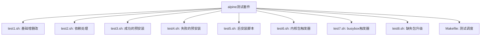
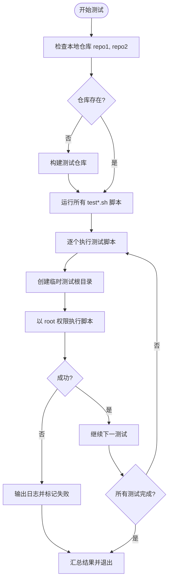

# 集成测试

<cite>
**本文档中引用的文件**   
- [test1.sh](file://test/alpine/test1.sh)
- [test2.sh](file://test/alpine/test2.sh)
- [test3.sh](file://test/alpine/test3.sh)
- [test4.sh](file://test/alpine/test4.sh)
- [test5.sh](file://test/alpine/test5.sh)
- [test6.sh](file://test/alpine/test6.sh)
- [test7.sh](file://test/alpine/test7.sh)
- [test8.sh](file://test/alpine/test8.sh)
- [Makefile](file://test/alpine/Makefile)
- [testlib.sh](file://test/testlib.sh)
</cite>

## 目录
1. [简介](#简介)
2. [测试套件结构](#测试套件结构)
3. [各测试脚本功能分析](#各测试脚本功能分析)
4. [测试执行流程](#测试执行流程)
5. [测试输出与故障排查](#测试输出与故障排查)
6. [端到端测试最佳实践](#端到端测试最佳实践)

## 简介
本项目中的集成测试套件位于 `test/alpine/` 目录下，旨在验证 apk-tools 在接近生产环境中的行为。这些测试覆盖了软件包管理系统的核心功能，包括安装、删除、升级、依赖解析、事务回滚、脚本执行和触发器机制等。通过模拟真实使用场景，确保多组件协同工作的稳定性与可靠性。

## 测试套件结构



**Diagram sources**
- [test1.sh](file://test/alpine/test1.sh)
- [test2.sh](file://test/alpine/test2.sh)
- [test3.sh](file://test/alpine/test3.sh)
- [test4.sh](file://test/alpine/test4.sh)
- [test5.sh](file://test/alpine/test5.sh)
- [test6.sh](file://test/alpine/test6.sh)
- [test7.sh](file://test/alpine/test7.sh)
- [test8.sh](file://test/alpine/test8.sh)
- [Makefile](file://test/alpine/Makefile)

**Section sources**
- [test/alpine](file://test/alpine)

## 各测试脚本功能分析

### test1.sh：基础安装、删除与升级验证
该脚本验证了软件包管理系统的基本操作流程，包括初始化数据库、添加软件包、升级版本以及删除软件包。通过检查 `$ROOT/usr/bin/test-a` 的输出内容变化，确认版本从 1.0 升级至 1.1，并验证删除后可执行文件不再存在。

**Section sources**
- [test1.sh](file://test/alpine/test1.sh#L1-L16)

### test2.sh：依赖关系处理
此测试验证了依赖解析机制。`test-b` 依赖于 `test-a`，在安装 `test-b` 时会自动安装其依赖项 `test-a`。升级操作会同时更新依赖包，而删除主包时若无其他依赖引用，则依赖包也应被自动清理。

**Section sources**
- [test2.sh](file://test/alpine/test2.sh#L1-L24)

### test3.sh：成功的预安装脚本执行
测试预安装脚本是否能正确执行。通过 `-U` 参数启用用户模式脚本执行，在安装 `test-c` 时触发 `pre-install` 脚本，并验证该脚本生成的标记文件 `/pre-install` 是否存在。

**Section sources**
- [test3.sh](file://test/alpine/test3.sh#L1-L13)

### test4.sh：失败的预安装脚本回滚
模拟预安装脚本失败场景。通过在根目录创建 `should-fail` 文件触发脚本异常，验证系统能否正确回滚事务，防止部分安装状态残留。即使脚本已执行，最终软件包不应被记录为已安装。

**Section sources**
- [test4.sh](file://test/alpine/test4.sh#L1-L18)

### test5.sh：后安装脚本执行
验证安装完成后 `post-install` 脚本是否被调用。测试通过检查 `/post-install` 文件是否存在来确认脚本执行成功，确保配置初始化、服务注册等操作得以完成。

**Section sources**
- [test5.sh](file://test/alpine/test5.sh#L1-L10)

### test6.sh：内核包触发器机制
测试内核类软件包的触发器行为。安装 `linux-lts` 和相关固件后，验证是否生成了正确的内核镜像和初始化内存盘（initramfs），确保系统可引导。

**Section sources**
- [test6.sh](file://test/alpine/test6.sh#L1-L12)

### test7.sh：busybox符号链接重建
针对 busybox 这类提供多个符号链接的工具包，测试其触发器能否在每次重装时正确重建 `/usr/bin/wget` 等符号链接。循环执行四次以验证稳定性，避免出现段错误或链接丢失问题。

**Section sources**
- [test7.sh](file://test/alpine/test7.sh#L1-L23)

### test8.sh：仓库缺失情况下的升级处理
测试当目标仓库中缺少更新版本时，`apk upgrade` 命令的行为是否符合预期。应能正常处理而非报错，保持当前安装状态不变。

**Section sources**
- [test8.sh](file://test/alpine/test8.sh#L1-L8)

## 测试执行流程



**Diagram sources**
- [Makefile](file://test/alpine/Makefile#L37-L63)

**Section sources**
- [Makefile](file://test/alpine/Makefile#L1-L64)

Makefile 定义了自动化测试流程：
- `repos.stamp` 确保测试仓库已构建
- `%.ok: %.sh` 规则为每个 `.sh` 脚本生成对应的目标，执行前创建独立的临时根目录
- 使用 `sudo` 提权运行测试，模拟真实系统环境
- 捕获标准输出与错误输出，便于调试
- 支持 QEMU 用户模式仿真，用于跨架构测试

## 测试输出与故障排查

当某个测试失败时，系统会输出类似以下信息：
```
test4.sh FAIL
------------- output -------------
...（详细日志）
----------------------------------
```

排查步骤如下：
1. 查看 `.out` 日志文件，定位具体失败命令
2. 检查 `$testroot` 中的文件系统状态，确认脚本执行痕迹
3. 验证环境变量（如 `APK`, `ROOT`, `SYSREPO`）是否正确传递
4. 若涉及脚本执行，检查权限与解释器路径
5. 对于依赖问题，确认仓库索引是否包含所需包及其依赖关系

复现复杂问题时，可手动进入 `$testroot` 目录，使用 `chroot` 或直接调用 `apk` 命令进行交互式调试。

**Section sources**
- [Makefile](file://test/alpine/Makefile#L37-L53)
- [testlib.sh](file://test/testlib.sh#L1-L54)

## 端到端测试最佳实践

为新功能添加端到端测试时，建议遵循以下原则：
- **覆盖核心路径**：确保正向流程能正常工作
- **模拟异常场景**：如脚本失败、网络中断、权限不足等
- **隔离测试环境**：每个测试使用独立的 `testroot`，避免相互干扰
- **可重复执行**：测试应具备幂等性，多次运行结果一致
- **清晰断言**：使用明确的 `test` 命令验证结果，而非仅依赖命令退出码
- **最小依赖**：尽量减少对外部服务的依赖，使用本地仓库模拟
- **文档化意图**：在脚本头部添加 `# desc:` 注释说明测试目的

这些集成测试是保障 apk-tools 质量的关键防线，确保在真实系统中多组件协同工作时的稳定性与一致性。

**Section sources**
- [test1.sh](file://test/alpine/test1.sh)
- [test2.sh](file://test/alpine/test2.sh)
- [test3.sh](file://test/alpine/test3.sh)
- [test4.sh](file://test/alpine/test4.sh)
- [test5.sh](file://test/alpine/test5.sh)
- [test6.sh](file://test/alpine/test6.sh)
- [test7.sh](file://test/alpine/test7.sh)
- [test8.sh](file://test/alpine/test8.sh)
- [Makefile](file://test/alpine/Makefile)