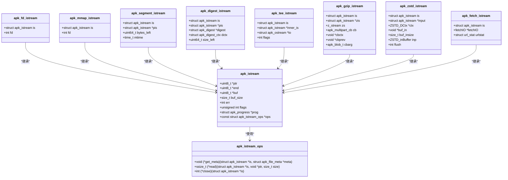

# IO抽象层

<cite>
**本文档引用的文件**   
- [io.c](file://src/io.c)
- [apk_io.h](file://src/apk_io.h)
- [io_gunzip.c](file://src/io_gunzip.c)
- [io_zstd.c](file://src/io_zstd.c)
- [io_url_libfetch.c](file://src/io_url_libfetch.c)
- [adb.c](file://src/adb.c)
- [database.c](file://src/database.c)
- [extract_v3.c](file://src/extract_v3.c)
- [app_fetch.c](file://src/app_fetch.c)
</cite>

## 目录
1. [引言](#引言)
2. [核心抽象：apk_istream结构体](#核心抽象apk_istream结构体)
3. [分层设计原则](#分层设计原则)
4. [通用IO工具函数](#通用io工具函数)
5. [输入流的创建与组合](#输入流的创建与组合)
6. [错误传播与资源清理](#错误传播与资源清理)
7. [类图：apk_istream继承与组合关系](#类图apk_istream继承与组合关系)

## 引言
apk-tools的IO抽象层设计旨在提供一个统一、灵活且高效的接口，用于处理各种数据源，包括本地文件、网络资源和压缩数据。该设计的核心是`apk_istream`结构体，它通过定义一组标准的操作（如读取、获取元数据和关闭），实现了对不同数据源的统一访问。这种抽象不仅简化了高层逻辑的实现，还增强了代码的可维护性和可扩展性。

**Section sources**
- [io.c](file://src/io.c#L78-L85)
- [apk_io.h](file://src/apk_io.h#L78-L85)

## 核心抽象：apk_istream结构体
`apk_istream`是IO抽象层的核心结构体，它定义了一个统一的输入流接口。该结构体通过`ops`字段指向一个`apk_istream_ops`结构体，后者包含了具体的实现函数，如`read`、`get_meta`和`close`。这种设计模式允许不同的数据源（如文件、内存块、网络流）通过实现相同的接口来提供数据，从而实现了多态性。

```c
struct apk_istream {
    uint8_t *ptr, *end, *buf;
    size_t buf_size;
    int err;
    unsigned int flags;
    struct apk_progress *prog;
    const struct apk_istream_ops *ops;
};
```

**Section sources**
- [apk_io.h](file://src/apk_io.h#L78-L85)

## 分层设计原则
IO抽象层遵循分层设计原则，高层逻辑通过统一的`apk_istream`接口访问数据，而底层则提供具体的实现。例如，`apk_istream_from_file`函数创建一个文件输入流，`apk_istream_from_url`函数创建一个网络输入流，而`apk_istream_gunzip`函数则创建一个解压输入流。这些函数返回的都是`apk_istream`指针，使得高层逻辑无需关心数据源的具体类型。

**Section sources**
- [io.c](file://src/io.c#L584-L603)
- [io.c](file://src/io.c#L606-L610)
- [io_gunzip.c](file://src/io_gunzip.c#L155-L180)

## 通用IO工具函数
IO抽象层提供了多个通用的IO工具函数，用于简化常见的IO操作。例如，`apk_istream_read`函数用于从输入流中读取指定数量的字节，`apk_istream_get`函数用于获取指定长度的数据，而`apk_stream_copy`函数则用于将数据从一个输入流复制到一个输出流。这些函数不仅提高了代码的复用性，还减少了出错的可能性。

**Section sources**
- [io.c](file://src/io.c#L128-L131)
- [io.c](file://src/io.c#L170-L176)
- [io.c](file://src/io.c#L644-L668)

## 输入流的创建与组合
IO抽象层支持创建和组合不同类型的输入流。例如，可以通过`apk_istream_from_file`函数创建一个文件输入流，然后通过`apk_istream_gunzip`函数将其包装成一个解压输入流。这种组合方式使得可以轻松处理复杂的IO场景，如从网络下载并解压一个文件。

```c
struct apk_istream *is = apk_istream_from_file(AT_FDCWD, "file.gz");
is = apk_istream_gunzip(is);
```

**Section sources**
- [io.c](file://src/io.c#L584-L603)
- [io_gunzip.c](file://src/io_gunzip.c#L155-L180)

## 错误传播与资源清理
IO抽象层通过`err`字段和`close`操作来处理错误传播和资源清理。当发生错误时，`err`字段会被设置为相应的错误码，而`close`操作则负责释放与输入流相关的资源。这种设计确保了即使在发生错误的情况下，资源也能被正确地清理。

**Section sources**
- [io.c](file://src/io.c#L80-L81)
- [io.c](file://src/io.c#L577-L581)

## 类图：apk_istream继承与组合关系


**Diagram sources**
- [io.c](file://src/io.c#L78-L85)
- [io.c](file://src/io.c#L547-L549)
- [io.c](file://src/io.c#L484-L484)
- [io.c](file://src/io.c#L299-L319)
- [io.c](file://src/io.c#L362-L380)
- [io.c](file://src/io.c#L382-L387)
- [io_gunzip.c](file://src/io_gunzip.c#L18-L27)
- [io_zstd.c](file://src/io_zstd.c#L20-L27)
- [io_url_libfetch.c](file://src/io_url_libfetch.c#L21-L24)

**Section sources**
- [io.c](file://src/io.c#L78-L85)
- [io.c](file://src/io.c#L547-L549)
- [io.c](file://src/io.c#L484-L484)
- [io.c](file://src/io.c#L299-L319)
- [io.c](file://src/io.c#L362-L380)
- [io.c](file://src/io.c#L382-L387)
- [io_gunzip.c](file://src/io_gunzip.c#L18-L27)
- [io_zstd.c](file://src/io_zstd.c#L20-L27)
- [io_url_libfetch.c](file://src/io_url_libfetch.c#L21-L24)