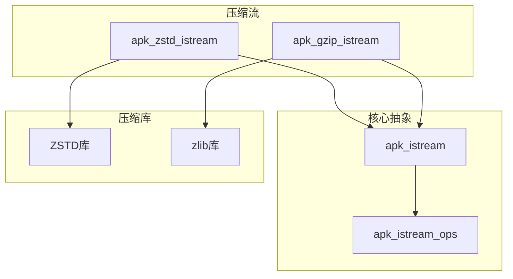
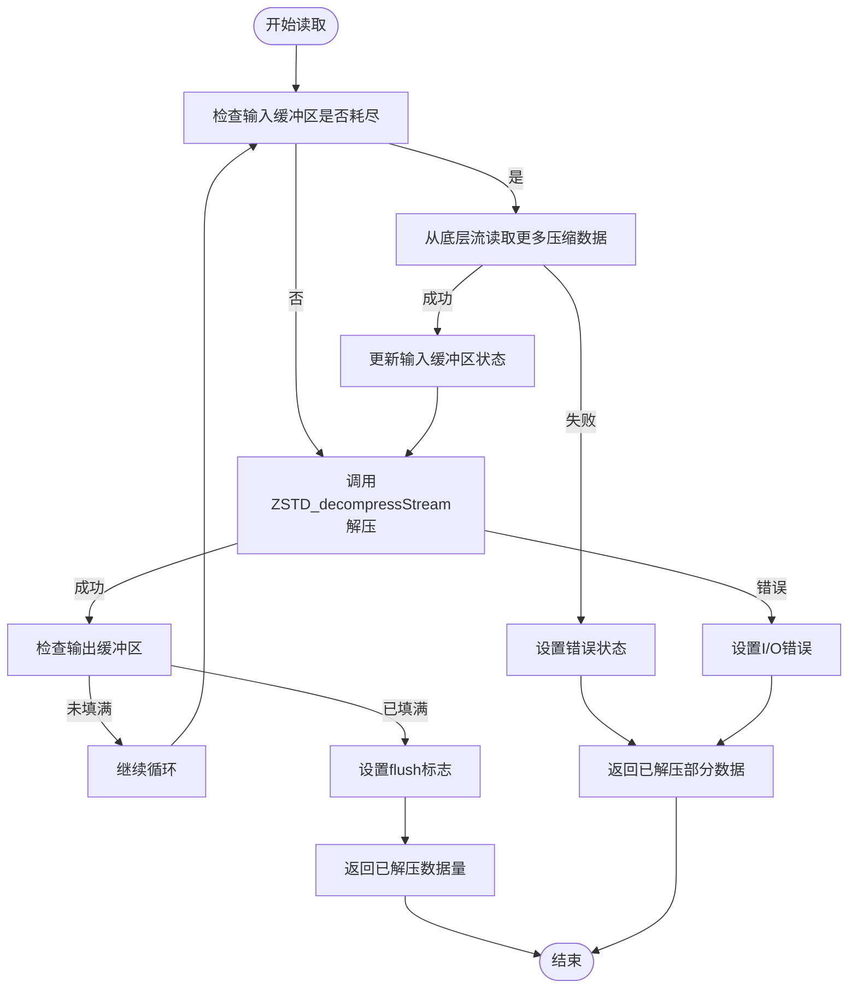
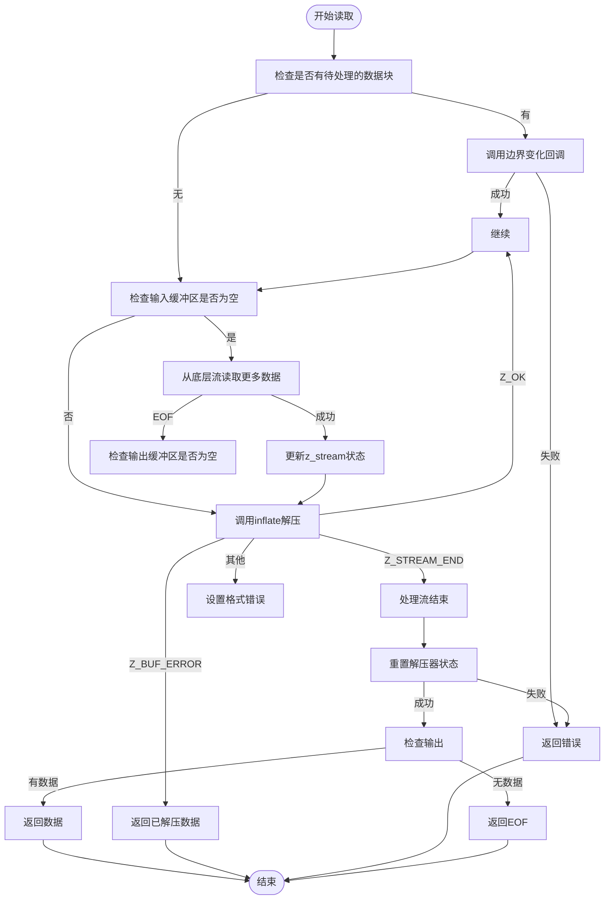
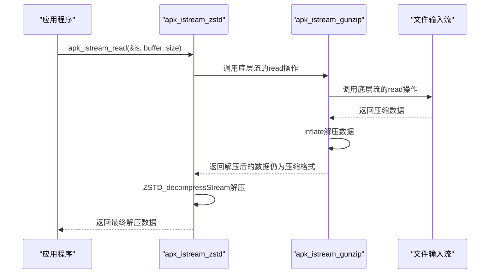

# 压缩格式支持

<cite>
**本文档引用的文件**
- [io_zstd.c](file://src/io_zstd.c)
- [io_gunzip.c](file://src/io_gunzip.c)
- [apk_io.h](file://src/apk_io.h)
- [apk_defines.h](file://src/apk_defines.h)
- [apk_blob.h](file://src/apk_blob.h)
</cite>

## 目录
1. [简介](#简介)
2. [压缩解压架构](#压缩解压架构)
3. [Zstd压缩支持](#zstd压缩支持)
4. [Gzip压缩支持](#gzip压缩支持)
5. [输入流抽象集成](#输入流抽象集成)
6. [内存管理策略](#内存管理策略)
7. [性能特征与权衡](#性能特征与权衡)
8. [错误处理模式](#错误处理模式)

## 简介
apk-tools通过`apk_istream`输入流抽象层实现了对zstd和gzip两种压缩格式的无缝支持。该系统设计允许在不修改上层应用逻辑的情况下，透明地处理压缩数据。核心机制是将压缩解压层作为流式过滤器集成到输入流管道中，使得上层代码可以像读取普通文件一样读取压缩数据。zstd和gzip的实现分别位于`io_zstd.c`和`io_gunzip.c`文件中，它们都遵循相同的抽象接口，确保了API的一致性和可扩展性。

## 压缩解压架构
apk-tools的压缩解压架构基于流式处理模型，通过`apk_istream_ops`操作集将压缩解压逻辑与数据源解耦。`apk_istream`结构体作为核心抽象，包含指向具体操作函数的指针、缓冲区和状态信息。当创建一个压缩流时，系统会分配一个包含具体压缩器状态的私有结构体（如`apk_zstd_istream`或`apk_gzip_istream`），并将其与`apk_istream`关联。数据读取时，`read`操作会调用压缩库的流式解压函数，从底层输入流获取压缩数据并解压到输出缓冲区。

**Diagram sources**
- [io_zstd.c](file://src/io_zstd.c#L19-L27)
- [io_gunzip.c](file://src/io_gunzip.c#L17-L26)
- [apk_io.h](file://src/apk_io.h#L69-L73)

**Section sources**
- [io_zstd.c](file://src/io_zstd.c#L1-L259)
- [io_gunzip.c](file://src/io_gunzip.c#L1-L266)
- [apk_io.h](file://src/apk_io.h#L64-L93)

## Zstd压缩支持
### 流式解压实现
zstd支持通过`apk_istream_zstd`函数实现，该函数创建一个`apk_zstd_istream`结构体，其中包含ZSTD解压上下文`ZSTD_DCtx`、输入缓冲区和流状态。解压过程基于`ZSTD_decompressStream`函数，采用流式处理方式，能够高效处理大文件而无需一次性加载全部数据到内存。

**Diagram sources**
- [io_zstd.c](file://src/io_zstd.c#L36-L81)

**Section sources**
- [io_zstd.c](file://src/io_zstd.c#L101-L133)

### 压缩流初始化
`apk_istream_zstd`函数负责初始化zstd解压流。它首先检查输入流的有效性，然后分配内存，其中包含`apk_zstd_istream`结构体、输出缓冲区和输入缓冲区。输入缓冲区大小由`ZSTD_DStreamInSize()`确定，确保足够容纳一个完整的压缩块。解压上下文通过`ZSTD_createDCtx()`创建，并初始化操作函数指针。

### 内存管理
zstd流的内存管理采用紧凑分配策略，将`apk_zstd_istream`结构体、输出缓冲区和输入缓冲区连续分配在一块内存中。这种设计减少了内存碎片并提高了缓存局部性。输出缓冲区大小为`apk_io_bufsize`（默认128KB），输入缓冲区大小由zstd库建议。当流关闭时，整个内存块通过`free()`一次性释放。

## Gzip压缩支持
### Gzip解压细节
gzip支持通过`apk_istream_zlib`函数实现，使用zlib库进行解压。与zstd类似，它创建一个`apk_gzip_istream`结构体，包含`z_stream`解压状态、回调函数和上下文。解压过程基于`inflate`函数，采用增量解压模式（`Z_NO_FLUSH`）。

**Diagram sources**
- [io_gunzip.c](file://src/io_gunzip.c#L67-L125)

**Section sources**
- [io_gunzip.c](file://src/io_gunzip.c#L155-L180)

### 多部分流支持
gzip实现支持多部分流（multipart streams），通过`apk_multipart_cb`回调函数通知上层应用数据块的边界。当检测到一个gzip流结束时，会调用回调函数通知`APK_MPART_BOUNDARY`事件，允许上层应用处理每个独立的数据块。这对于处理包含多个压缩文件的tar.gz文件特别有用。

## 输入流抽象集成
### 无缝集成机制
压缩解压层通过`apk_istream`抽象无缝集成到apk-tools中。任何`apk_istream`都可以作为另一个压缩流的输入，形成一个处理管道。例如，可以从文件创建一个输入流，然后将其包装成gzip流，再包装成zstd流，系统会自动处理解压顺序。

**Diagram sources**
- [apk_io.h](file://src/apk_io.h#L104-L105)
- [io_zstd.c](file://src/io_zstd.c#L36-L81)
- [io_gunzip.c](file://src/io_gunzip.c#L67-L125)

**Section sources**
- [apk_io.h](file://src/apk_io.h#L95-L112)
- [io.c](file://src/io.c#L91-L126)

### 初始化与数据读取
压缩流的初始化通过`apk_istream_zstd`或`apk_istream_gunzip`函数完成。这些函数返回一个`apk_istream`指针，可以像普通输入流一样使用。数据读取通过`apk_istream_read`函数进行，该函数内部调用压缩流的`read`操作，实现透明的解压。

## 内存管理策略
### 缓冲区分配
apk-tools采用高效的内存分配策略。对于zstd流，使用单次`malloc`分配整个结构体，包括`apk_zstd_istream`、输出缓冲区和输入缓冲区。输出缓冲区位于结构体之后，输入缓冲区紧随其后。这种布局减少了内存分配次数并优化了内存访问模式。

对于gzip流，由于`z_stream`结构体大小固定，内存分配相对简单，主要分配`apk_gzip_istream`结构体和输出缓冲区。

### 流状态维护
流状态维护通过结构体成员变量实现。zstd流维护`flush`标志以处理内部缓冲区数据，而gzip流维护`cbprev`指针以跟踪上一个数据块的结束位置。错误状态通过`is.err`成员变量传递，确保错误信息能够从底层流传递到上层应用。

## 性能特征与权衡
### Zstd性能特征
zstd在压缩比和速度之间提供了良好的平衡。在apk-tools中，zstd默认使用9级压缩，提供较高的压缩比。zstd支持多线程压缩，但代码中限制线程数不超过6个，因为超过此数量后性能提升不明显，反而会增加CPU和内存开销。zstd的流式解压性能优异，特别适合处理大型软件包。

### Gzip性能特征
gzip作为广泛支持的压缩格式，提供了良好的兼容性。其压缩比通常低于zstd，但解压速度较快。在apk-tools中，gzip主要用于向后兼容和网络传输场景。由于gzip是单线程算法，其性能主要取决于CPU速度。

### 权衡考量
在软件包管理场景下，选择压缩算法需要权衡压缩比、解压速度、CPU和内存开销。zstd适合存储场景，因为它能显著减少磁盘空间占用；而gzip适合网络传输，因为其解压速度快且客户端支持广泛。apk-tools通过支持多种格式，允许用户根据具体需求进行选择。

## 错误处理模式
### 错误传播机制
apk-tools采用统一的错误处理模式。所有错误通过`is.err`成员变量传播，从底层流到上层应用。当发生错误时，`apk_istream_error`函数被调用，设置错误码并返回已处理的数据量。这允许上层应用区分完全成功、部分成功和完全失败的情况。

### 具体错误类型
- **I/O错误**：通过`-EIO`表示，通常由底层流读取失败引起
- **格式错误**：通过`-APKE_FORMAT_INVALID`表示，当压缩数据损坏时返回
- **内存不足**：通过`-ENOMEM`表示，当内存分配失败时返回
- **EOF处理**：通过特殊错误码`1`表示，当到达流末尾时返回

**Section sources**
- [apk_defines.h](file://src/apk_defines.h#L31-L100)
- [io_zstd.c](file://src/io_zstd.c#L64-L66)
- [io_gunzip.c](file://src/io_gunzip.c#L124-L125)