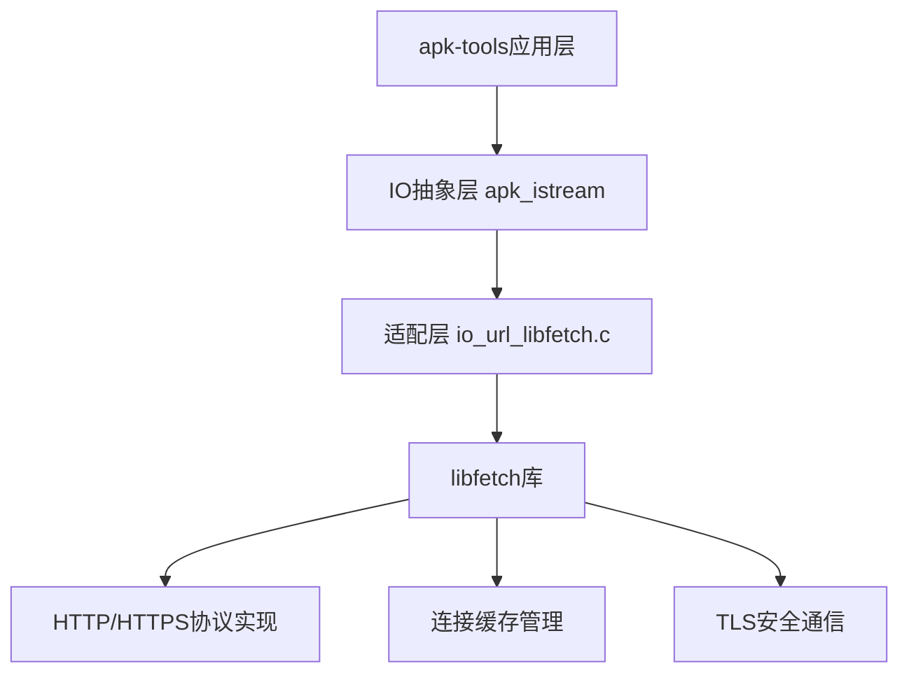
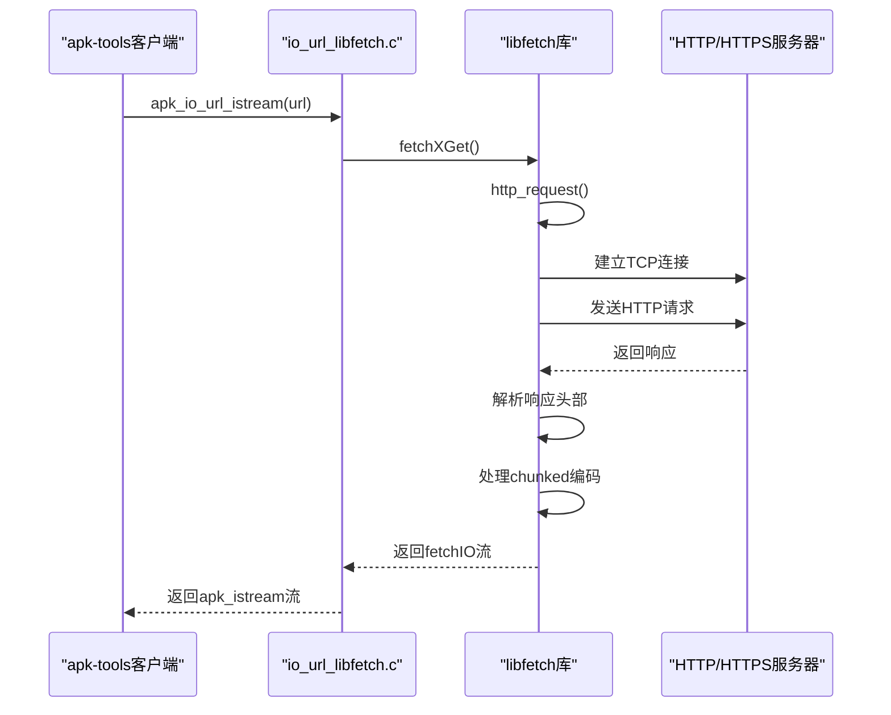
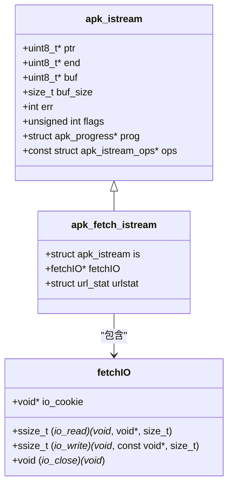
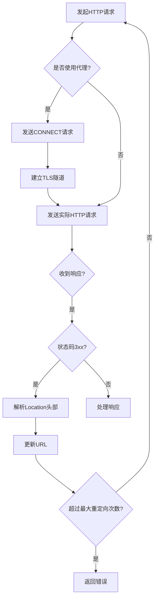
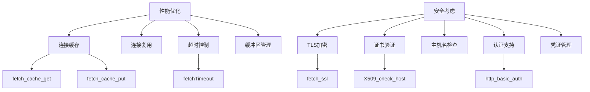
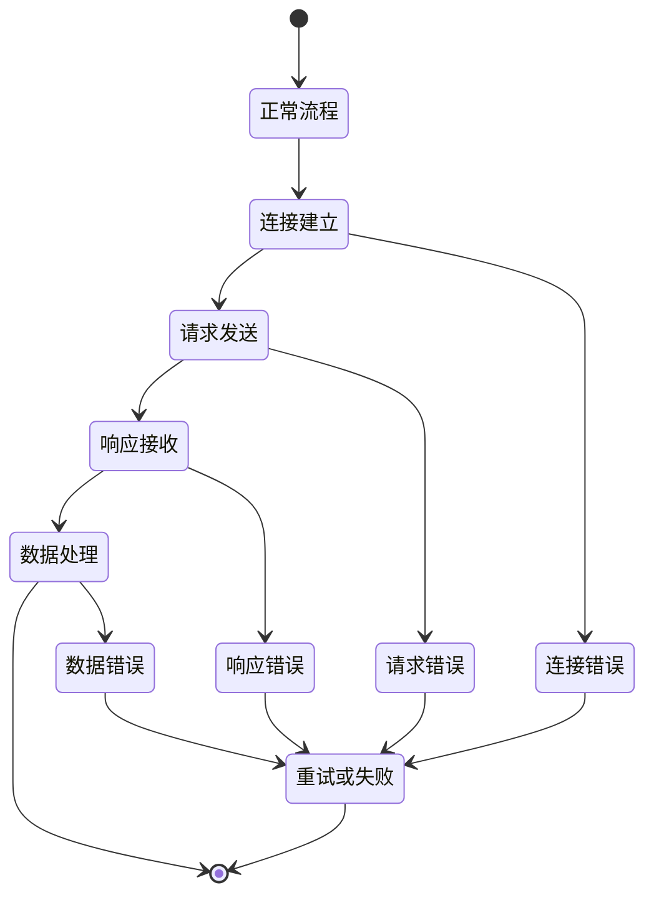

# 网络IO实现

<cite>
**本文档引用的文件**   
- [fetch.c](file://libfetch/fetch.c)
- [http.c](file://libfetch/http.c)
- [io_url_libfetch.c](file://src/io_url_libfetch.c)
- [fetch.h](file://libfetch/fetch.h)
- [common.h](file://libfetch/common.h)
- [apk_io.h](file://src/apk_io.h)
</cite>

## 目录
1. [引言](#引言)
2. [核心组件](#核心组件)
3. [HTTP/HTTPS协议处理逻辑](#httphttps协议处理逻辑)
4. [适配层实现](#适配层实现)
5. [重定向与代理支持](#重定向与代理支持)
6. [性能优化与安全考虑](#性能优化与安全考虑)
7. [数据流图](#数据流图)
8. [错误处理机制](#错误处理机制)

## 引言
apk-tools通过集成libfetch库实现了HTTP/HTTPS网络IO功能，为包管理器提供了可靠的网络通信能力。该实现不仅支持标准的HTTP/1.1协议特性，还包含了连接复用、超时控制、代理支持等高级功能。本文档详细分析了相关代码的实现机制，重点介绍协议处理逻辑、适配层设计以及性能优化策略。

**Section sources**
- [fetch.c](file://libfetch/fetch.c#L1-L620)
- [http.c](file://libfetch/http.c#L1-L800)
- [io_url_libfetch.c](file://src/io_url_libfetch.c#L1-L219)

## 核心组件
系统由三个主要组件构成：libfetch库提供底层网络IO功能，apk-tools的IO抽象层定义统一接口，适配层负责两者之间的桥接。`fetch.c`和`http.c`文件实现了HTTP协议的核心逻辑，包括连接管理、请求构造和响应解析。`io_url_libfetch.c`作为适配层，将libfetch的API转换为apk-tools所需的`apk_istream`接口。

**Diagram sources **
- [io_url_libfetch.c](file://src/io_url_libfetch.c#L1-L219)
- [fetch.c](file://libfetch/fetch.c#L1-L620)
- [http.c](file://libfetch/http.c#L1-L800)

**Section sources**
- [fetch.c](file://libfetch/fetch.c#L1-L620)
- [http.c](file://libfetch/http.c#L1-L800)
- [io_url_libfetch.c](file://src/io_url_libfetch.c#L1-L219)

## HTTP/HTTPS协议处理逻辑
libfetch库在`http.c`文件中实现了完整的HTTP/1.1协议栈。`http_request`函数是核心入口点，处理从连接建立到响应解析的完整流程。该函数首先通过`http_connect`建立到服务器或代理的连接，然后构造符合HTTP规范的请求报文。对于HTTPS连接，需要先通过CONNECT方法建立隧道，再进行TLS握手。

请求报文的构造遵循严格的格式规范，包括请求行、头部字段和消息体。关键头部如Host、User-Agent、Authorization等都被正确设置。`http_cmd`函数负责格式化并发送命令，使用`vasprintf`动态生成完整的HTTP请求。响应处理通过`http_get_reply`解析状态行，`http_next_header`逐个读取响应头部。

**Diagram sources **
- [http.c](file://libfetch/http.c#L809-L1194)
- [io_url_libfetch.c](file://src/io_url_libfetch.c#L129-L174)

**Section sources**
- [http.c](file://libfetch/http.c#L809-L1194)
- [fetch.c](file://libfetch/fetch.c#L56-L70)

## 适配层实现
`io_url_libfetch.c`文件实现了从libfetch到apk-tools IO抽象的适配。核心数据结构`apk_fetch_istream`封装了`fetchIO`对象和URL状态信息。适配层通过函数指针表`fetch_istream_ops`实现多态，将`apk_istream`的读取、关闭等操作委托给libfetch的对应函数。

`apk_io_url_istream`函数是主要入口点，它解析URL字符串，设置请求标志，调用`fetchXGet`获取网络流。错误处理通过`fetch_maperror`函数将libfetch的错误码转换为apk-tools的错误码。`fetch_read`和`fetch_close`函数分别处理数据读取和资源释放，确保内存安全。

**Diagram sources **
- [io_url_libfetch.c](file://src/io_url_libfetch.c#L21-L25)
- [apk_io.h](file://src/apk_io.h#L77-L84)
- [fetch.h](file://libfetch/fetch.h#L46-L58)

**Section sources**
- [io_url_libfetch.c](file://src/io_url_libfetch.c#L21-L174)
- [apk_io.h](file://src/apk_io.h#L69-L73)

## 重定向与代理支持
系统通过`fetchRedirectMethod`回调机制处理HTTP重定向。当收到301、302等重定向响应时，`http_request`函数会解析Location头部，构造新的URL并重新发起请求。最大重定向次数由`MAX_REDIRECT`常量限制为5次，防止无限循环。

代理支持通过环境变量`HTTP_PROXY`和`HTTPS_PROXY`配置。`http_get_proxy`函数检查环境变量并解析代理URL。对于HTTPS连接，需要先通过HTTP CONNECT方法建立隧道。代理认证通过`http_proxy_authorize`函数处理，支持基本认证和环境变量配置的认证信息。

**Diagram sources **
- [http.c](file://libfetch/http.c#L771-L782)
- [http.c](file://libfetch/http.c#L180-L195)
- [io_url_libfetch.c](file://src/io_url_libfetch.c#L177-L189)

**Section sources**
- [http.c](file://libfetch/http.c#L680-L740)
- [http.c](file://libfetch/http.c#L179-L189)
- [io_url_libfetch.c](file://src/io_url_libfetch.c#L177-L189)

## 性能优化与安全考虑
连接复用通过连接缓存实现，`fetchConnectionCacheInit`初始化缓存，`fetch_cache_get`和`fetch_cache_put`管理连接的获取和归还。这减少了TCP握手和TLS协商的开销，显著提升了性能。超时控制由`fetchTimeout`全局变量配置，`fetch_read`和`fetch_write`函数在I/O操作中检查超时。

安全方面，TLS验证通过OpenSSL库实现。`fetch_ssl`函数处理SSL握手，`openssl-compat.h`提供兼容性层。证书验证包括主机名匹配和信任链检查。`apk_io_url_no_check_certificate`函数允许跳过证书验证，仅用于测试环境。用户凭证通过`fetch_netrc_auth`从.netrc文件读取，支持自动认证。

**Diagram sources **
- [common.h](file://libfetch/common.h#L159-L160)
- [http.c](file://libfetch/http.c#L734-L736)
- [openssl-compat.h](file://libfetch/openssl-compat.h#L30-L32)

**Section sources**
- [common.h](file://libfetch/common.h#L159-L160)
- [http.c](file://libfetch/http.c#L734-L736)
- [openssl-compat.h](file://libfetch/openssl-compat.h#L1-L34)

## 数据流图
从高层`apk_istream`调用到底层socket通信的数据路径清晰地展示了数据流动过程。应用层通过`apk_istream_read`发起读取请求，经过适配层转换为`fetchIO_read`调用。在libfetch内部，`http_readfn`处理chunked编码，`fetch_read`从socket读取原始数据。写入过程则相反，数据从应用层流向socket。

**Diagram sources **
- [io_url_libfetch.c](file://src/io_url_libfetch.c#L103-L111)
- [http.c](file://libfetch/http.c#L240-L265)
- [common.c](file://libfetch/common.c#L567-L644)

**Section sources**
- [io_url_libfetch.c](file://src/io_url_libfetch.c#L103-L111)
- [http.c](file://libfetch/http.c#L240-L265)

## 错误处理机制
错误处理采用分层策略，每层负责处理特定类型的错误。`fetchLastErrCode`全局变量存储最后的错误信息，包含错误类别和代码。`fetch_syserr`函数将系统错误转换为libfetch错误。适配层通过`fetch_maperror`将libfetch错误映射为apk-tools错误码。

HTTP特定错误如401未授权、404未找到等被单独处理。网络错误通过`netdb_seterr`转换，TLS错误通过`tls_seterr`转换。`http_seterr`宏用于设置HTTP协议错误。错误传播通过返回NULL指针或负值实现，调用者需要检查返回值并采取相应措施。

**Diagram sources **
- [fetch.h](file://libfetch/fetch.h#L106-L109)
- [common.h](file://libfetch/common.h#L113-L117)
- [io_url_libfetch.c](file://src/io_url_libfetch.c#L32-L91)

**Section sources**
- [fetch.h](file://libfetch/fetch.h#L106-L109)
- [common.h](file://libfetch/common.h#L113-L117)
- [io_url_libfetch.c](file://src/io_url_libfetch.c#L32-L91)