# 网络与IO

<cite>
**本文档引用的文件**
- [io.c](file://src/io.c)
- [io_url_libfetch.c](file://src/io_url_libfetch.c)
- [io_gunzip.c](file://src/io_gunzip.c)
- [io_zstd.c](file://src/io_zstd.c)
- [apk_io.h](file://src/apk_io.h)
- [http.c](file://libfetch/http.c)
- [fetch.h](file://libfetch/fetch.h)
- [fetch.c](file://libfetch/fetch.c)
</cite>

## 目录
1. [输入输出子系统概述](#输入输出子系统概述)
2. [IO分层架构](#io分层架构)
3. [网络IO实现](#网络io实现)
4. [压缩格式支持](#压缩格式支持)
5. [性能优化策略](#性能优化策略)
6. [错误处理与重试机制](#错误处理与重试机制)
7. [数据流图](#数据流图)

## 输入输出子系统概述

apk-tools的输入输出子系统设计用于高效处理从远程仓库到本地文件系统的数据传输。该系统通过分层架构实现了网络IO、文件IO和压缩解压功能的解耦，提供了灵活且可扩展的数据处理能力。核心组件包括`apk_istream`抽象流、libfetch网络库适配层以及对zstd和gzip压缩格式的支持。

**Section sources**
- [io.c](file://src/io.c#L79-L85)
- [apk_io.h](file://src/apk_io.h#L77-L84)

## IO分层架构

apk-tools的IO子系统采用分层架构设计，从高层的`apk_istream`抽象到底层的具体实现，形成了清晰的层次结构。`apk_istream`结构体是整个IO系统的核心，它通过`ops`字段指向具体的`apk_istream_ops`操作集，实现了多态性。

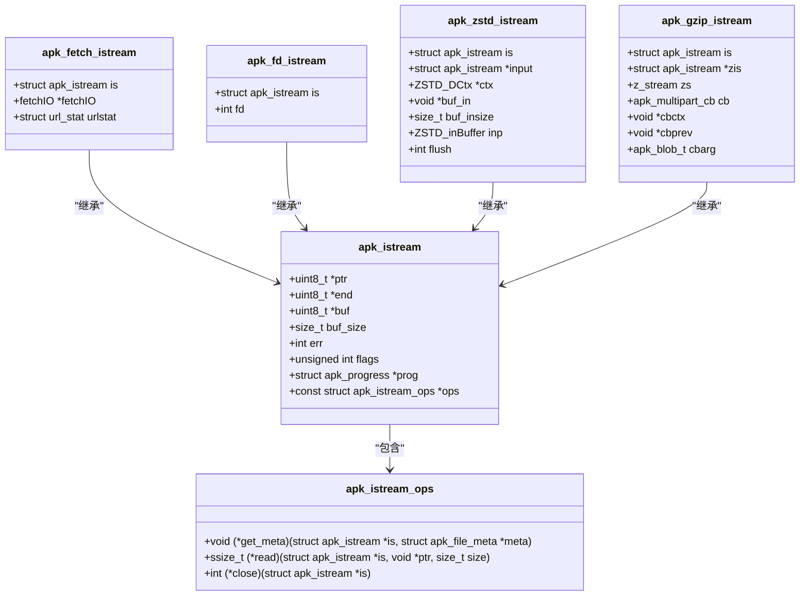

**Diagram sources**
- [apk_io.h](file://src/apk_io.h#L77-L84)
- [io_url_libfetch.c](file://src/io_url_libfetch.c#L21-L25)
- [io.c](file://src/io.c#L547-L550)
- [io_zstd.c](file://src/io_zstd.c#L20-L27)
- [io_gunzip.c](file://src/io_gunzip.c#L18-L27)

**Section sources**
- [apk_io.h](file://src/apk_io.h#L77-L84)
- [io_url_libfetch.c](file://src/io_url_libfetch.c#L21-L25)
- [io.c](file://src/io.c#L547-L550)
- [io_zstd.c](file://src/io_zstd.c#L20-L27)
- [io_gunzip.c](file://src/io_gunzip.c#L18-L27)

## 网络IO实现

### libfetch库适配层

apk-tools通过`io_url_libfetch.c`文件中的适配层实现了对libfetch库的封装。`apk_io_url_istream`函数是网络IO的主要入口，它将libfetch的`fetchIO`对象包装成`apk_istream`接口。

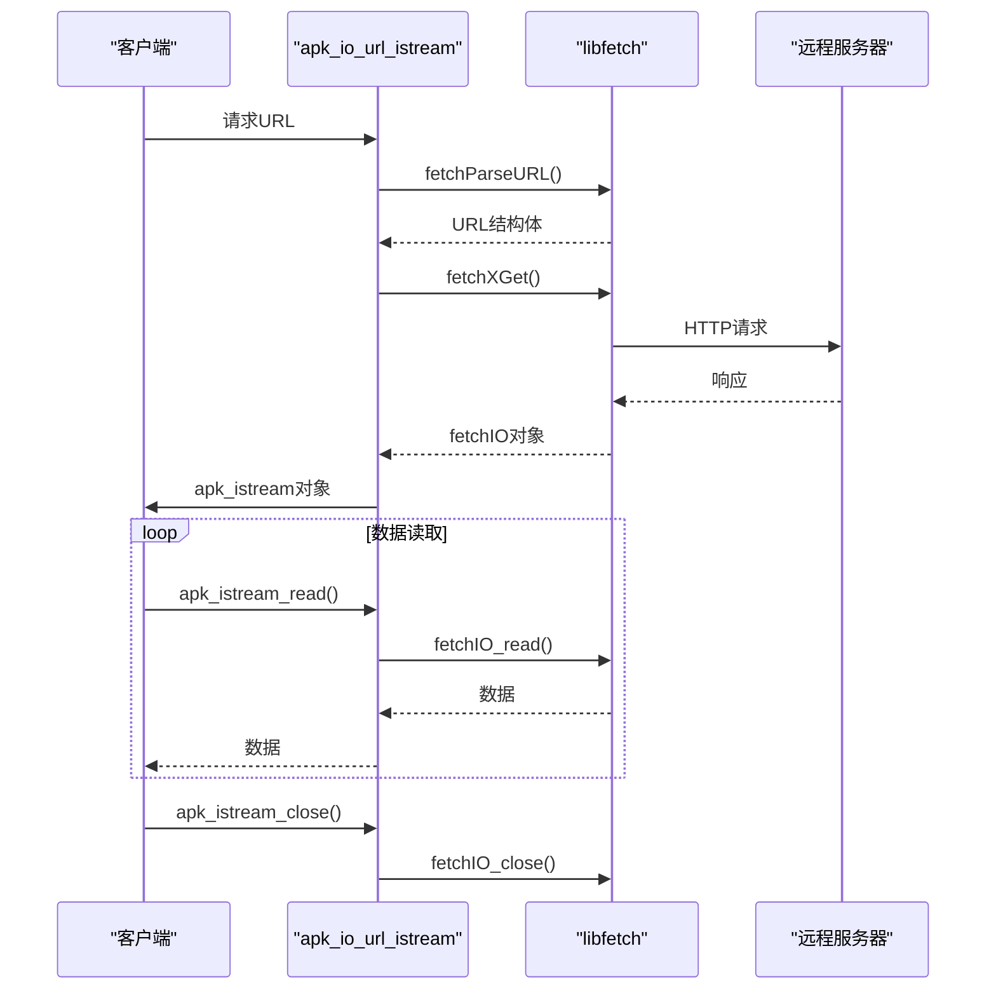

**Diagram sources**
- [io_url_libfetch.c](file://src/io_url_libfetch.c#L130-L174)
- [fetch.c](file://libfetch/fetch.c#L57-L71)
- [http.c](file://libfetch/http.c#L810-L1183)

**Section sources**
- [io_url_libfetch.c](file://src/io_url_libfetch.c#L130-L174)
- [fetch.c](file://libfetch/fetch.c#L57-L71)
- [http.c](file://libfetch/http.c#L810-L1183)

### HTTP/HTTPS网络IO

网络IO的实现基于libfetch库，支持HTTP和HTTPS协议。`http_request`函数处理完整的HTTP请求流程，包括连接建立、请求发送、响应处理和重定向。

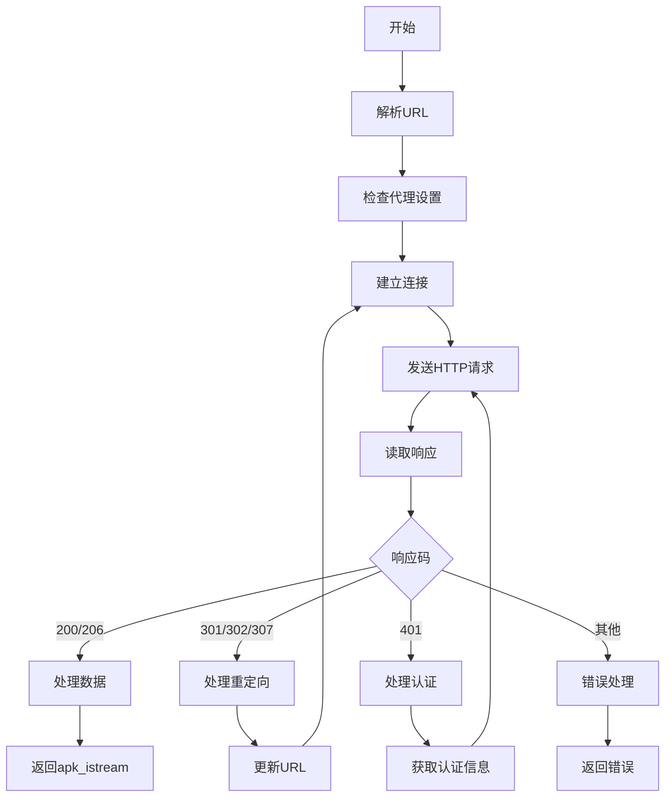

**Diagram sources**
- [http.c](file://libfetch/http.c#L810-L1183)
- [fetch.c](file://libfetch/fetch.c#L57-L71)

**Section sources**
- [http.c](file://libfetch/http.c#L810-L1183)
- [fetch.c](file://libfetch/fetch.c#L57-L71)

## 压缩格式支持

### zstd压缩支持

apk-tools通过`io_zstd.c`文件实现了对zstd压缩格式的支持。`apk_istream_zstd`函数创建一个zstd解压流，将压缩数据流转换为原始数据流。

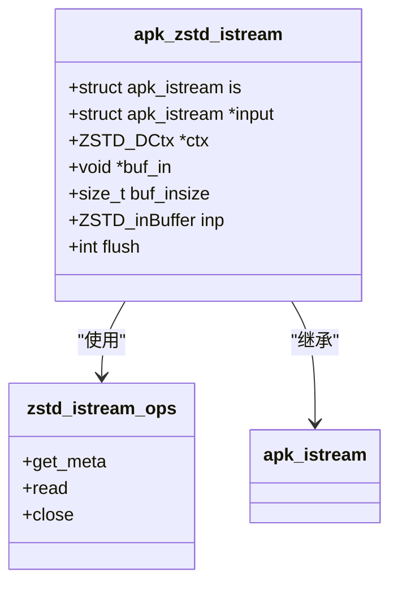

**Diagram sources**
- [io_zstd.c](file://src/io_zstd.c#L20-L27)
- [io_zstd.c](file://src/io_zstd.c#L95-L99)

**Section sources**
- [io_zstd.c](file://src/io_zstd.c#L20-L27)
- [io_zstd.c](file://src/io_zstd.c#L95-L99)

### gzip压缩支持

通过`io_gunzip.c`文件实现了对gzip压缩格式的支持。`apk_istream_zlib`函数创建一个zlib解压流，支持gzip和deflate格式。

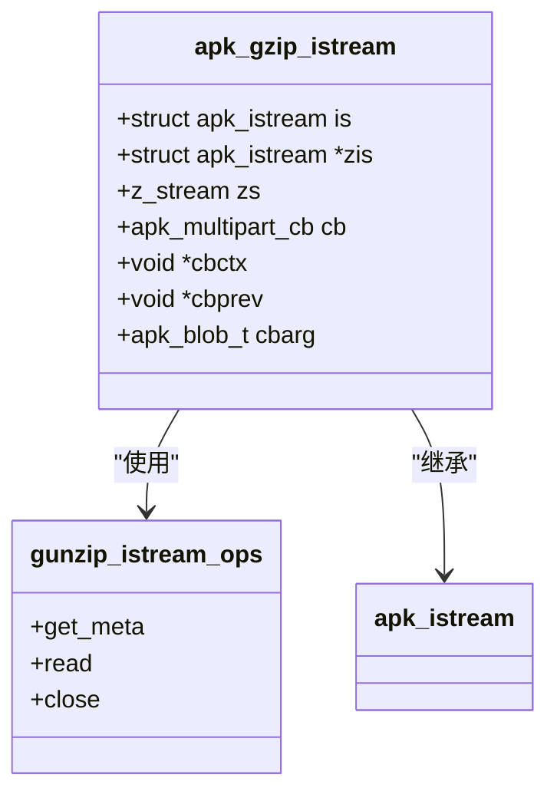

**Diagram sources**
- [io_gunzip.c](file://src/io_gunzip.c#L18-L27)
- [io_gunzip.c](file://src/io_gunzip.c#L143-L147)

**Section sources**
- [io_gunzip.c](file://src/io_gunzip.c#L18-L27)
- [io_gunzip.c](file://src/io_gunzip.c#L143-L147)

## 性能优化策略

### 并行下载

apk-tools通过连接缓存机制优化网络性能。`fetchConnectionCacheInit`函数初始化连接缓存，允许重用TCP连接。

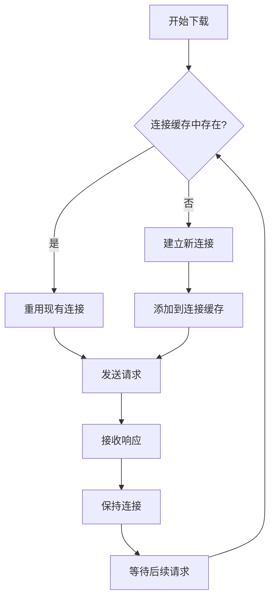

**Diagram sources**
- [io_url_libfetch.c](file://src/io_url_libfetch.c#L216)
- [common.c](file://libfetch/common.c#L298-L312)

**Section sources**
- [io_url_libfetch.c](file://src/io_url_libfetch.c#L216)
- [common.c](file://libfetch/common.c#L298-L312)

### 缓存预取

系统通过`apk_io_bufsize`全局变量控制缓冲区大小，优化IO性能。默认缓冲区大小为128KB。

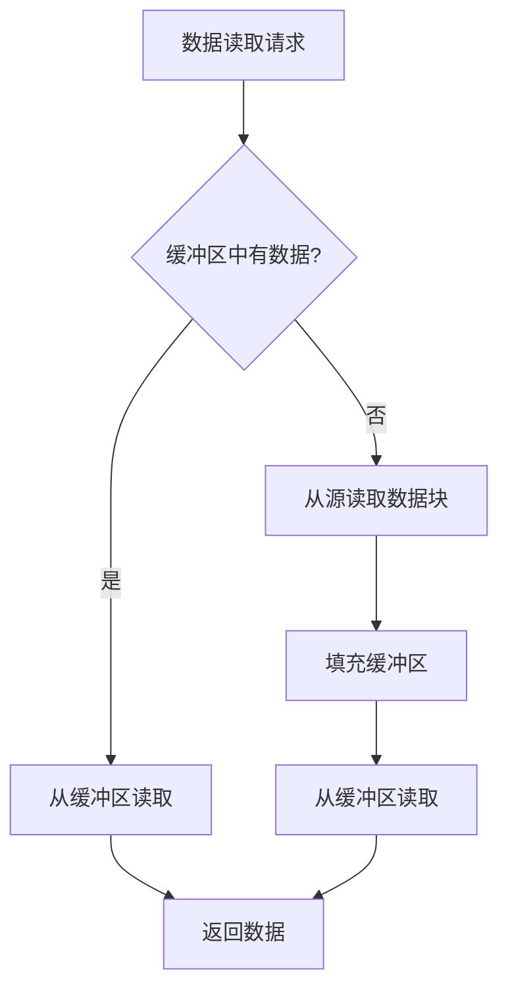

**Diagram sources**
- [io.c](file://src/io.c#L33)
- [io.c](file://src/io.c#L97-L104)

**Section sources**
- [io.c](file://src/io.c#L33)
- [io.c](file://src/io.c#L97-L104)

## 错误处理与重试机制

### 网络错误处理

系统通过`fetch_maperror`函数将libfetch的错误码映射到apk-tools的错误码，实现了统一的错误处理。

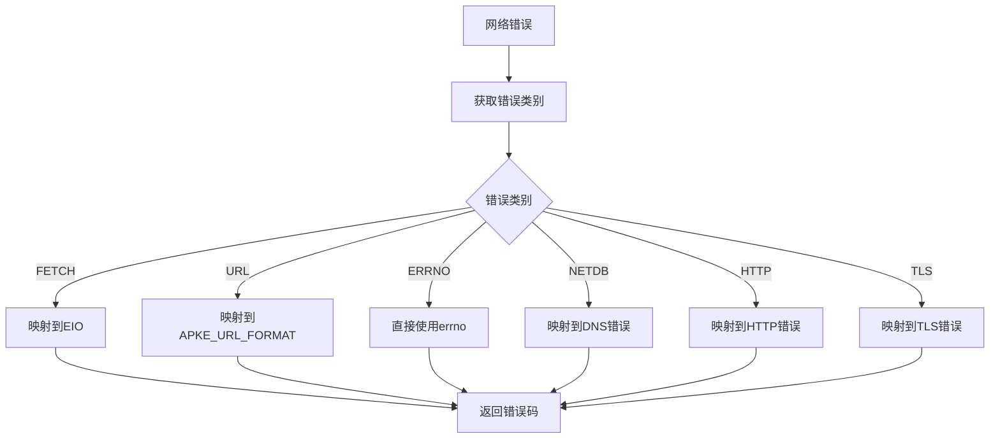

**Diagram sources**
- [io_url_libfetch.c](file://src/io_url_libfetch.c#L32-L91)

**Section sources**
- [io_url_libfetch.c](file://src/io_url_libfetch.c#L32-L91)

### 重试逻辑

系统支持条件性重试，当服务器返回304状态码（未修改）时，会返回`APKE_FILE_UNCHANGED`错误。

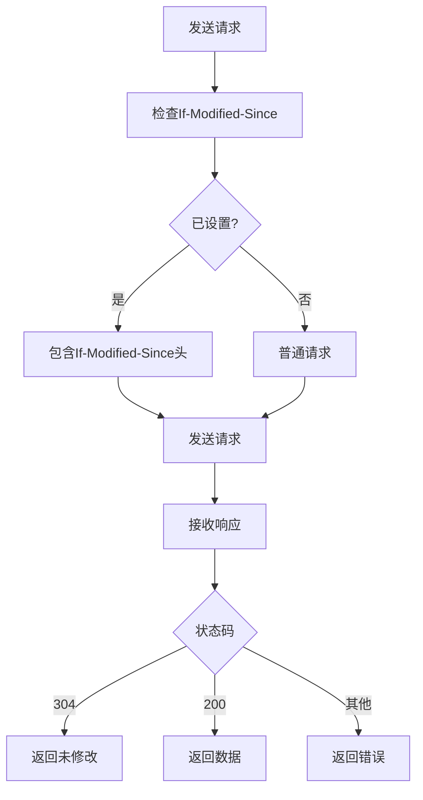

**Diagram sources**
- [io_url_libfetch.c](file://src/io_url_libfetch.c#L149-L152)
- [http.c](file://libfetch/http.c#L793-L797)

**Section sources**
- [io_url_libfetch.c](file://src/io_url_libfetch.c#L149-L152)
- [http.c](file://libfetch/http.c#L793-L797)

### 代理配置

系统通过环境变量支持代理配置，自动检测HTTP_PROXY和HTTPS_PROXY环境变量。

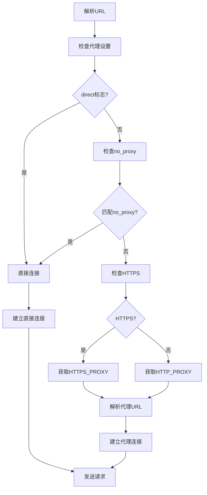

**Diagram sources**
- [http.c](file://libfetch/http.c#L771-L782)
- [http.c](file://libfetch/http.c#L682-L741)

**Section sources**
- [http.c](file://libfetch/http.c#L771-L782)
- [http.c](file://libfetch/http.c#L682-L741)

## 数据流图

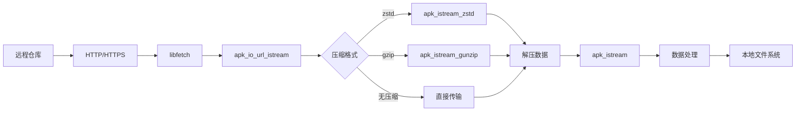

**Diagram sources**
- [io_url_libfetch.c](file://src/io_url_libfetch.c#L130-L174)
- [io_zstd.c](file://src/io_zstd.c#L100-L133)
- [io_gunzip.c](file://src/io_gunzip.c#L154-L180)
- [io.c](file://src/io.c#L606-L610)

**Section sources**
- [io_url_libfetch.c](file://src/io_url_libfetch.c#L130-L174)
- [io_zstd.c](file://src/io_zstd.c#L100-L133)
- [io_gunzip.c](file://src/io_gunzip.c#L154-L180)
- [io.c](file://src/io.c#L606-L610)