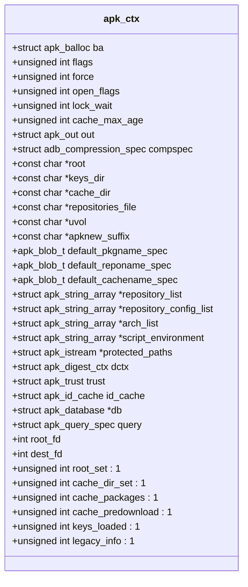

# 上下文对象配置

<cite>
**Referenced Files in This Document**   
- [apk_context.h](file://src/apk_context.h)
- [context.c](file://src/context.c)
- [apk.c](file://src/apk.c)
</cite>

## 目录
1. [简介](#简介)
2. [apk_ctx结构体详解](#apk_ctx结构体详解)
3. [标志位配置](#标志位配置)
4. [路径配置](#路径配置)
5. [多值配置管理](#多值配置管理)
6. [上下文初始化与准备](#上下文初始化与准备)
7. [配置加载](#配置加载)
8. [生命周期管理](#生命周期管理)

## 简介
`apk_ctx`结构体是APK包管理器的核心配置中心，负责聚合和管理所有运行时配置。该结构体作为全局上下文，贯穿整个APK工具的生命周期，存储了标志位、路径、字符串数组等多种配置信息，并提供了初始化、准备和清理等生命周期管理函数。

**Section sources**
- [apk_context.h](file://src/apk_context.h#L65-L97)

## apk_ctx结构体详解
`apk_ctx`结构体是APK工具的核心数据结构，作为配置的聚合中心，它包含了运行时所需的各种配置和状态信息。该结构体通过`apk_ctx_init`函数进行初始化，通过`apk_ctx_prepare`函数进行准备，并在使用完毕后通过`apk_ctx_free`函数进行资源清理。



**Diagram sources**
- [apk_context.h](file://src/apk_context.h#L65-L97)

**Section sources**
- [apk_context.h](file://src/apk_context.h#L65-L97)

## 标志位配置
`apk_ctx`结构体通过三个主要的标志位字段来控制APK工具的行为：`flags`、`force`和`open_flags`。这些标志位使用位操作进行设置和检查，每个位代表一个特定的功能或行为。

### flags字段
`flags`字段用于控制APK工具的全局行为，定义在`apk_context.h`文件中：

- `APK_SIMULATE`: 模拟模式，不执行实际的写操作
- `APK_CLEAN_PROTECTED`: 清理受保护的文件
- `APK_RECURSIVE`: 递归操作
- `APK_ALLOW_UNTRUSTED`: 允许不信任的包
- `APK_PURGE`: 清理模式
- `APK_INTERACTIVE`: 交互模式
- `APK_NO_NETWORK`: 禁用网络
- `APK_OVERLAY_FROM_STDIN`: 从标准输入读取覆盖层
- `APK_NO_SCRIPTS`: 不执行脚本
- `APK_NO_CACHE`: 禁用缓存
- `APK_NO_COMMIT_HOOKS`: 不执行提交钩子
- `APK_NO_CHROOT`: 不使用chroot
- `APK_NO_LOGFILE`: 不创建日志文件
- `APK_PRESERVE_ENV`: 保留环境变量

### force字段
`force`字段用于强制执行某些操作，定义在`apk_context.h`文件中：

- `APK_FORCE_OVERWRITE`: 强制覆盖
- `APK_FORCE_OLD_APK`: 强制使用旧APK格式
- `APK_FORCE_BROKEN_WORLD`: 强制破坏世界
- `APK_FORCE_REFRESH`: 强制刷新
- `APK_FORCE_NON_REPOSITORY`: 强制非仓库包
- `APK_FORCE_BINARY_STDOUT`: 强制二进制输出到标准输出
- `APK_FORCE_MISSING_REPOSITORIES`: 强制缺少的仓库

### open_flags字段
`open_flags`字段用于控制数据库的打开方式，定义在`apk_context.h`文件中：

- `APK_OPENF_READ`: 只读模式
- `APK_OPENF_WRITE`: 写模式
- `APK_OPENF_CREATE`: 创建模式
- `APK_OPENF_NO_INSTALLED`: 不加载已安装的包
- `APK_OPENF_NO_SCRIPTS`: 不加载脚本
- `APK_OPENF_NO_WORLD`: 不加载世界
- `APK_OPENF_NO_SYS_REPOS`: 不加载系统仓库
- `APK_OPENF_NO_INSTALLED_REPO`: 不加载已安装的仓库
- `APK_OPENF_CACHE_WRITE`: 缓存写模式
- `APK_OPENF_NO_AUTOUPDATE`: 不自动更新
- `APK_OPENF_NO_CMDLINE_REPOS`: 不加载命令行指定的仓库
- `APK_OPENF_USERMODE`: 用户模式
- `APK_OPENF_ALLOW_ARCH`: 允许架构

**Section sources**
- [apk_context.h](file://src/apk_context.h#L19-L58)

## 路径配置
`apk_ctx`结构体包含了多个路径配置字段，用于指定APK工具在运行时使用的各种目录和文件路径。

### 核心路径
- `root`: 根目录路径，默认为"/"
- `keys_dir`: 密钥目录路径
- `cache_dir`: 缓存目录路径，默认为"etc/apk/cache"
- `repositories_file`: 仓库配置文件路径
- `uvol`: uvol工具路径

### 其他路径相关字段
- `apknew_suffix`: .apk-new文件的后缀，默认为".apk-new"
- `default_pkgname_spec`: 默认包名规范
- `default_reponame_spec`: 默认仓库名规范
- `default_cachename_spec`: 默认缓存名规范

这些路径配置在`apk_ctx_prepare`函数中进行处理和验证，确保所有路径都有效且可访问。

**Section sources**
- [apk_context.h](file://src/apk_context.h#L71-L79)
- [context.c](file://src/context.c#L64-L67)

## 多值配置管理
`apk_ctx`结构体使用字符串数组来管理多值配置，这些数组通过`apk_string_array`类型实现，可以动态添加和删除字符串。

### 字符串数组字段
- `repository_list`: 仓库列表
- `repository_config_list`: 仓库配置列表
- `arch_list`: 架构列表
- `script_environment`: 脚本环境变量列表

这些字符串数组在`apk_ctx_init`函数中进行初始化，在`apk_ctx_free`函数中进行清理。它们用于存储命令行参数、配置文件中的多值配置等。

### 数组操作
字符串数组的操作主要通过以下函数实现：
- `apk_string_array_init`: 初始化字符串数组
- `apk_string_array_add`: 添加字符串到数组
- `apk_string_array_free`: 释放字符串数组

这些数组在APK工具的各个模块中被广泛使用，例如在添加仓库、指定架构等场景中。

**Section sources**
- [apk_context.h](file://src/apk_context.h#L80-L83)
- [context.c](file://src/context.c#L20-L23)

## 上下文初始化与准备
`apk_ctx`结构体的生命周期管理通过三个主要函数实现：`apk_ctx_init`、`apk_ctx_prepare`和`apk_ctx_free`。

### apk_ctx_init函数
`apk_ctx_init`函数负责初始化`apk_ctx`结构体的所有字段，将其设置为默认值。该函数在`context.c`文件中定义：

```c
void apk_ctx_init(struct apk_ctx *ac)
{
	memset(ac, 0, sizeof *ac);
	apk_balloc_init(&ac->ba, 64*1024);
	apk_string_array_init(&ac->repository_list);
	apk_string_array_init(&ac->repository_config_list);
	apk_string_array_init(&ac->arch_list);
	apk_string_array_init(&ac->script_environment);
	apk_trust_init(&ac->trust);
	apk_out_reset(&ac->out);
	ac->out.out = stdout;
	ac->out.err = stderr;
	ac->out.verbosity = 1;
	ac->out.progress_char = "#";
	ac->cache_max_age = 4*60*60; /* 4 hours default */
	apk_id_cache_init(&ac->id_cache, -1);
	ac->root_fd = -1;
	ac->legacy_info = 1;
	ac->apknew_suffix = ".apk-new";
	ac->default_pkgname_spec = APK_BLOB_STRLIT("${name}-${version}.apk");
	ac->default_reponame_spec = APK_BLOB_STRLIT("${arch}/${name}-${version}.apk");;
	ac->default_cachename_spec = APK_BLOB_STRLIT("${name}-${version}.${hash:8}.apk");
	apk_digest_ctx_init(&ac->dctx, APK_DIGEST_SHA256);
}
```

该函数将结构体清零，然后初始化各个子结构体和数组，设置默认值。

### apk_ctx_prepare函数
`apk_ctx_prepare`函数负责准备`apk_ctx`结构体，使其处于可用状态。该函数在`context.c`文件中定义：

```c
int apk_ctx_prepare(struct apk_ctx *ac)
{
	if (ac->flags & APK_SIMULATE &&
	    ac->open_flags & (APK_OPENF_CREATE | APK_OPENF_WRITE)) {
		ac->open_flags &= ~(APK_OPENF_CREATE | APK_OPENF_WRITE);
		ac->open_flags |= APK_OPENF_READ;
	}
	if (ac->flags & APK_ALLOW_UNTRUSTED) ac->trust.allow_untrusted = 1;
	if (!ac->cache_dir) ac->cache_dir = "etc/apk/cache";
	else ac->cache_dir_set = 1;
	if (!ac->root) ac->root = "/";
	if (ac->cache_predownload) ac->cache_packages = 1;

	if (!strcmp(ac->root, "/")) {
		// No chroot needed if using system root
		ac->flags |= APK_NO_CHROOT;

		// Check uvol availability
		if (!ac->uvol) ac->uvol = "/usr/sbin/uvol";
	} else {
		ac->root_set = 1;
		if (!ac->uvol) ac->uvol = ERR_PTR(-APKE_UVOL_ROOT);
	}
	if (!IS_ERR(ac->uvol) && (ac->uvol[0] != '/' || access(ac->uvol, X_OK) != 0))
		ac->uvol = ERR_PTR(-APKE_UVOL_NOT_AVAILABLE);

	ac->root_fd = openat(AT_FDCWD, ac->root, O_DIRECTORY | O_RDONLY | O_CLOEXEC);
	if (ac->root_fd < 0 && (ac->open_flags & APK_OPENF_CREATE)) {
		mkdirat(AT_FDCWD, ac->root, 0755);
		ac->root_fd = openat(AT_FDCWD, ac->root, O_DIRECTORY | O_RDONLY | O_CLOEXEC);
	}
	if (ac->root_fd < 0) {
		apk_err(&ac->out, "Unable to open root: %s", apk_error_str(errno));
		return -errno;
	}
	ac->dest_fd = ac->root_fd;

	if (ac->open_flags & APK_OPENF_CREATE) {
		uid_t uid = getuid();
		if (ac->open_flags & APK_OPENF_USERMODE) {
			if (uid == 0) {
				apk_err(&ac->out, "--usermode not allowed as root");
				return -EINVAL;
			}
		} else {
			if (uid != 0) {
				apk_err(&ac->out, "Use --usermode to allow creating database as non-root");
				return -EINVAL;
			}
		}
	}

	if ((ac->open_flags & APK_OPENF_WRITE) && !(ac->flags & APK_NO_LOGFILE)) {
		const char *log_path = "var/log/apk.log";
		const int lflags = O_WRONLY | O_APPEND | O_CREAT | O_CLOEXEC;
		int fd = openat(ac->root_fd, log_path, lflags, 0644);
		if (fd < 0) {
			apk_make_dirs(ac->root_fd, "var/log", 0755, 0755);
			fd = openat(ac->root_fd, log_path, lflags, 0644);
		}
		if (fd < 0) {
			apk_err(&ac->out, "Unable to open log: %s", apk_error_str(errno));
			return -errno;
		}
		ac->out.log = fdopen(fd, "a");
	}

	if (ac->flags & APK_PRESERVE_ENV) {
		for (int i = 0; environ[i]; i++)
			if (strncmp(environ[i], "APK_", 4) != 0)
				apk_string_array_add(&ac->script_environment, environ[i]);
	} else {
		apk_string_array_add(&ac->script_environment, "PATH=/usr/sbin:/usr/bin:/sbin:/bin");
	}

	return 0;
}
```

该函数处理各种配置，验证路径，打开文件描述符，并设置必要的状态。

**Section sources**
- [context.c](file://src/context.c#L15-L131)

## 配置加载
`load_config`函数负责从配置文件中加载配置到`apk_ctx`结构体中。该函数在`apk.c`文件中定义：

```c
static int load_config(struct apk_ctx *ac, struct apk_options *opts)
{
	struct apk_out *out = &ac->out;
	struct apk_istream *is;
	apk_blob_t newline = APK_BLOB_STRLIT("\n"), comment = APK_BLOB_STRLIT("#");
	apk_blob_t space = APK_BLOB_STRLIT(" "), line, key, value;
	int r;

	is = apk_istream_from_file(AT_FDCWD, getenv("APK_CONFIG") ?: "/etc/apk/config");
	if (is == ERR_PTR(-ENOENT)) is = apk_istream_from_file(AT_FDCWD, "/lib/apk/config");
	if (IS_ERR(is)) return PTR_ERR(is);

	while (apk_istream_get_delim(is, newline, &line) == 0) {
		apk_blob_split(line, comment, &line, &value);
		if (!apk_blob_split(line, space, &key, &value)) {
			key = line;
			value = APK_BLOB_NULL;
		}
		key = apk_blob_trim_end(key, ' ');
		value = apk_blob_trim_end(value, ' ');
		if (key.len == 0) continue;

		r = -1;
		for (int i = 0; i < opts->num_opts; i++) {
			struct option *opt = &opts->options[i];
			char *str = NULL;
			if (strncmp(opt->name, key.ptr, key.len) != 0 || opt->name[key.len] != 0) continue;
			switch (opt->has_arg) {
			case no_argument:
				if (!APK_BLOB_IS_NULL(value)) r = -2;
				break;
			case required_argument:
				if (APK_BLOB_IS_NULL(value)) {
					r = -3;
					break;
				}
				str = apk_balloc_cstr(&ac->ba, value);
				break;
			}
			assert(APK_OPTVAL_GROUPID(opt->val) == 1);
			if (r == -1) r = optgroup_global_parse(ac, APK_OPTVAL_OPTIONID(opt->val), apk_optval_arg(opt->val, str));
			break;
		}
		switch (r) {
		case 0: break;
		case -1:
			apk_warn(out, "config: option '" BLOB_FMT "' unknown", BLOB_PRINTF(key));
			break;
		case -2:
			apk_warn(out, "config: option '" BLOB_FMT "' does not expect argument (got '" BLOB_FMT "')",
				BLOB_PRINTF(key), BLOB_PRINTF(value));
			break;
		case -3:
			apk_warn(out, "config: option '" BLOB_FMT "' expects an argument",
				BLOB_PRINTF(key));
			break;
		default: apk_warn(out, "config: setting option '" BLOB_FMT "' failed", BLOB_PRINTF(key)); break;
		}
	}
	return apk_istream_close(is);
}
```

该函数从`/etc/apk/config`或`/lib/apk/config`文件中读取配置，解析每一行，并将配置应用到`apk_ctx`结构体中。

**Section sources**
- [apk.c](file://src/apk.c#L411-L471)

## 生命周期管理
`apk_ctx`结构体的生命周期由三个主要函数管理：`apk_ctx_init`、`apk_ctx_prepare`和`apk_ctx_free`。

### 初始化
`apk_ctx_init`函数在`main`函数中被调用，用于初始化`apk_ctx`结构体：

```c
int main(int argc, char **argv)
{
	// ...
	apk_ctx_init(&ctx);
	// ...
}
```

### 准备
`apk_ctx_prepare`函数在解析完命令行参数后被调用，用于准备`apk_ctx`结构体：

```c
int main(int argc, char **argv)
{
	// ...
	r = apk_ctx_prepare(&ctx);
	if (r != 0) goto err;
	// ...
}
```

### 清理
`apk_ctx_free`函数在`main`函数的清理阶段被调用，用于释放`apk_ctx`结构体占用的资源：

```c
int main(int argc, char **argv)
{
	// ...
err:
	apk_ctx_free(&ctx);
	// ...
}
```

这三个函数共同管理`apk_ctx`结构体的完整生命周期，确保资源的正确分配和释放。

**Section sources**
- [context.c](file://src/context.c#L15-L53)
- [apk.c](file://src/apk.c#L557-L645)