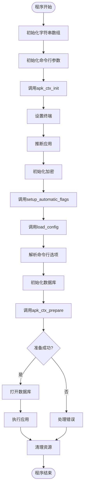

# 初始化流程

<cite>
**本文档中引用的文件**   
- [apk.c](file://src/apk.c)
- [context.c](file://src/context.c)
- [apk_context.h](file://src/apk_context.h)
</cite>

## 目录
1. [简介](#简介)
2. [结构体初始化](#结构体初始化)
3. [自动标志设置](#自动标志设置)
4. [配置加载](#配置加载)
5. [运行环境准备](#运行环境准备)
6. [主函数调用链](#主函数调用链)
7. [结论](#结论)

## 简介
本文档详细描述了apk工具中上下文对象的完整初始化流程。重点分析了`apk_ctx_init`函数如何为结构体各字段设置默认安全值，`setup_automatic_flags`函数如何根据环境变量自动配置输出行为，`load_config`函数如何从配置文件加载设置，以及`apk_ctx_prepare`函数如何准备运行环境。最后通过`main`函数展示了完整的调用链及其错误处理机制。

## 结构体初始化
`apk_ctx_init`函数负责初始化`apk_ctx`结构体的各个字段为默认安全值。该函数首先使用`memset`将整个结构体清零，然后逐个初始化各个成员字段。

函数初始化了内存分配器`ba`，设置了64KB的初始缓冲区。字符串数组`repository_list`、`repository_config_list`、`arch_list`和`script_environment`都被初始化为空数组。信任系统`trust`和输出系统`out`也被正确初始化。

输出系统被配置为使用标准输出和标准错误流， verbosity级别设置为1（默认），进度条字符设置为"#"。缓存最大年龄设置为4小时（14400秒），这是为了在合理的时间内重用缓存文件，同时确保不会使用过期太久的数据。

其他安全相关的默认值包括：根目录文件描述符`root_fd`设置为-1（表示未打开），`legacy_info`标志设置为1（启用传统信息格式），以及`.apk-new`作为新文件的后缀名。

**Section sources**
- [context.c](file://src/context.c#L15-L38)

## 自动标志设置
`setup_automatic_flags`函数根据环境变量和终端状态自动设置输出行为相关的标志。该函数首先检查`APK_PROGRESS_CHAR`环境变量，如果存在则使用其值作为进度条字符；否则检查`LANG`环境变量是否包含"UTF-8"，如果是则使用Unicode方块字符"█"作为进度条。

函数通过`isatty`系统调用检查标准输出和标准错误是否连接到终端设备。如果不是终端设备（例如重定向到文件或管道），则禁用进度条显示，避免在非交互式环境中产生不必要的输出。

如果`TERM`环境变量设置为"dumb"，也禁用进度条，因为"dumb"终端通常不支持复杂的控制序列。这种自动检测机制确保了在不同环境下都能提供合适的用户体验。

最后，如果`APK_SIMULATE`标志未设置且存在`/etc/apk/interactive`文件，则自动设置`APK_INTERACTIVE`标志，表明系统处于交互模式。

**Section sources**
- [apk.c](file://src/apk.c#L390-L409)

## 配置加载
`load_config`函数负责从配置文件加载设置。函数首先尝试从`APK_CONFIG`环境变量指定的文件加载配置，如果不存在则尝试加载`/etc/apk/config`，最后尝试`/lib/apk/config`作为后备选项。

配置文件按行解析，每行格式为"key value"，以#号作为注释开始。函数使用`apk_istream_get_delim`逐行读取配置，然后使用`apk_blob_split`分离键和值。空格和行尾空格会被自动去除。

对于每个配置项，函数遍历所有可用的选项，找到匹配的选项后根据其参数类型进行处理。无参数选项直接设置，有参数选项则从配置值创建字符串并传递给解析函数。

错误处理机制完善：未知选项会发出警告，参数不匹配会给出具体错误信息，设置失败也会记录警告。这种设计确保了配置文件的健壮性，即使存在错误配置也不会导致程序崩溃。

**Section sources**
- [apk.c](file://src/apk.c#L411-L471)

## 运行环境准备
`apk_ctx_prepare`函数基于已配置的上下文准备运行环境。函数首先处理模拟模式：如果设置了`APK_SIMULATE`标志且需要创建或写入，则改为只读模式，这是安全的默认行为。

缓存目录默认设置为"etc/apk/cache"，根目录默认为"/"。如果使用系统根目录，则设置`APK_NO_CHROOT`标志，并检查`uvol`管理器的可用性。否则，标记根目录已设置，并验证`uvol`路径的有效性和可执行性。

函数打开根目录文件描述符，如果需要创建数据库且根目录不存在，则尝试创建。日志文件在需要写入且未禁用日志的情况下打开，路径为"var/log/apk.log"，并确保目录存在。

环境变量处理方面：如果设置了`APK_PRESERVE_ENV`标志，则保留除`APK_`开头外的所有环境变量；否则设置最小化的PATH环境变量。这种设计平衡了环境隔离和必要功能的需求。

**Section sources**
- [context.c](file://src/context.c#L55-L131)

## 主函数调用链
`main`函数展示了从`apk_ctx_init`到`apk_ctx_prepare`的完整调用链。首先初始化字符串数组和命令行参数数组，然后调用`apk_ctx_init`初始化上下文。

接着初始化加密系统和URL I/O系统，设置60秒的超时时间。调用`setup_automatic_flags`自动配置输出行为，然后调用`load_config`加载配置文件。

解析命令行选项后，初始化数据库并设置信号处理程序。关键的`apk_ctx_prepare`调用在此时发生，准备运行环境。如果准备失败，通过`goto err`跳转到错误处理部分。

错误处理机制完善：`-ESHUTDOWN`特殊错误码被转换为成功退出，应用程序上下文和资源在退出前被正确释放。返回码被限制在合理范围内（0-99），确保了与其他系统的兼容性。

**Diagram sources **
- [apk.c](file://src/apk.c#L557-L645)

**Section sources**
- [apk.c](file://src/apk.c#L557-L645)

## 结论
apk工具的初始化流程设计严谨，注重安全性和用户体验。通过分阶段的初始化过程，确保了上下文对象的各个字段都被正确设置为安全的默认值。自动标志设置机制能够智能适应不同的运行环境，配置加载系统灵活且健壮。运行环境准备阶段充分考虑了各种边界情况和错误处理，确保了程序的稳定运行。整个流程体现了良好的软件工程实践，为后续的操作提供了可靠的基础。