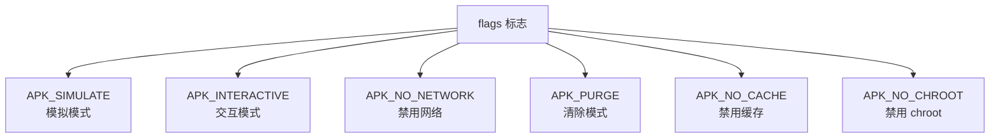
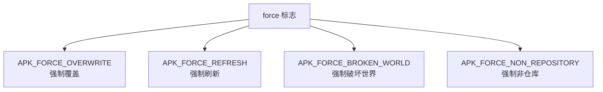
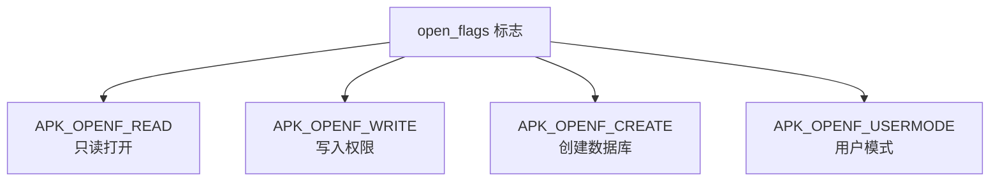
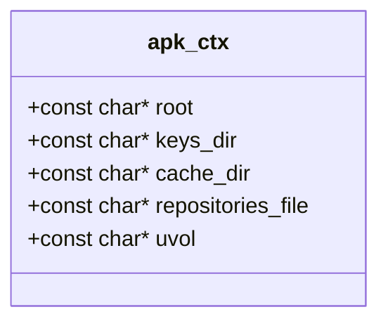
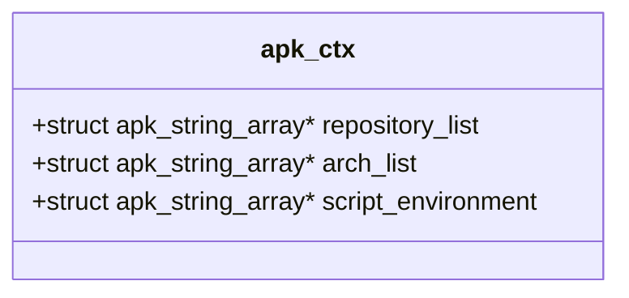
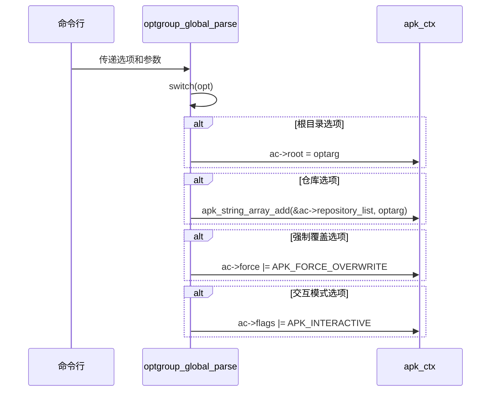

# 核心配置字段

<cite>
**Referenced Files in This Document**   
- [apk_context.h](file://src/apk_context.h)
- [apk.c](file://src/apk.c)
- [context.c](file://src/context.c)
</cite>

## 核心配置字段

`apk_context.h` 文件中定义的 `apk_ctx` 结构体是 APK 工具的核心上下文对象，它集中管理了工具运行时的所有配置和状态。该结构体通过位标志、路径配置和字符串数组等多种方式，提供了高度灵活的配置机制，以控制工具在不同场景下的行为模式。

### 位标志字段

`apk_ctx` 结构体包含三个关键的位标志字段：`flags`、`force` 和 `open_flags`。这些字段通过按位或（OR）操作组合不同的宏定义，实现对工具行为的精细化控制。

**Section sources**
- [apk_context.h](file://src/apk_context.h#L19-L58)

#### flags 标志

`flags` 字段用于控制工具的全局行为模式。每个位代表一个独立的功能开关，通过在命令行中指定相应的选项来激活。

- **APK_SIMULATE (BIT(0))**: 启用模拟模式。在此模式下，任何需要写入或创建文件的操作都会被自动转换为只读操作，确保不会对系统造成实际修改。
- **APK_INTERACTIVE (BIT(5))**: 启用交互模式。工具在执行关键操作前会提示用户确认。
- **APK_NO_NETWORK (BIT(6))**: 禁用网络访问。所有需要从远程仓库下载数据的操作都将失败。
- **APK_PURGE (BIT(4))**: 启用清除模式。在删除包时，会同时删除其配置文件。
- **APK_NO_CACHE (BIT(9))**: 禁用缓存。工具将忽略本地缓存，强制从源获取数据。
- **APK_NO_CHROOT (BIT(11))**: 禁用 chroot 操作。当目标根目录为 `/` 时，此标志会自动设置。

**Section sources**
- [apk_context.h](file://src/apk_context.h#L19-L33)
- [apk.c](file://src/apk.c#L226-L238)

#### force 标志

`force` 字段用于强制覆盖默认的安全策略和限制，允许执行一些高风险操作。

- **APK_FORCE_OVERWRITE (BIT(0))**: 强制覆盖文件。允许安装包时覆盖已存在的文件，即使这可能导致冲突。
- **APK_FORCE_REFRESH (BIT(3))**: 强制刷新。忽略缓存的元数据，强制从远程仓库重新下载索引文件。
- **APK_FORCE_BROKEN_WORLD (BIT(2))**: 强制破坏世界。允许安装会导致依赖关系不一致的包。
- **APK_FORCE_NON_REPOSITORY (BIT(4))**: 强制非仓库。允许安装不在任何已知仓库中的包。

**Section sources**
- [apk_context.h](file://src/apk_context.h#L34-L41)
- [apk.c](file://src/apk.c#L113-L140)

#### open_flags 标志

`open_flags` 字段控制数据库的打开方式和初始化行为。

- **APK_OPENF_READ (0x0001)**: 以只读模式打开数据库。
- **APK_OPENF_WRITE (0x0002)**: 以写入模式打开数据库。
- **APK_OPENF_CREATE (0x0004)**: 如果数据库不存在，则创建它。
- **APK_OPENF_USERMODE (0x2000)**: 以用户模式运行，允许非 root 用户创建数据库。

**Section sources**
- [apk_context.h](file://src/apk_context.h#L42-L58)
- [context.c](file://src/context.c#L58-L62)

### 路径配置字段

`apk_ctx` 结构体定义了多个路径字段，用于指定关键目录和文件的位置。

- **root**: 指定目标系统的根目录，默认值为 `/`。所有操作都将相对于此目录进行。
- **keys_dir**: 指定公钥目录，用于验证包的签名。默认会从 `/etc/apk/keys` 和 `/lib/apk/keys` 加载。
- **cache_dir**: 指定包缓存目录，默认值为 `etc/apk/cache`。如果未设置，将使用此默认值。
- **repositories_file**: 指定仓库列表文件的路径，包含了可用的软件源地址。
- **uvol**: 指定 uvol 管理器的路径，用于管理用户卷。

这些字段的默认值在 `context.c` 文件的 `apk_ctx_init` 和 `apk_ctx_prepare` 函数中设置。例如，`cache_dir` 的默认值在 `apk_ctx_prepare` 中被设置为 `etc/apk/cache`。

**Section sources**
- [apk_context.h](file://src/apk_context.h#L71-L75)
- [context.c](file://src/context.c#L64-L78)

### 字符串数组配置

`apk_ctx` 结构体使用字符串数组来支持多仓库、多架构和脚本环境的配置。

- **repository_list**: 存储通过命令行 `-X` 或 `--repository` 选项添加的仓库地址列表。每个新添加的仓库都会通过 `apk_string_array_add` 函数追加到数组中。
- **arch_list**: 存储目标架构列表。工具可以为多个架构配置和管理包。
- **script_environment**: 存储在执行包脚本时使用的环境变量。如果设置了 `APK_PRESERVE_ENV` 标志，它会继承当前环境变量；否则，会设置一个安全的默认环境。

**Section sources**
- [apk_context.h](file://src/apk_context.h#L80-L83)
- [context.c](file://src/context.c#L123-L129)

### 命令行参数解析

`src/apk.c` 文件中的 `optgroup_global_parse` 函数负责将命令行参数解析并赋值给 `apk_ctx` 对象的各个字段。

该函数通过一个大的 `switch` 语句处理所有全局选项。例如，当遇到 `OPT_GLOBAL_root` 时，它会将 `optarg`（即命令行参数的值）直接赋给 `ac->root`。对于 `OPT_GLOBAL_repository`，它会调用 `apk_string_array_add` 将新的仓库地址添加到 `repository_list` 数组中。对于 `OPT_GLOBAL_force_overwrite`，它会使用按位或操作将 `APK_FORCE_OVERWRITE` 标志设置到 `ac->force` 字段中。

**Section sources**
- [apk.c](file://src/apk.c#L83-L210)
- [apk_context.h](file://src/apk_context.h#L67)