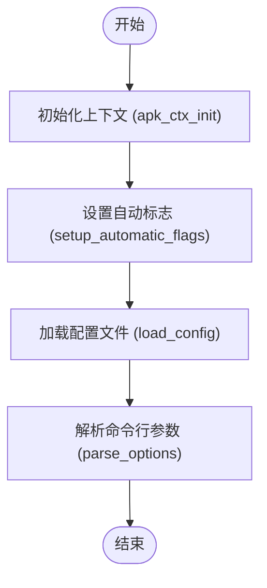

# 配置源与优先级

<cite>
**本文档中引用的文件**   
- [apk.c](file://src/apk.c)
- [context.c](file://src/context.c)
- [common.c](file://src/common.c)
</cite>

## 目录
1. [配置源层次结构](#配置源层次结构)
2. [命令行参数、配置文件与环境变量的优先级关系](#命令行参数配置文件与环境变量的优先级关系)
3. [全局选项组定义与解析机制](#全局选项组定义与解析机制)
4. [配置解析流程与自动标志设置](#配置解析流程与自动标志设置)

## 配置源层次结构

apk-tools 的配置系统采用多层级源结构，按照优先级从高到低依次为：命令行参数、环境变量、配置文件。配置文件的加载路径优先检查环境变量 `APK_CONFIG` 指定的路径，若未设置则依次尝试 `/etc/apk/config` 和 `/lib/apk/config`。这种设计允许用户在不同层级上覆盖配置，确保灵活性和可定制性。

**Section sources**
- [apk.c](file://src/apk.c#L411-L471)
- [context.c](file://src/context.c#L15-L38)

## 命令行参数配置文件与环境变量的优先级关系

在 apk-tools 中，命令行参数具有最高优先级，能够覆盖配置文件中的设置。环境变量在初始化阶段发挥作用，主要用于确定配置文件路径和终端行为。例如，`APK_PROGRESS_CHAR` 和 `LANG` 环境变量影响进度条字符的显示，而 `TERM` 环境变量决定是否禁用进度条。命令行参数通过 `getopt_long` 解析，直接修改运行时上下文，确保用户指令优先执行。

**Section sources**
- [apk.c](file://src/apk.c#L473-L518)
- [context.c](file://src/context.c#L15-L38)

## 全局选项组定义与解析机制

全局选项组通过 `GLOBAL_OPTIONS` 宏定义，包含所有全局可用的选项，如 `--allow-untrusted`、`--cache-dir` 等。这些选项通过 `APK_OPTIONS` 宏展开为 `struct option` 数组，供 `getopt_long` 使用。解析时，`parse_options` 函数调用 `add_options` 将全局选项添加到选项列表中，并通过 `optgroup_global_parse` 函数处理具体选项的赋值逻辑。选项的处理遵循 `OPT_GLOBAL` 前缀规则，确保命名空间清晰。

**Section sources**
- [apk.c](file://src/apk.c#L37-L79)
- [apk.c](file://src/apk.c#L81-L209)

## 配置解析流程与自动标志设置

配置解析流程始于 `main` 函数调用 `apk_ctx_init` 初始化上下文，随后 `setup_automatic_flags` 根据终端环境自动设置标志。例如，若 `stdout` 或 `stderr` 不是终端，则禁用进度条；若 `TERM` 为 `dumb`，同样禁用进度条。`load_config` 函数负责加载配置文件，逐行解析键值对，并调用 `optgroup_global_parse` 应用配置。`optval_arg` 函数处理布尔值和参数值，通过位运算判断选项类型，返回相应的整数值或参数指针。

**Diagram sources**
- [apk.c](file://src/apk.c#L557-L645)
- [context.c](file://src/context.c#L15-L38)

**Section sources**
- [apk.c](file://src/apk.c#L390-L409)
- [apk.c](file://src/apk.c#L323-L328)
- [apk.c](file://src/apk.c#L411-L471)