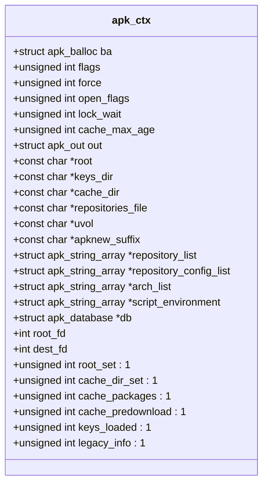
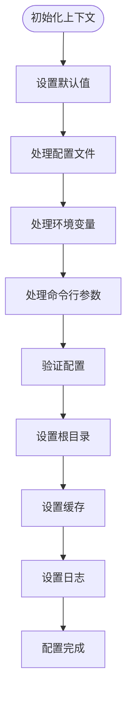
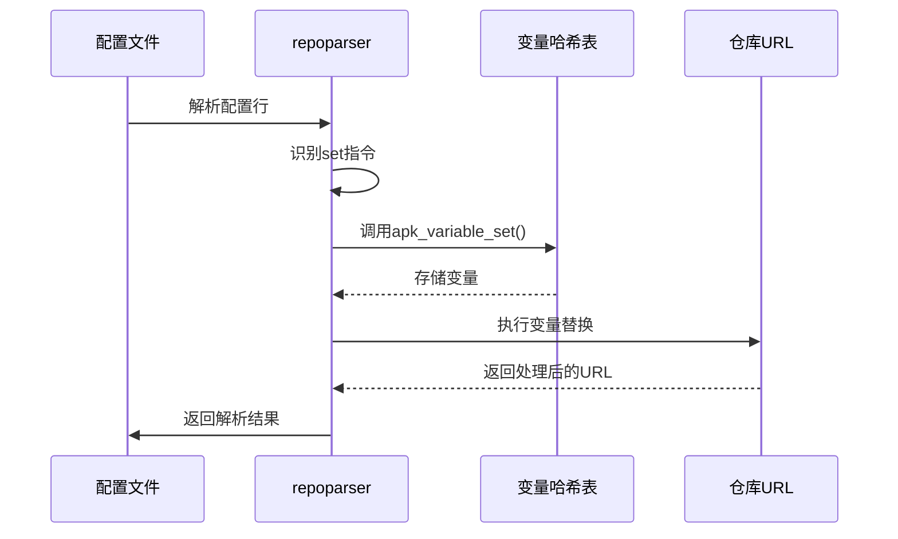

# 配置管理

<cite>
**本文档中引用的文件**   
- [apk_context.h](file://src/apk_context.h)
- [context.c](file://src/context.c)
- [repoparser.c](file://src/repoparser.c)
- [database.c](file://src/database.c)
</cite>

## 目录
1. [配置层次结构与优先级](#配置层次结构与优先级)
2. [上下文对象与配置聚合](#上下文对象与配置聚合)
3. [配置解析流程与默认值](#配置解析流程与默认值)
4. [配置选项参考](#配置选项参考)
5. [软件源与包偏好配置](#软件源与包偏好配置)
6. [配置最佳实践](#配置最佳实践)
7. [运行时配置API](#运行时配置api)

## 配置层次结构与优先级

apk-tools的配置系统采用多层级的配置机制，通过命令行参数、配置文件和环境变量共同作用。其优先级顺序为：命令行参数 > 环境变量 > 配置文件。这种设计确保了用户可以在不同场景下灵活地覆盖配置。

命令行参数具有最高优先级，允许用户在执行命令时直接指定配置选项。环境变量次之，为用户提供了一种在shell会话中设置持久配置的方式。配置文件则提供了最基础的系统级配置，通常位于`/etc/apk/`目录下。

关键配置文件包括`/etc/apk/repositories`和`/etc/apk/world`。`repositories`文件定义了软件包仓库的URL列表，而`world`文件记录了系统中显式安装的包。这些文件在系统初始化时被读取，并作为默认配置的基础。

**Section sources**
- [context.c](file://src/context.c#L16-L38)
- [database.c](file://src/database.c#L2103-L2124)

## 上下文对象与配置聚合

`apk_context.h`中定义的`struct apk_ctx`是配置系统的核心数据结构，负责聚合所有配置选项。该结构体通过统一的接口管理各种配置参数，包括标志位、路径设置、缓存配置等。

上下文对象包含多个关键字段：`flags`用于存储布尔型配置标志，`root`指定根文件系统路径，`cache_dir`定义缓存目录，`repository_list`维护仓库URL列表。此外，还包含`script_environment`等数组，用于存储脚本环境变量。

该结构体的设计体现了模块化思想，将不同类型的配置分组管理。例如，与打开操作相关的标志位被集中管理，而与网络相关的配置则通过独立的字段处理。这种设计提高了代码的可维护性和可扩展性。

**Diagram sources **
- [apk_context.h](file://src/apk_context.h#L65-L98)

**Section sources**
- [apk_context.h](file://src/apk_context.h#L65-L98)
- [context.c](file://src/context.c#L16-L38)

## 配置解析流程与默认值

配置解析流程始于`apk_ctx_init()`函数的调用，该函数初始化上下文对象并设置默认值。默认缓存最大年龄设置为4小时，输出流指向标准输出和标准错误，进度字符设为"#"。

`apk_ctx_prepare()`函数负责配置的最终准备和验证。该函数处理根目录设置、缓存目录配置、日志文件创建等关键任务。当根目录为"/"时，系统自动禁用chroot功能，并检查uvol工具的可用性。

配置解析过程中，系统会按优先级顺序处理不同来源的配置。首先读取配置文件中的设置，然后应用环境变量，最后处理命令行参数。这种顺序确保了高优先级的配置能够正确覆盖低优先级的设置。

**Diagram sources **
- [context.c](file://src/context.c#L56-L131)

**Section sources**
- [context.c](file://src/context.c#L56-L131)
- [apk_context.h](file://src/apk_context.h#L100-L102)

## 配置选项参考

apk-tools提供了丰富的配置选项，涵盖网络、缓存、并发等多个方面。网络相关配置包括超时设置、重定向处理等，可通过`apk_io_url_set_timeout()`函数进行设置。

缓存配置方面，`cache_max_age`控制缓存的最大年龄，`cache_dir`指定缓存目录位置。系统支持预下载缓存包，通过`cache_predownload`标志位启用。并发配置主要涉及线程数控制，但具体实现细节在代码中未明确体现。

路径相关配置包括`root`（根目录）、`keys_dir`（密钥目录）、`repositories_file`（仓库配置文件）等。这些路径配置支持绝对路径和相对路径，系统会根据上下文进行适当的解析和处理。

安全相关配置通过`flags`字段中的位标志实现，如`APK_ALLOW_UNTRUSTED`允许使用不受信任的包，`APK_NO_SCRIPTS`禁用安装脚本执行。这些标志位提供了细粒度的安全控制能力。

**Section sources**
- [apk_context.h](file://src/apk_context.h#L19-L58)
- [context.c](file://src/context.c#L63-L67)
- [database.c](file://src/database.c#L2068-L2073)

## 软件源与包偏好配置

软件源配置主要通过`/etc/apk/repositories`文件和命令行参数实现。系统支持多种仓库格式，包括v2、v3和ndx格式，能够自动识别并处理不同格式的仓库索引。

包偏好配置通过变量替换机制实现。`repoparser.c`中的`apk_variable_set()`函数允许定义可替换的变量，如`APK_ARCH`。这些变量可以在仓库URL中使用`${variable}`语法进行引用，实现动态配置。

配置文件支持`set`关键字来定义变量，支持`-default`选项来设置默认值。系统会自动处理变量的优先级和覆盖关系，确保配置的一致性和可预测性。这种机制使得配置文件更加灵活和可重用。

**Diagram sources **
- [repoparser.c](file://src/repoparser.c#L108-L135)
- [repoparser.c](file://src/repoparser.c#L198-L202)

**Section sources**
- [repoparser.c](file://src/repoparser.c#L108-L135)
- [repoparser.c](file://src/repoparser.c#L198-L202)

## 配置最佳实践

为确保系统稳定性和安全性，建议遵循以下配置最佳实践：始终使用受信任的仓库源，定期更新密钥环，合理设置缓存策略以平衡性能和磁盘使用。

在生产环境中，建议禁用不受信任的包安装（`APK_ALLOW_UNTRUSTED`），并启用脚本执行（`APK_NO_SCRIPTS`）以确保包的完整功能。对于网络环境较差的场景，可以适当增加超时时间，避免因网络波动导致操作失败。

配置文件应保持简洁和可读性，避免过度复杂的变量替换。建议使用版本控制系统管理配置文件，便于追踪变更和回滚。对于多环境部署，可以使用配置文件片段（`.d`目录）来组织环境特定的配置。

定期审查和清理`/etc/apk/world`文件，移除不再需要的包声明，有助于保持系统的整洁和可维护性。同时，建议定期检查缓存使用情况，避免磁盘空间被过度占用。

**Section sources**
- [context.c](file://src/context.c#L63-L67)
- [database.c](file://src/database.c#L2053-L2064)

## 运行时配置API

apk-tools提供了完整的运行时配置API，允许开发者在程序执行过程中访问和修改配置。核心API包括`apk_ctx_init()`、`apk_ctx_free()`和`apk_ctx_prepare()`，分别用于初始化、清理和准备上下文对象。

通过`apk_ctx_get_trust()`和`apk_ctx_get_id_cache()`等函数，开发者可以获取特定的配置子系统。这些函数实现了延迟加载模式，仅在首次访问时初始化相关资源，提高了系统性能。

上下文对象的字段大多为公共访问，允许直接读取和修改配置值。但建议通过提供的API函数进行操作，以确保配置的一致性和完整性。例如，修改仓库列表时应使用`apk_string_array_add()`函数，而不是直接操作指针。

对于自定义应用，可以通过继承和扩展上下文对象来添加特定的配置选项。这种设计模式保持了系统的灵活性和可扩展性，同时确保了与现有代码的兼容性。

**Section sources**
- [apk_context.h](file://src/apk_context.h#L100-L108)
- [context.c](file://src/context.c#L145-L170)
- [database.c](file://src/database.c#L2401-L2431)