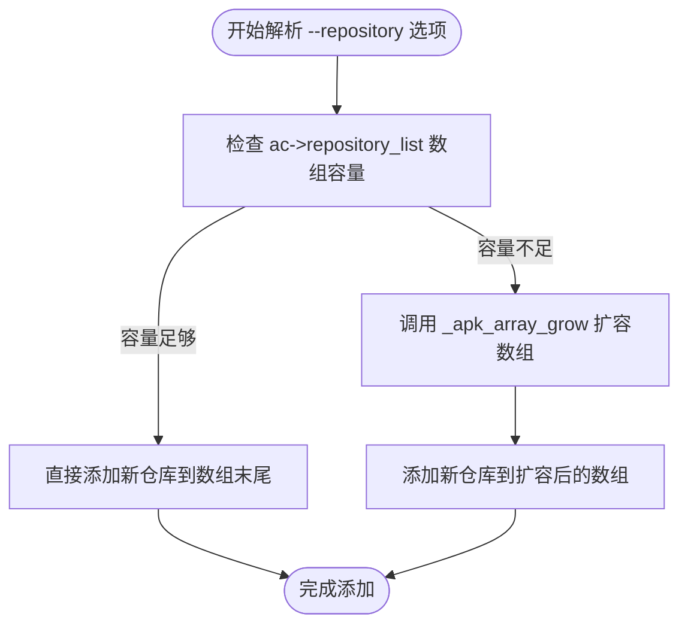
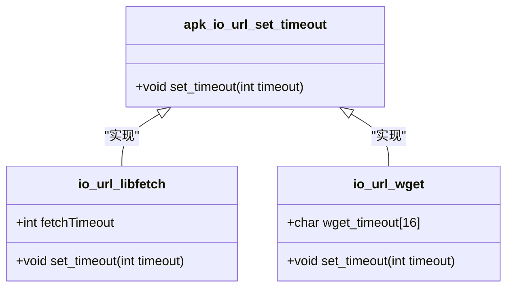
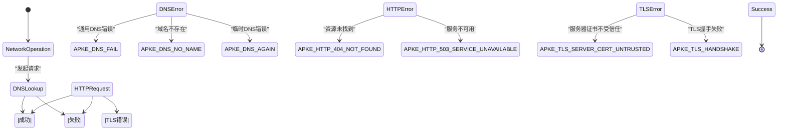
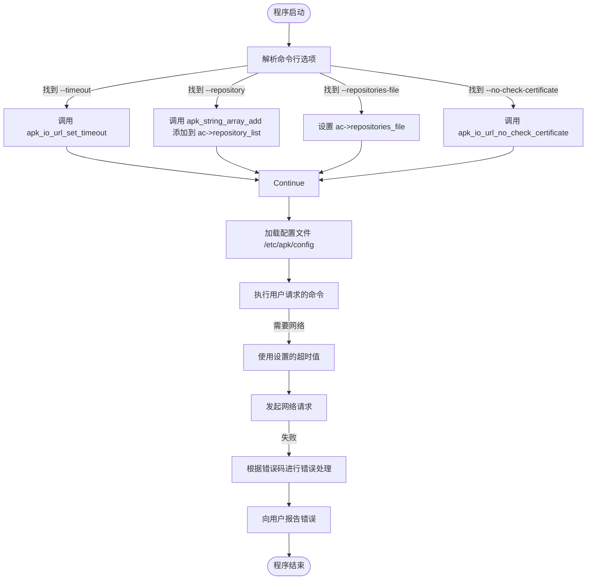

# 仓库与网络配置

<cite>
**Referenced Files in This Document**  
- [src/apk.c](file://src/apk.c#L38-L78)
- [src/apk_defines.h](file://src/apk_defines.h#L31-L100)
- [src/apk_context.h](file://src/apk_context.h#L65-L98)
- [src/apk_io.h](file://src/apk_io.h#L136-L140)
- [src/io_url_libfetch.c](file://src/io_url_libfetch.c#L197-L202)
- [src/io_url_wget.c](file://src/io_url_wget.c#L39-L42)
</cite>

## 目录
1. [仓库与网络配置选项](#仓库与网络配置选项)
2. [核心数据结构与宏定义](#核心数据结构与宏定义)
3. [网络超时机制](#网络超时机制)
4. [证书验证控制](#证书验证控制)
5. [网络错误处理机制](#网络错误处理机制)
6. [配置选项处理流程](#配置选项处理流程)

## 仓库与网络配置选项

`apk`工具通过`GLOBAL_OPTIONS`宏定义了一系列用于仓库和网络配置的命令行选项。这些选项在`src/apk.c`文件中定义，为用户提供了灵活的配置能力，以适应不同的网络环境和仓库管理需求。

**Section sources**
- [src/apk.c](file://src/apk.c#L38-L78)

### --repositories-file 选项

`--repositories-file`选项用于指定一个包含仓库地址列表的文件路径。该选项允许用户自定义软件包仓库的来源，替代系统默认的仓库配置。

- **功能描述**：当使用此选项时，`apk`工具将读取指定文件中的每一行作为仓库URL。这为批量管理和切换仓库提供了便利。
- **默认值**：未指定时，使用系统默认的仓库配置文件（通常为`/etc/apk/repositories`）。
- **取值范围**：有效的文件路径字符串。
- **使用示例**：
  ```bash
  apk --repositories-file /path/to/custom_repos.txt update
  ```

当解析到此选项时，`apk`工具会将文件路径存储在`struct apk_ctx`结构体的`repositories_file`字段中，供后续的仓库解析逻辑使用。

**Section sources**
- [src/apk.c](file://src/apk.c#L95-L97)
- [src/apk_context.h](file://src/apk_context.h#L74)

### --repository 选项

`--repository`选项允许用户直接在命令行中添加一个或多个仓库URL。该选项可以多次使用，以添加多个仓库。

- **功能描述**：此选项提供了一种快速、临时添加仓库的方法，无需修改配置文件。
- **默认值**：无。
- **取值范围**：有效的仓库URL字符串。
- **使用示例**：
  ```bash
  apk --repository http://dl-cdn.alpinelinux.org/alpine/edge/main --repository http://dl-cdn.alpinelinux.org/alpine/edge/community add vim
  ```

该选项的处理逻辑通过`apk_string_array_add`函数实现。当解析到`--repository`选项时，`optgroup_global_parse`函数会调用`apk_string_array_add(&ac->repository_list, (char*) optarg)`，将命令行提供的仓库URL添加到`ac->repository_list`字符串数组中。



**Diagram sources**
- [src/apk.c](file://src/apk.c#L98-L100)
- [src/apk_defines.h](file://src/apk_defines.h#L209-L240)

**Section sources**
- [src/apk.c](file://src/apk.c#L98-L100)
- [src/apk_context.h](file://src/apk_context.h#L80)

### --timeout 选项

`--timeout`选项用于设置网络操作的超时时间（以秒为单位）。

- **功能描述**：该选项控制`apk`工具在进行网络请求（如下载软件包索引或软件包本身）时的等待时间。超时后，操作将被中断并返回错误。
- **默认值**：60秒（在`main`函数中通过`apk_io_url_set_timeout(60)`设置）。
- **取值范围**：正整数。
- **使用示例**：
  ```bash
  apk --timeout 30 update
  ```

该选项的处理通过`apk_io_url_set_timeout`函数实现。当解析到`--timeout`选项时，`optgroup_global_parse`函数会调用`apk_io_url_set_timeout(atoi(optarg))`，将用户指定的超时值传递给底层的网络I/O模块。

**Section sources**
- [src/apk.c](file://src/apk.c#L195-L197)

### --no-check-certificate 选项

`--no-check-certificate`选项用于禁用HTTPS连接的证书验证。

- **功能描述**：在使用HTTPS协议访问仓库时，此选项会跳过对服务器SSL/TLS证书的验证。这在使用自签名证书或内部CA的私有仓库时非常有用，但会降低连接的安全性。
- **默认值**：禁用（即默认进行证书验证）。
- **取值范围**：无参数，存在即生效。
- **使用示例**：
  ```bash
  apk --no-check-certificate add https://internal-repo.example.com/package.apk
  ```

当解析到此选项时，`apk`工具会调用`apk_io_url_no_check_certificate()`函数，通知底层网络库忽略证书验证错误。

**Section sources**
- [src/apk.c](file://src/apk.c#L174-L176)

## 核心数据结构与宏定义

`apk`工具的配置选项处理依赖于几个关键的数据结构和宏定义。

`struct apk_ctx`是`apk`工具的核心上下文结构体，它包含了所有运行时的状态和配置。与仓库和网络配置相关的字段包括：
- `repository_list`：一个`apk_string_array`类型的指针，用于存储通过`--repository`选项添加的所有仓库URL。
- `repositories_file`：一个`const char *`类型的指针，用于存储通过`--repositories-file`选项指定的文件路径。
- `flags`和`force`：位标志字段，用于存储布尔型选项的状态（如`APK_NO_NETWORK`、`APK_NO_CHECK_CERTIFICATE`等）。

`APK_ARRAY`宏定义了一个通用的动态数组模板，`apk_string_array`是其一个特化实例，用于管理字符串数组。该宏定义了一系列内联函数，如`_add`、`_resize`和`_grow`，用于高效地管理数组的内存和元素。

**Section sources**
- [src/apk_context.h](file://src/apk_context.h#L65-L98)
- [src/apk_defines.h](file://src/apk_defines.h#L209-L240)

## 网络超时机制

`--timeout`选项的实现依赖于`apk_io_url_set_timeout`函数。该函数是一个接口函数，其具体实现根据编译时链接的网络后端（`libfetch`或`wget`）而有所不同。



**Diagram sources**
- [src/io_url_libfetch.c](file://src/io_url_libfetch.c#L197-L202)
- [src/io_url_wget.c](file://src/io_url_wget.c#L39-L42)

- 在使用`libfetch`后端时，`apk_io_url_set_timeout`函数直接将超时值赋给全局变量`fetchTimeout`。`libfetch`库在发起网络请求时会使用此变量。
- 在使用`wget`后端时，`apk_io_url_set_timeout`函数使用`apk_fmt`将超时值格式化为字符串，并存储在全局缓冲区`wget_timeout`中。当构建`wget`命令行时，此字符串会被作为`-T`参数的值。

无论使用哪个后端，`apk`工具在发起网络请求前都会调用`apk_io_url_istream`函数，该函数会根据当前设置的超时值来配置具体的网络操作。

**Section sources**
- [src/io_url_libfetch.c](file://src/io_url_libfetch.c#L197-L202)
- [src/io_url_wget.c](file://src/io_url_wget.c#L39-L42)
- [src/apk_io.h](file://src/apk_io.h#L137)

## 证书验证控制

`--no-check-certificate`选项的实现通过`apk_io_url_no_check_certificate`函数完成。与超时设置类似，该函数的具体行为也取决于所使用的网络后端。

- 在`libfetch`后端中，该函数调用`fetch_no_check_certificate()`，这是`libfetch`库提供的API，用于全局禁用证书验证。
- 在`wget`后端中，该函数将一个标志`wget_no_check_certificate`设置为1。当构建`wget`命令行时，如果此标志为真，就会添加`--no-check-certificate`参数。

这种设计使得`apk`工具能够以统一的接口控制网络行为，同时兼容不同的底层实现。

**Section sources**
- [src/io_url_libfetch.c](file://src/io_url_libfetch.c#L193-L196)
- [src/io_url_wget.c](file://src/io_url_wget.c#L35-L38)

## 网络错误处理机制

`apk`工具定义了一套详细的网络错误代码，这些代码在`src/apk_defines.h`文件中声明，以`APKE_`为前缀。



**Diagram sources**
- [src/apk_defines.h](file://src/apk_defines.h#L34-L60)

这些错误代码被`libfetch`后端的`fetch_maperror`函数映射。当底层网络库返回错误时，`fetch_maperror`会将其转换为相应的`APKE_`错误码，然后由`apk`工具的上层逻辑进行处理和报告。这为用户提供了清晰、具体的错误信息，便于诊断网络问题。

**Section sources**
- [src/apk_defines.h](file://src/apk_defines.h#L31-L100)
- [src/io_url_libfetch.c](file://src/io_url_libfetch.c#L32-L92)

## 配置选项处理流程

`apk`工具的配置选项处理遵循一个清晰的流程：



**Diagram sources**
- [src/apk.c](file://src/apk.c#L474-L518)
- [src/apk_io.h](file://src/apk_io.h#L136-L140)

1. **初始化**：`main`函数首先初始化上下文，并设置默认的超时时间为60秒。
2. **解析选项**：`parse_options`函数调用`getopt_long`解析命令行参数，并根据`GLOBAL_OPTIONS`宏定义的规则，将每个选项分派给`optgroup_global_parse`函数。
3. **执行动作**：`optgroup_global_parse`函数根据选项的类型，执行相应的动作，如修改上下文字段、调用网络I/O函数等。
4. **执行命令**：在所有选项解析完毕后，`apk`工具执行用户请求的具体命令（如`update`、`add`等），此时会使用已配置的仓库列表和网络参数。

这个流程确保了配置选项能够被正确、一致地处理，并最终影响到`apk`工具的实际行为。

**Section sources**
- [src/apk.c](file://src/apk.c#L474-L518)
- [src/apk.c](file://src/apk.c#L558-L646)