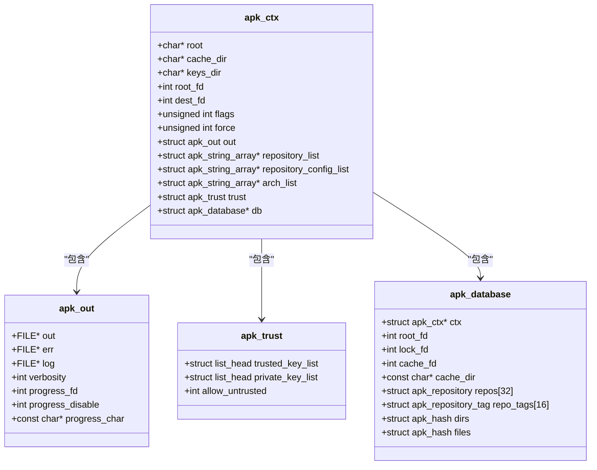

# 基本路径配置

<cite>
**本文档引用的文件**  
- [apk.c](file://src/apk.c)
- [apk_context.h](file://src/apk_context.h)
- [context.c](file://src/context.c)
</cite>

## 目录
1. [简介](#简介)
2. [核心路径配置选项](#核心路径配置选项)
3. [底层数据结构实现](#底层数据结构实现)
4. [实际使用场景](#实际使用场景)

## 简介
`apk` 工具是 Alpine Linux 系统中的包管理器，其行为受到多个路径相关配置选项的控制。这些选项通过命令行参数进行设置，并在程序启动时解析，用于定义工具的运行环境和文件系统布局。本文档基于 `src/apk.c` 文件中的 `GLOBAL_OPTIONS` 宏定义，重点分析 `--root`、`--cache-dir`、`--keys-dir` 等关键路径配置选项，解释其功能、默认值、取值范围及对系统的影响。

**Section sources**
- [apk.c](file://src/apk.c#L38-L79)

## 核心路径配置选项

### --root 选项
`--root` 选项用于指定 `apk` 工具操作的目标系统根目录。此选项允许 `apk` 在非宿主系统环境中进行包管理操作，例如在容器、chroot 环境或挂载的文件系统中安装或查询软件包。

- **功能描述**: 设置目标系统的根目录路径。所有后续的文件操作（如安装、查询、配置）都将相对于此目录进行。
- **默认值**: `/` (系统根目录)。
- **取值范围**: 有效的文件系统路径。
- **使用示例**: `apk --root /mnt/alpine install vim` 将在 `/mnt/alpine` 目录下安装 `vim` 软件包，而不是在当前运行系统的根目录下。

**Section sources**
- [apk.c](file://src/apk.c#L69-L72)
- [context.c](file://src/context.c#L66-L71)

### --cache-dir 选项
`--cache-dir` 选项用于指定 `apk` 工具的缓存目录，该目录用于存储下载的软件包文件和索引文件。

- **功能描述**: 设置软件包和索引文件的缓存位置。这可以优化网络使用，避免重复下载，并允许在离线环境中使用缓存的包。
- **默认值**: `etc/apk/cache` (相对于 `--root` 指定的根目录)。
- **取值范围**: 有效的文件系统路径。
- **使用示例**: `apk --cache-dir /tmp/apk-cache fetch nginx` 将 `nginx` 软件包下载到 `/tmp/apk-cache` 目录中。

**Section sources**
- [apk.c](file://src/apk.c#L41-L43)
- [context.c](file://src/context.c#L64-L65)

### --keys-dir 选项
`--keys-dir` 选项用于指定存储公钥的目录，这些公钥用于验证软件包的签名和完整性。

- **功能描述**: 设置公钥文件的搜索目录。`apk` 工具会从该目录加载公钥以验证从仓库下载的软件包。
- **默认值**: 如果未指定，则默认从 `/etc/apk/keys` 和 `/lib/apk/keys` 目录加载。
- **取值范围**: 有效的文件系统路径。
- **使用示例**: `apk --keys-dir /custom/keys list` 将使用 `/custom/keys` 目录下的公钥来验证软件包列表的完整性。

**Section sources**
- [apk.c](file://src/apk.c#L56-L58)
- [context.c](file://src/context.c#L148-L158)

## 底层数据结构实现
`apk` 工具的配置选项最终映射到 `struct apk_ctx` 结构体中的字段。该结构体是 `apk` 上下文的核心，存储了所有运行时配置和状态。

- **`ac->root`**: 对应 `--root` 选项，类型为 `const char *`，存储目标根目录的路径。
- **`ac->cache_dir`**: 对应 `--cache-dir` 选项，类型为 `const char *`，存储缓存目录的路径。
- **`ac->keys_dir`**: 对应 `--keys-dir` 选项，类型为 `const char *`，存储公钥目录的路径。

这些字段在 `apk_ctx_init` 函数中被初始化，并在 `optgroup_global_parse` 函数中根据命令行参数进行赋值。当 `apk` 工具执行具体操作时，会通过 `apk_ctx_prepare` 函数准备上下文，例如根据 `ac->root` 打开一个文件描述符 `ac->root_fd`，后续的所有文件操作都基于此描述符进行，从而实现了对指定根目录的隔离操作。

**Diagram sources**
- [apk_context.h](file://src/apk_context.h#L65-L98)
- [context.c](file://src/context.c#L17-L38)

**Section sources**
- [apk_context.h](file://src/apk_context.h#L71-L75)
- [context.c](file://src/context.c#L17-L38)

## 实际使用场景
在容器化环境中，`--root` 选项是 `apk` 工具最关键的配置之一。当构建一个 Alpine Linux 容器镜像时，通常会先挂载一个空的文件系统，然后使用 `apk` 命令在该挂载点上安装基础软件包。例如，在 Dockerfile 或类似的构建脚本中，可能会执行 `apk --root /path/to/container/rootfs add alpine-base`。这确保了所有安装的文件都位于容器的根文件系统内，而不会影响宿主机。同时，可以结合 `--cache-dir` 将缓存放在构建主机的临时目录中，以加速后续的构建过程。`--keys-dir` 选项则允许在自定义仓库或安全要求严格的环境中，使用特定的公钥进行验证。

**Section sources**
- [apk.c](file://src/apk.c#L89-L91)
- [context.c](file://src/context.c#L66-L77)