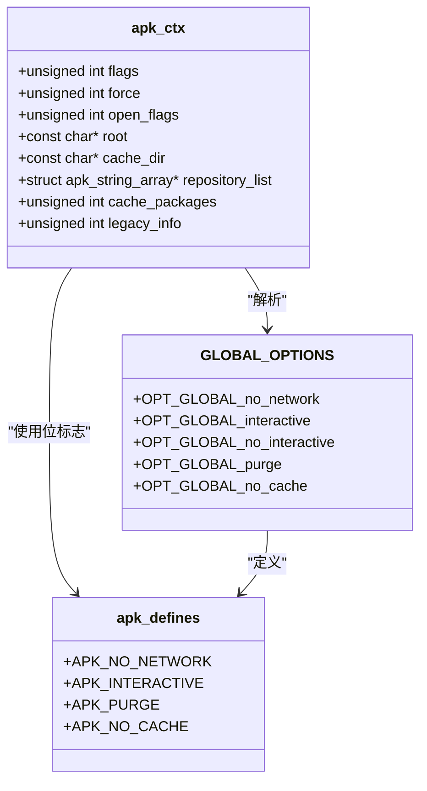
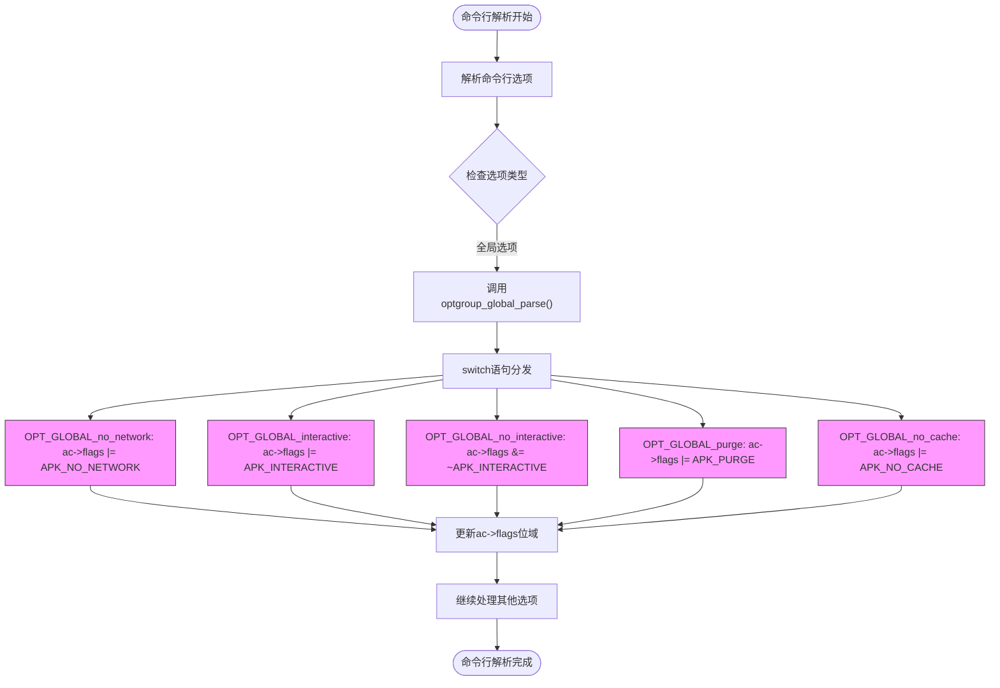

# 常规操作标志

<cite>
**本文档中引用的文件**
- [apk.c](file://src/apk.c)
- [apk_defines.h](file://src/apk_defines.h)
- [apk_context.h](file://src/apk_context.h)
</cite>

## 目录
1. [简介](#简介)
2. [常规操作标志概述](#常规操作标志概述)
3. [标志详细说明](#标志详细说明)
   - [--no-network](#--no-network)
   - [--interactive 和 --no-interactive](#--interactive-和---no-interactive)
   - [--purge](#--purge)
   - [--no-cache](#--no-cache)
4. [标志管理机制](#标志管理机制)
5. [自动交互检测机制](#自动交互检测机制)

## 简介
本文档详细说明了APK包管理器中的常规操作标志，这些标志通过`src/apk.c`文件中的`GLOBAL_OPTIONS`宏定义，并在`apk_defines.h`中定义了相应的位标志。文档重点介绍`--no-network`、`--interactive`、`--no-interactive`、`--purge`和`--no-cache`等核心标志的功能、默认值、取值范围和使用示例，并解释它们如何通过`ac->flags`位域进行管理。

**Section sources**
- [apk.c](file://src/apk.c#L38-L79)
- [apk_defines.h](file://src/apk_defines.h#L22-L28)

## 常规操作标志概述
APK包管理器提供了一系列全局操作标志，用于控制其行为和功能。这些标志在`src/apk.c`文件中通过`GLOBAL_OPTIONS`宏进行定义，并通过`optgroup_global_parse`函数进行解析和处理。所有标志的状态通过`struct apk_ctx`结构体中的`flags`位域进行管理，该位域使用位操作来设置和清除各个功能标志。



**Diagram sources**
- [apk.c](file://src/apk.c#L62-L68)
- [apk_defines.h](file://src/apk_defines.h#L22-L28)
- [apk_context.h](file://src/apk_context.h#L64-L97)

## 标志详细说明

### --no-network
**功能描述**：禁用网络访问功能，强制APK在离线模式下运行。当此标志被设置时，APK将不会尝试从远程仓库下载任何数据或更新。

**默认值**：未设置（允许网络访问）

**取值范围**：布尔值（存在即启用）

**使用示例**：
```bash
# 在离线环境中查询已安装的包
apk --no-network list installed

# 在没有网络连接的情况下检查包信息
apk --no-network info vim
```

**Section sources**
- [apk.c](file://src/apk.c#L62)
- [apk_defines.h](file://src/apk_defines.h#L24)

### --interactive 和 --no-interactive
**功能描述**：
- `--interactive`：显式启用交互模式，即使在非交互式环境中也允许用户输入。
- `--no-interactive`：显式禁用交互模式，即使存在交互式条件也不进行用户交互。

**默认值**：根据系统配置自动确定（见自动交互检测机制）

**取值范围**：布尔值（存在即启用对应模式）

**使用示例**：
```bash
# 强制启用交互模式进行包安装
apk --interactive add nginx

# 强制禁用交互模式进行批量操作
apk --no-interactive upgrade

# 结合使用（后者优先级更高）
apk --interactive --no-interactive list
```

**Section sources**
- [apk.c](file://src/apk.c#L55-L60)
- [apk_defines.h](file://src/apk_defines.h#L23)

### --purge
**功能描述**：在删除包时同时清除其配置文件。此标志会影响`del`和`purge`子命令的行为，确保不仅删除包本身，还删除与之关联的所有配置文件。

**默认值**：未设置（保留配置文件）

**取值范围**：布尔值（存在即启用）

**使用示例**：
```bash
# 删除包并清除其所有配置文件
apk --purge del apache2

# 升级前彻底清除旧版本及其配置
apk --purge upgrade
```

**Section sources**
- [apk.c](file://src/apk.c#L67)
- [apk_defines.h](file://src/apk_defines.h#L22)

### --no-cache
**功能描述**：禁用所有缓存功能，包括包缓存和元数据缓存。当此标志被设置时，APK将不会使用任何缓存数据，也不会将新数据写入缓存。

**默认值**：未设置（启用缓存）

**取值范围**：布尔值（存在即启用）

**使用示例**：
```bash
# 强制从远程仓库获取最新数据，忽略本地缓存
apk --no-cache update

# 安装包时不使用缓存的包文件
apk --no-cache add python3

# 查询信息时强制重新下载索引
apk --no-cache search vim
```

**Section sources**
- [apk.c](file://src/apk.c#L58)
- [apk_defines.h](file://src/apk_defines.h#L27)

## 标志管理机制
APK使用位域（bitfield）机制来高效管理各种操作标志。所有标志通过`struct apk_ctx`结构体中的`flags`成员进行管理，每个标志对应一个唯一的位位置。



**Diagram sources**
- [apk.c](file://src/apk.c#L168-L172)
- [apk_context.h](file://src/apk_context.h#L64)

## 自动交互检测机制
APK实现了智能的自动交互检测机制，通过`setup_automatic_flags`函数在程序启动时自动确定是否启用交互模式。

```mermaid
flowchart TD
Start([程序启动]) --> CheckSimulate{"ac->flags & APK_SIMULATE?"}
CheckSimulate --> |是| SkipInteractive[跳过交互检测]
CheckSimulate --> |否| CheckInteractiveFile["access(\"/etc/apk/interactive\", F_OK) == 0?"]
CheckInteractiveFile --> |是| EnableInteractive["ac->flags |= APK_INTERACTIVE"]
CheckInteractiveFile --> |否| KeepDefault[保持默认设置]
EnableInteractive --> End([交互模式启用])
KeepDefault --> End
SkipInteractive --> End
style EnableInteractive fill:#bbf,stroke:#333
style KeepDefault fill:#fbb,stroke:#333
```

该机制的工作流程如下：
1. 首先检查是否处于模拟模式（`APK_SIMULATE`标志）
2. 如果不是模拟模式，则检查`/etc/apk/interactive`文件是否存在
3. 如果文件存在，则自动设置`APK_INTERACTIVE`标志
4. 用户可以通过`--interactive`或`--no-interactive`标志覆盖此自动检测结果

此机制确保了在典型的交互式系统中默认启用交互功能，同时允许用户根据需要进行覆盖。

**Section sources**
- [apk.c](file://src/apk.c#L408-L409)
- [apk_defines.h](file://src/apk_defines.h#L23)