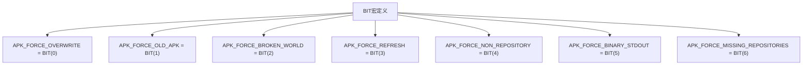
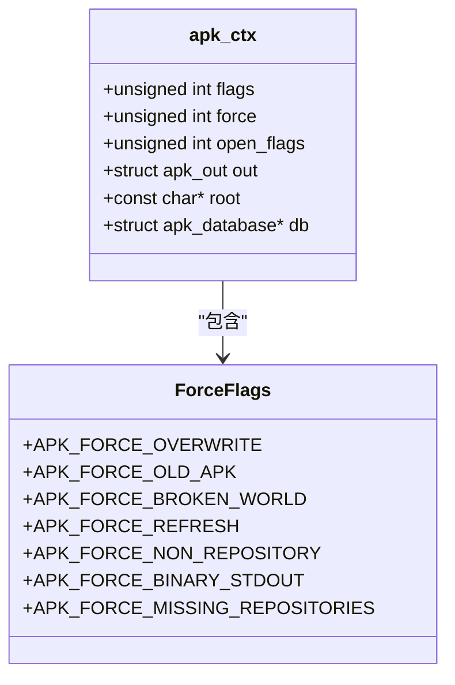
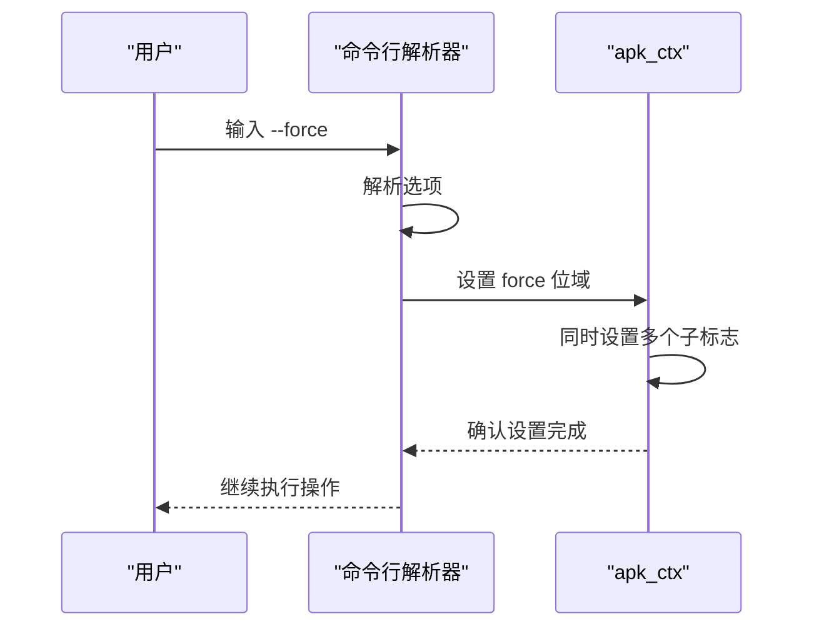

# 强制操作标志

<cite>
**本文档中引用的文件**  
- [apk.c](file://src/apk.c)
- [apk_defines.h](file://src/apk_defines.h)
- [apk_context.h](file://src/apk_context.h)
</cite>

## 目录
1. [简介](#简介)
2. [强制操作选项](#强制操作选项)
3. [位标志实现机制](#位标志实现机制)
4. [ac->force位域管理](#ac-force位域管理)
5. [复合行为说明](#复合行为说明)

## 简介
本文档详细说明了apk工具中的强制操作标志，基于src/apk.c中的GLOBAL_OPTIONS宏定义，重点分析--force、--force-overwrite、--force-refresh、--force-missing-repositories等强制操作选项。文档解释了这些标志的位标志实现机制，引用apk_defines.h中的BIT宏定义，并说明这些标志如何通过ac->force位域进行管理。

**Section sources**
- [apk.c](file://src/apk.c#L38-L79)
- [apk_defines.h](file://src/apk_defines.h#L23)
- [apk_context.h](file://src/apk_context.h#L33-L41)

## 强制操作选项
以下是对各个强制操作选项的详细说明：

### --force
- **功能描述**：启用多个强制操作模式的复合选项
- **默认值**：未设置
- **取值范围**：布尔值
- **使用示例**：`apk add --force package_name`

### --force-overwrite
- **功能描述**：允许覆盖已存在的文件
- **默认值**：未设置
- **取值范围**：布尔值
- **使用示例**：`apk add --force-overwrite package_name`

### --force-refresh
- **功能描述**：强制刷新缓存，忽略缓存有效期
- **默认值**：未设置
- **取值范围**：布尔值
- **使用示例**：`apk update --force-refresh`

### --force-missing-repositories
- **功能描述**：即使缺少仓库配置也继续操作
- **默认值**：未设置
- **取值范围**：布尔值
- **使用示例**：`apk add --force-missing-repositories package_name`

**Section sources**
- [apk.c](file://src/apk.c#L45-L54)
- [apk_context.h](file://src/apk_context.h#L34)

## 位标志实现机制
强制操作标志采用位标志（bit flag）机制实现，通过BIT宏定义在apk_defines.h中：

```c
#define BIT(x) (1ULL << (x))
```

各个强制标志在apk_context.h中定义为不同的位位置：



**Diagram sources**
- [apk_defines.h](file://src/apk_defines.h#L23)
- [apk_context.h](file://src/apk_context.h#L33-L41)

**Section sources**
- [apk_defines.h](file://src/apk_defines.h#L23)
- [apk_context.h](file://src/apk_context.h#L33-L41)

## ac->force位域管理
强制标志通过apk_ctx结构体中的force成员进行管理：

```c
struct apk_ctx {
    unsigned int flags, force, open_flags;
    // 其他成员...
};
```

当用户指定强制选项时，相应的位标志会被设置到force位域中。例如，在apk.c中处理--force-overwrite选项：

```c
case OPT_GLOBAL_force_overwrite:
    ac->force |= APK_FORCE_OVERWRITE;
    break;
```



**Diagram sources**
- [apk_context.h](file://src/apk_context.h#L66)
- [apk.c](file://src/apk.c#L117-L140)

**Section sources**
- [apk_context.h](file://src/apk_context.h#L66)
- [apk.c](file://src/apk.c#L117-L140)

## 复合行为说明
--force选项具有复合行为，会同时设置多个子标志：

```c
case OPT_GLOBAL_force:
    ac->force |= APK_FORCE_OVERWRITE | APK_FORCE_OLD_APK
        | APK_FORCE_NON_REPOSITORY | APK_FORCE_BINARY_STDOUT;
    break;
```

这种设计允许用户通过单个选项启用多个相关的强制行为，简化了命令行操作。例如，使用--force时，系统会同时启用文件覆盖、旧APK格式支持、非仓库模式和二进制输出等特性。



**Diagram sources**
- [apk.c](file://src/apk.c#L113-L116)

**Section sources**
- [apk.c](file://src/apk.c#L113-L116)