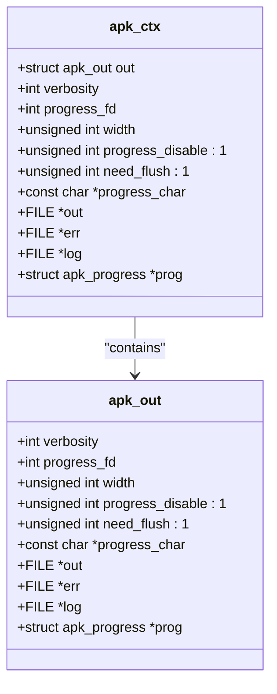
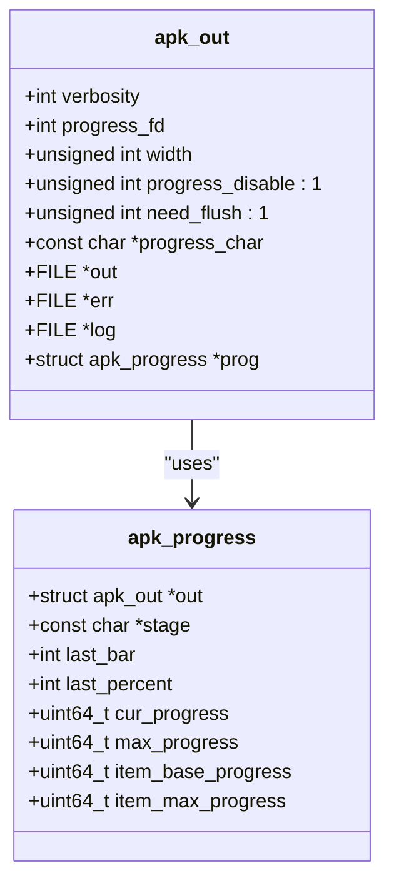
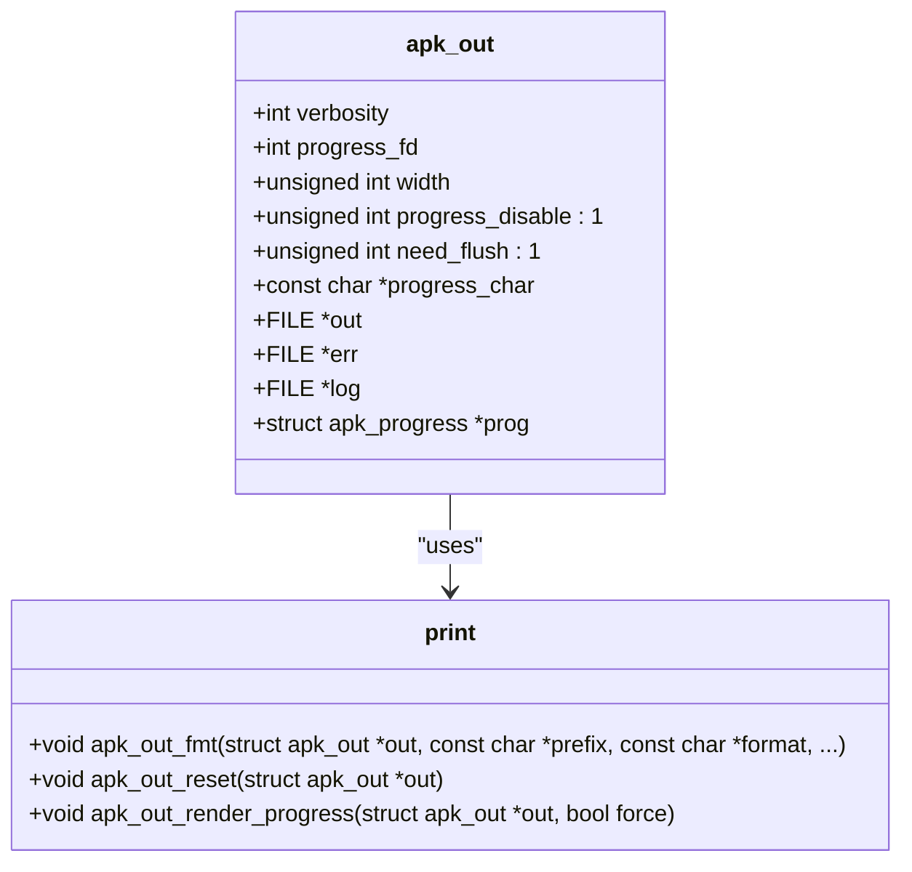

# 输出与日志控制

<cite>
**Referenced Files in This Document**   
- [apk.c](file://src/apk.c)
- [apk_print.h](file://src/apk_print.h)
- [print.c](file://src/print.c)
- [apk_defines.h](file://src/apk_defines.h)
- [apk_context.h](file://src/apk_context.h)
</cite>

## 目录
1. [输出控制选项](#输出控制选项)
2. [日志控制选项](#日志控制选项)
3. [底层实现机制](#底层实现机制)

## 输出控制选项

`apk`工具通过`GLOBAL_OPTIONS`宏定义提供了一系列输出控制选项，这些选项通过修改`apk_ctx`结构体中的`out`字段来控制程序的输出行为。以下是对主要输出控制选项的详细说明。

### --quiet 选项

`--quiet`选项用于减少程序的输出详细程度。当使用此选项时，程序的输出将更加简洁，仅显示关键信息。

- **功能描述**：降低输出的详细程度，减少非关键信息的显示。
- **默认值**：未启用，输出详细程度为默认级别。
- **取值范围**：布尔值，可通过多次使用`-q`或`--quiet`来进一步降低详细程度。
- **使用示例**：
  ```bash
  apk --quiet install package-name
  ```

**Section sources**
- [apk.c](file://src/apk.c#L104-L106)

### --verbose 选项

`--verbose`选项用于增加程序的输出详细程度。当使用此选项时，程序将显示更多的调试和详细信息。

- **功能描述**：增加输出的详细程度，显示更多的调试和详细信息。
- **默认值**：未启用，输出详细程度为默认级别。
- **取值范围**：布尔值，可通过多次使用`-v`或`--verbose`来进一步增加详细程度。
- **使用示例**：
  ```bash
  apk --verbose install package-name
  ```

**Section sources**
- [apk.c](file://src/apk.c#L107-L109)

### --progress 选项

`--progress`选项用于控制进度条的显示。通过此选项，用户可以开启或关闭操作过程中的进度条显示。

- **功能描述**：控制操作过程中进度条的显示。
- **默认值**：根据终端环境自动决定，通常在交互式终端中启用。
- **取值范围**：布尔值，`true`表示显示进度条，`false`表示不显示。
- **使用示例**：
  ```bash
  apk --progress=true install package-name
  apk --progress=false install package-name
  ```

**Section sources**
- [apk.c](file://src/apk.c#L150-L152)

### --force-binary-stdout 选项

`--force-binary-stdout`选项用于强制将二进制数据输出到标准输出。此选项在处理二进制文件时非常有用。

- **功能描述**：强制将二进制数据输出到标准输出，避免文本模式下的数据损坏。
- **默认值**：未启用，标准输出为文本模式。
- **取值范围**：布尔值。
- **使用示例**：
  ```bash
  apk --force-binary-stdout extract package.apk
  ```

**Section sources**
- [apk.c](file://src/apk.c#L135-L137)

## 日志控制选项

### --no-logfile 选项

`--no-logfile`选项用于禁用日志文件的创建和写入。当使用此选项时，程序将不会生成日志文件。

- **功能描述**：禁用日志文件的创建和写入，减少磁盘I/O操作。
- **默认值**：未启用，日志文件正常创建和写入。
- **取值范围**：布尔值。
- **使用示例**：
  ```bash
  apk --no-logfile install package-name
  ```

**Section sources**
- [apk.c](file://src/apk.c#L165-L167)

## 底层实现机制

### 输出详细程度控制

`--quiet`和`--verbose`选项通过修改`ac->out.verbosity`值来控制输出的详细程度。`ac`是`apk_ctx`结构体的实例，`out`是其中的一个字段，类型为`struct apk_out`。`verbosity`字段的值决定了输出的详细程度，值越大，输出越详细。



**Diagram sources**
- [apk_context.h](file://src/apk_context.h#L64-L97)
- [apk_print.h](file://src/apk_print.h#L24-L31)

**Section sources**
- [apk.c](file://src/apk.c#L104-L109)

### 进度条显示控制

`--progress`选项通过`ac->out.progress_disable`字段来控制进度条的显示。当`progress_disable`为`true`时，进度条将被禁用；当为`false`时，进度条将被启用。此字段的值可以通过命令行选项或环境变量自动设置。



**Diagram sources**
- [apk_print.h](file://src/apk_print.h#L24-L31)
- [apk_print.h](file://src/apk_print.h#L55-L61)

**Section sources**
- [apk.c](file://src/apk.c#L150-L152)

### 输出控制的底层实现

`apk`工具的输出控制机制主要通过`struct apk_out`结构体和相关的函数实现。`apk_out`结构体包含了输出控制所需的所有字段，如`verbosity`、`progress_disable`等。相关的函数如`apk_out_fmt`、`apk_out_reset`等用于格式化输出和重置输出状态。



**Diagram sources**
- [apk_print.h](file://src/apk_print.h#L24-L31)
- [print.c](file://src/print.c#L241-L258)
- [print.c](file://src/print.c#L162-L165)

**Section sources**
- [apk_print.h](file://src/apk_print.h#L24-L31)
- [print.c](file://src/print.c#L241-L258)
- [print.c](file://src/print.c#L162-L165)