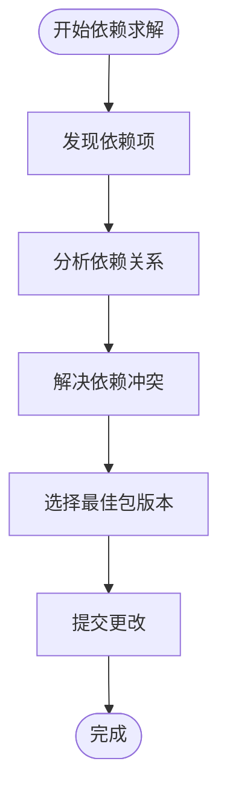

# 项目概述

<cite>
**本文档引用的文件**   
- [README.md](file://README.md)
- [src/apk.c](file://src/apk.c)
- [src/solver.c](file://src/solver.c)
- [src/apk_solver.h](file://src/apk_solver.h)
- [src/apk_context.h](file://src/apk_context.h)
- [src/app_add.c](file://src/app_add.c)
- [src/app_update.c](file://src/app_update.c)
- [src/app_query.c](file://src/app_query.c)
- [src/app_verify.c](file://src/app_verify.c)
- [python/apk_module.c](file://python/apk_module.c)
- [lua/lua-apk.c](file://lua/lua-apk.c)
</cite>

## 目录
1. [引言](#引言)
2. [核心价值与设计目标](#核心价值与设计目标)
3. [核心功能模块](#核心功能模块)
4. [实际使用示例](#实际使用示例)
5. [系统集成](#系统集成)
6. [构建与编译](#构建与编译)

## 引言

apk-tools 是 Alpine Linux 的原生软件包管理器，专为轻量级和高效能而设计。该项目不仅服务于 Alpine Linux，还被多个其他发行版所采用。其核心设计理念是提供一个快速、可靠且资源占用少的软件包管理系统，特别适用于容器环境和嵌入式系统。

**Section sources**
- [README.md](file://README.md#L3-L4)

## 核心价值与设计目标

apk-tools 的核心价值在于其作为轻量级软件包管理器的定位。它通过静态编译支持、高效的依赖解析机制和事务性操作，确保了系统的稳定性和可靠性。设计目标包括最小化资源消耗、最大化执行效率以及提供强大的安全验证功能。

**Section sources**
- [README.md](file://README.md#L3-L4)

## 核心功能模块

### 软件包管理

apk-tools 提供了完整的软件包管理功能，包括安装、更新、删除和查询等操作。这些功能通过不同的子命令实现，如 `add`、`update`、`del` 和 `query`。

**Section sources**
- [src/app_add.c](file://src/app_add.c#L198-L207)
- [src/app_update.c](file://src/app_update.c#L57-L62)
- [src/app_query.c](file://src/app_query.c#L19-L24)

### 依赖求解

依赖求解是 apk-tools 的核心功能之一。通过 `apk_solver_solve` 函数，系统能够高效地解析复杂的依赖关系，确保所有依赖项都能正确安装或更新。该功能支持多种求解策略，包括最新版本优先和忽略冲突等。



**Diagram sources **
- [src/solver.c](file://src/solver.c#L1050-L1090)
- [src/apk_solver.h](file://src/apk_solver.h#L41-L44)

**Section sources**
- [src/solver.c](file://src/solver.c#L1050-L1090)
- [src/apk_solver.h](file://src/apk_solver.h#L41-L44)

### 安全验证

安全验证功能确保了软件包的完整性和来源可信。通过数字签名和哈希校验，apk-tools 能够防止恶意软件的安装。`app_verify.c` 文件中的 `verify_main` 函数实现了这一功能。

**Section sources**
- [src/app_verify.c](file://src/app_verify.c#L1-L45)

### 可扩展性机制

apk-tools 设计了灵活的可扩展性机制，允许开发者通过插件或脚本扩展其功能。这种设计使得系统能够适应不同的使用场景和需求。

## 实际使用示例

### 基本安装命令

```bash
apk add package_name
```

此命令用于安装指定的软件包。`add` 子命令会自动解析并安装所有必要的依赖项。

**Section sources**
- [src/app_add.c](file://src/app_add.c#L107-L196)

### 更新命令

```bash
apk update
```

此命令用于更新软件包索引，确保系统能够获取最新的软件包信息。

**Section sources**
- [src/app_update.c](file://src/app_update.c#L29-L54)

### 查询命令

```bash
apk query package_name
```

此命令用于查询已安装或可用的软件包信息。

**Section sources**
- [src/app_query.c](file://src/app_query.c#L14-L26)

## 系统集成

### Python 集成

apk-tools 提供了 Python 绑定，允许开发者在 Python 脚本中调用其功能。`python/apk_module.c` 文件定义了 Python 模块，提供了版本验证和比较等功能。

**Section sources**
- [python/apk_module.c](file://python/apk_module.c#L92-L114)

### Lua 集成

类似地，apk-tools 也支持 Lua 集成。`lua/lua-apk.c` 文件实现了 Lua 接口，使得 Lua 脚本可以访问软件包管理功能。

**Section sources**
- [lua/lua-apk.c](file://lua/lua-apk.c#L325-L337)

## 构建与编译

### 构建方法

推荐使用 Meson 构建系统来编译 apk-tools。构建步骤如下：

```bash
meson setup -Dprefix=/ build
ninja -C build
meson install -C build
```

**Section sources**
- [README.md](file://README.md#L8-L14)

### 静态编译

为了生成静态链接的 apk 工具，可以使用以下命令：

```bash
meson setup -Dc_link_args="-static" -Dprefer_static=true -Ddefault_library=static build
ninja -C build src/apk
```

**Section sources**
- [README.md](file://README.md#L18-L23)